# OpenLakehouse


**An open-source, self-hosted, Dockerized data & AI platform — a real, working Databricks-style lakehouse you run entirely on your own infrastructure.**

Ingestion → streaming CDC → Spark/Iceberg lakehouse → SQL analytics → no-code pipelines → orchestration → data quality → lineage → BI dashboards → ML tracking → observability → an AI assistant, all wired together behind a single sign-on and a single UI.

> 39 Docker Compose services. 20 implementation phases, all complete and tested against real running containers (not mocked). See [docs/IMPLEMENTATION_STATUS.md](docs/IMPLEMENTATION_STATUS.md) for the live, phase-by-phase status log.

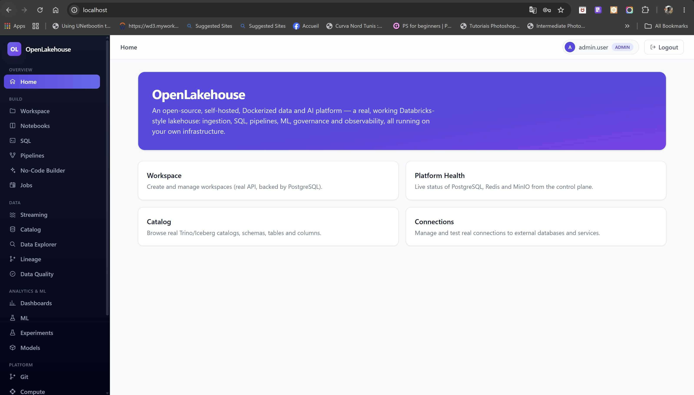

## Why OpenLakehouse?

Most "learn the modern data stack" tutorials make you stitch together a dozen SaaS trials or fight with half-broken local installs. OpenLakehouse is a single `docker compose up` that gives you a genuinely working lakehouse — real Spark jobs writing real Iceberg tables, real Trino queries, real Kafka/Debezium CDC streams, a real orchestrator, a real BI tool, a real ML registry — with a polished web UI on top, so you can learn (or prototype, or demo) the whole modern data platform stack without paying for a single cloud service.

## OpenLakehouse vs. a cloud lakehouse

| | Typical cloud lakehouse (Databricks/Snowflake-style) | OpenLakehouse |
|---|---|---|
| Cost | Per-node compute + storage + egress billing | $0 — runs on your own hardware |
| Setup time | Account creation, IAM, network/VPC config, workspace provisioning | `docker compose up -d` |
| Table format | Delta Lake / Iceberg (managed) | Apache Iceberg via Apache Polaris (self-hosted REST catalog) |
| Query engine | Proprietary SQL warehouse | Trino (open source) |
| Orchestration | Managed workflows | Dagster (open source, same engine you'd run in prod) |
| BI | Built-in or paid add-on | Apache Superset (open source) |
| ML tracking | Managed MLflow-compatible or proprietary | Real MLflow, self-hosted |
| Data resides | Vendor's cloud account | Your disk, in MinIO (S3-compatible) |
| Vendor lock-in | High | None — every component is open source |
| Good for | Production at scale | Learning, prototyping, demos, home-lab data engineering |

## Table of contents

- [Why OpenLakehouse?](#why-openlakehouse)
- [OpenLakehouse vs. a cloud lakehouse](#openlakehouse-vs-a-cloud-lakehouse)
- [Architecture at a glance](#architecture-at-a-glance)
- [Network architecture](#network-architecture)
- [Data flow — medallion architecture](#data-flow--medallion-architecture)
- [Authentication flow](#authentication-flow)
- [Roles & permissions (RBAC)](#roles--permissions-rbac)
- [No-code pipeline builder](#no-code-pipeline-builder)
- [Pipeline run lifecycle](#pipeline-run-lifecycle)
- [Observability pipeline](#observability-pipeline)
- [Features](#features)
- [Screenshots](#screenshots)
- [Docker Compose profiles](#docker-compose-profiles)
- [Port reference](#port-reference)
- [Quick start](#quick-start)
- [Build something on it](#build-something-on-it)
- [Database model](#database-model)
- [Architecture deep-dive](#architecture-deep-dive)
- [Known limitations](#known-limitations)
- [FAQ](#faq)
- [Documentation](#documentation)

## Architecture at a glance

Every arrow below is a real, running connection between real containers — nothing here is aspirational. The gateway is the single entrypoint; everything else talks over an internal Docker network.

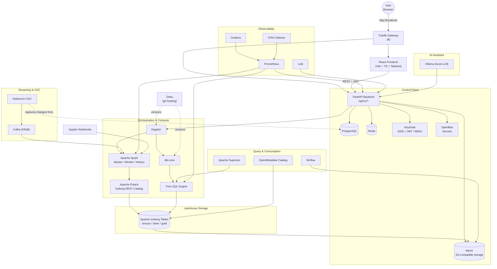
```mermaid
flowchart TB
    User((" User<br/>Browser ")) -->|"http://localhost"| Traefik["Traefik Gateway<br/>:80"]

    Traefik --> FE["React Frontend<br/>(Vite + TS + Tailwind)"]
    Traefik --> API["FastAPI Backend<br/>/api/v1/*"]
    FE -->|"REST + JWT"| API

    subgraph ControlPlane["Control Plane"]
        API --> PG[("PostgreSQL")]
        API --> RD[("Redis")]
        API --> MINIO[("MinIO<br/>S3-compatible storage")]
        API --> KC["Keycloak<br/>OIDC / JWT / RBAC"]
        API --> BAO["OpenBao<br/>Secrets"]
    end

    subgraph Orchestration["Orchestration & Compute"]
        API --> DAG["Dagster"]
        DAG --> SPARK["Apache Spark<br/>Master / Worker / History"]
        DAG --> DBT["dbt-core"]
        SPARK --> POLARIS["Apache Polaris<br/>Iceberg REST Catalog"]
        DBT --> TRINO
    end

    subgraph Lakehouse["Lakehouse Storage"]
        POLARIS --> ICEBERG[("Apache Iceberg Tables<br/>bronze / silver / gold")]
        ICEBERG --> MINIO
    end

    subgraph Streaming["Streaming & CDC"]
        KAFKA["Kafka (KRaft)"] --> SPARK
        DEBEZIUM["Debezium CDC"] --> KAFKA
        DEBEZIUM -.->|captures changes from| PG
    end

    subgraph Query["Query & Consumption"]
        TRINO["Trino SQL Engine"] --> ICEBERG
        SUPERSET["Apache Superset"] --> TRINO
        MLFLOW["MLflow"] --> MINIO
        OM["OpenMetadata Catalog"] --> ICEBERG
    end

    subgraph Obs["Observability"]
        PROM["Prometheus"] --> API
        PROM --> SPARK
        PROM --> TRINO
        GRAFANA["Grafana"] --> PROM
        LOKI["Loki"] --> API
        OTEL["OTel Collector"] --> PROM
    end

    subgraph AI["AI Assistant"]
        OLLAMA["Ollama (local LLM)"] --> API
    end

    GIT["Gitea<br/>(git hosting)"] -.->|versions| DAG
    GIT -.->|versions| DBT
    JUPYTER["Jupyter Notebooks"] --> SPARK
```

## Network architecture

All 39+ services join a single Docker bridge network (`openlakehouse-net`) and resolve each other by container name. **Traefik is the only service meant to be reached from outside Docker** — it terminates the browser connection on host port 80 and reverse-proxies to the frontend and backend based on path.

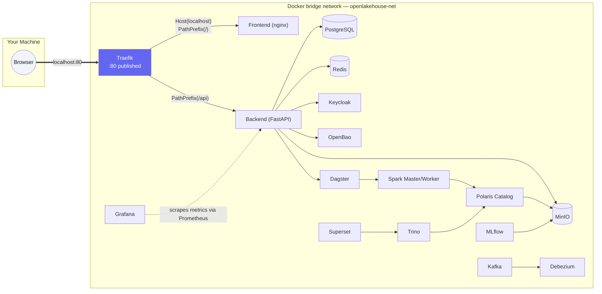
```mermaid
flowchart LR
    subgraph HostMachine["Your Machine"]
        Browser(("Browser"))
    end

    subgraph DockerNet["Docker bridge network — openlakehouse-net"]
        direction TB
        Traefik["Traefik<br/>:80 published"]
        Frontend["Frontend (nginx)"]
        Backend["Backend (FastAPI)"]
        Postgres[("PostgreSQL")]
        Redis[("Redis")]
        MinIO[("MinIO")]
        Keycloak["Keycloak"]
        OpenBao["OpenBao"]
        Spark["Spark Master/Worker"]
        Polaris["Polaris Catalog"]
        TrinoN["Trino"]
        KafkaN["Kafka"]
        DebeziumN["Debezium"]
        DagsterN["Dagster"]
        SupersetN["Superset"]
        MlflowN["MLflow"]
        GrafanaN["Grafana"]
    end

    Browser == "localhost:80" ==> Traefik
    Traefik -- "Host(localhost)<br/>PathPrefix(/)" --> Frontend
    Traefik -- "PathPrefix(/api)" --> Backend
    Backend --> Postgres
    Backend --> Redis
    Backend --> MinIO
    Backend --> Keycloak
    Backend --> OpenBao
    Backend --> DagsterN
    DagsterN --> Spark
    Spark --> Polaris
    Polaris --> MinIO
    TrinoN --> Polaris
    KafkaN --> DebeziumN
    SupersetN --> TrinoN
    MlflowN --> MinIO
    GrafanaN -.->|scrapes metrics via Prometheus| Backend

    style Traefik fill:#6366f1,color:#fff
    style Browser fill:#f1f5f9,color:#0f172a
```

## Data flow — medallion architecture

Every layer is a real Iceberg table on MinIO, queryable from Trino/SQL the moment it lands.

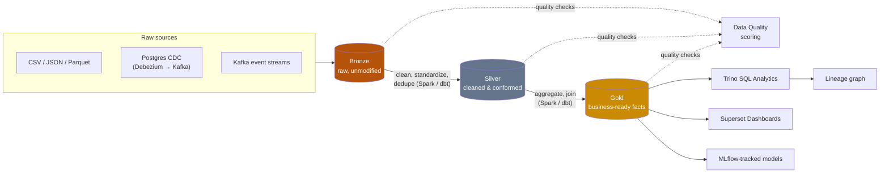
```mermaid
flowchart LR
    subgraph Sources["Raw sources"]
        CSVS["CSV / JSON / Parquet"]
        CDC["Postgres CDC<br/>(Debezium → Kafka)"]
        STREAM["Kafka event streams"]
    end

    Sources --> Bronze[("Bronze<br/>raw, unmodified")]
    Bronze -->|"clean, standardize,<br/>dedupe (Spark / dbt)"| Silver[("Silver<br/>cleaned & conformed")]
    Silver -->|"aggregate, join<br/>(Spark / dbt)"| Gold[("Gold<br/>business-ready facts")]

    Bronze -.->|quality checks| DQ["Data Quality<br/>scoring"]
    Silver -.->|quality checks| DQ
    Gold -.->|quality checks| DQ

    Gold --> TrinoDF["Trino SQL Analytics"]
    Gold --> SupersetDF["Superset Dashboards"]
    Gold --> MLDF["MLflow-tracked models"]
    TrinoDF --> LineageDF["Lineage graph"]

    style Bronze fill:#b45309,color:#fff
    style Silver fill:#64748b,color:#fff
    style Gold fill:#ca8a04,color:#fff
```

## Authentication flow

Every request through the UI is backed by a real Keycloak-issued JWT, validated by the backend against Keycloak's JWKS endpoint — not a mocked auth layer.

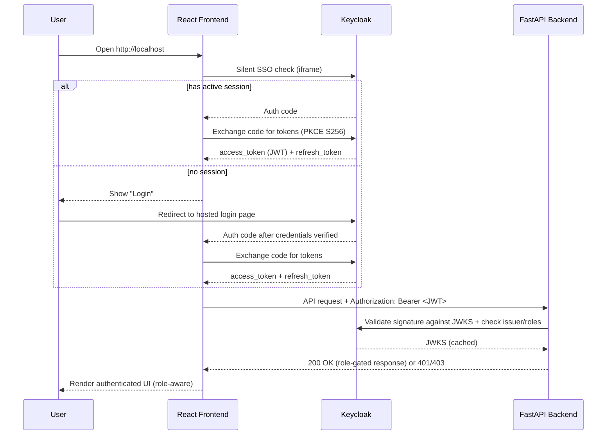
```mermaid
sequenceDiagram
    participant U as User
    participant FE as React Frontend
    participant KC as Keycloak
    participant BE as FastAPI Backend

    U->>FE: Open http://localhost
    FE->>KC: Silent SSO check (iframe)
    alt has active session
        KC-->>FE: Auth code
        FE->>KC: Exchange code for tokens (PKCE S256)
        KC-->>FE: access_token (JWT) + refresh_token
    else no session
        FE-->>U: Show "Login"
        U->>KC: Redirect to hosted login page
        KC-->>FE: Auth code after credentials verified
        FE->>KC: Exchange code for tokens
        KC-->>FE: access_token + refresh_token
    end
    FE->>BE: API request + Authorization: Bearer <JWT>
    BE->>KC: Validate signature against JWKS + check issuer/roles
    KC-->>BE: JWKS (cached)
    BE-->>FE: 200 OK (role-gated response) or 401/403
    FE-->>U: Render authenticated UI (role-aware)
```

## Roles & permissions (RBAC)

Five Keycloak realm roles gate what each user can see and do across every module — enforced server-side on every API call, not just hidden in the UI.

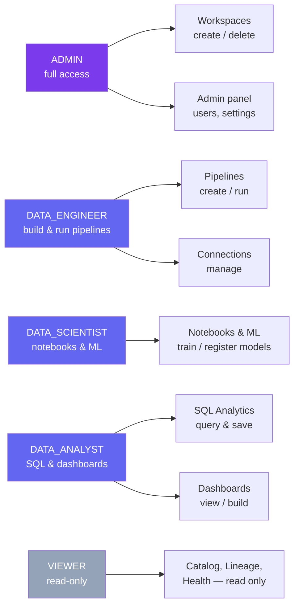
```mermaid
flowchart LR
    ADMIN["ADMIN<br/>full access"]
    ENGINEER["DATA_ENGINEER<br/>build & run pipelines"]
    SCIENTIST["DATA_SCIENTIST<br/>notebooks & ML"]
    ANALYST["DATA_ANALYST<br/>SQL & dashboards"]
    VIEWER["VIEWER<br/>read-only"]

    ADMIN --> Workspaces["Workspaces<br/>create / delete"]
    ADMIN --> Admin["Admin panel<br/>users, settings"]
    ENGINEER --> Pipelines["Pipelines<br/>create / run"]
    ENGINEER --> Connections["Connections<br/>manage"]
    SCIENTIST --> Notebooks["Notebooks & ML<br/>train / register models"]
    ANALYST --> SQLA["SQL Analytics<br/>query & save"]
    ANALYST --> Dashboards["Dashboards<br/>view / build"]
    VIEWER --> ReadOnly["Catalog, Lineage,<br/>Health — read only"]

    style ADMIN fill:#7c3aed,color:#fff
    style ENGINEER fill:#6366f1,color:#fff
    style SCIENTIST fill:#6366f1,color:#fff
    style ANALYST fill:#6366f1,color:#fff
    style VIEWER fill:#94a3b8,color:#fff
```

| Role | Can do |
|---|---|
| `ADMIN` | Everything: manage workspaces, users, connections, pipelines, and view the admin panel |
| `DATA_ENGINEER` | Create/run pipelines, manage connections, build in the No-Code Builder, orchestrate jobs |
| `DATA_SCIENTIST` | Use notebooks, train models, manage MLflow experiments/registry |
| `DATA_ANALYST` | Run SQL queries, build/view Superset dashboards |
| `VIEWER` | Read-only access to Catalog, Lineage, Data Quality and Platform Health |

## No-code pipeline builder

Every pipeline is a directed graph of nodes compiled down to real Spark SQL and executed against the live Iceberg/Polaris catalog.


```mermaid
flowchart LR
    subgraph SourceNodes["Source"]
        S1["iceberg_table"]
    end

    subgraph TransformNodes["Transform (choose any, chain freely)"]
        direction TB
        T1["select / rename / cast"]
        T2["filter / deduplicate"]
        T3["join / union"]
        T4["aggregate / sort / pivot"]
        T5["derived_column / window"]
        T6["fill_null / replace / unpivot"]
    end

    subgraph QualityNodes["Quality gates"]
        Q1["not_null · unique · range"]
        Q2["regex · schema · freshness"]
        Q3["row_count"]
    end

    subgraph DestNodes["Destination"]
        D1["iceberg_bronze / silver / gold"]
        D2["minio"]
        D3["postgresql"]
        D4["kafka"]
    end

    SourceNodes --> TransformNodes --> QualityNodes --> DestNodes
    QualityNodes -.->|failures logged to| DQPanel["Data Quality dashboard"]
    DestNodes -.->|source/destination pairs derive| LineageGraph["Lineage graph"]
```

### Scheduling & the Jobs page

The Pipeline Builder's "Pipeline settings" panel has a friendly schedule picker instead of a raw cron field — pick **No schedule**, **Every 15 minutes**, **Hourly**, **Daily**, **Weekly**, or drop into **Custom cron…** for anything more specific, and a plain-English summary (e.g. "Runs weekly on Monday at 03:00 UTC.") updates live as you choose. Behind the scenes it's still a real cron string, validated server-side and picked up by a Dagster sensor that polls every 30s for schedules due to fire.

The **Jobs** page (`/jobs`) is where you see it all run: a Scheduled Pipelines table with the same human-readable schedule description plus a computed next-run time (absolute + relative, e.g. "in 10h"), a Recent Runs table with relative timestamps ("14m ago") and live status, and a "View progress" toggle on each run that expands a step-by-step breakdown of every node in the pipeline — status, row count, and duration — polling live while the run is still in progress.

### Advanced nodes: variables, code, control flow, API ingestion, sub-pipelines

Pipelines aren't limited to the source/transform/quality/destination flow above. Add any of these node kinds to unlock a step-by-step execution engine (still real, still runs against live Trino/Iceberg — just executed node-by-node instead of compiled into one SQL statement):

- **variable** — `literal` (a constant, supports `{{other_var}}` substitution) or `from_query` (stores the first cell of a SQL query's first row)
- **code** — `sql` (an arbitrary statement, can store its result into a variable), `python`, or `pyspark` (arbitrary code with the shared `variables` dict available by reference; `python`/`pyspark` nodes require the `ADMIN` or `DATA_ENGINEER` role to run)
- **control** — `if` (skips a configured list of node ids depending on a condition evaluated against `variables`) or `for_each` (re-runs a configured list of body node ids once per item in a list variable)
- **api_ingestion** — `rest_get` / `rest_post` (calls a REST API, stores the JSON response into a variable)
- **sub_pipeline** — `call` (runs another saved pipeline inline, in the same run, with optional variable sharing)

A pipeline using only the original 4 node kinds still compiles to a single SQL statement exactly as before; the advanced engine only activates when at least one of these new kinds is present.

## Pipeline run lifecycle

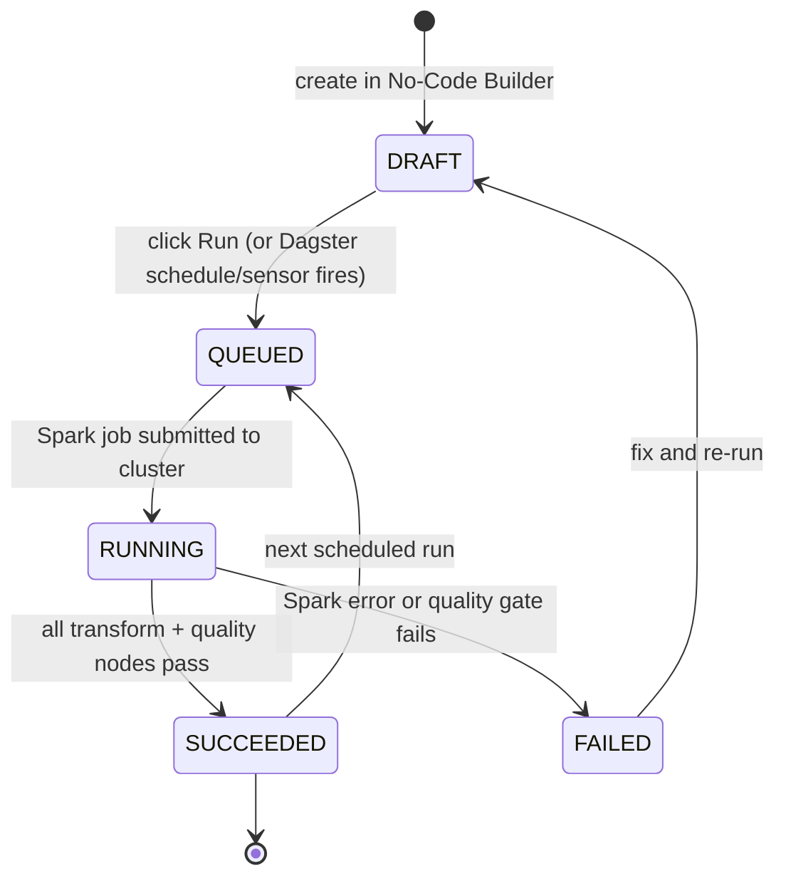
```mermaid
stateDiagram-v2
    [*] --> DRAFT: create in No-Code Builder
    DRAFT --> QUEUED: click Run (or Dagster schedule/sensor fires)
    QUEUED --> RUNNING: Spark job submitted to cluster
    RUNNING --> SUCCEEDED: all transform + quality nodes pass
    RUNNING --> FAILED: Spark error or quality gate fails
    SUCCEEDED --> [*]
    FAILED --> DRAFT: fix and re-run
    SUCCEEDED --> QUEUED: next scheduled run
```

## Observability pipeline

Every service emits metrics/logs into the same Prometheus + Loki + Grafana stack, so a single Grafana dashboard can correlate a slow Trino query with the Spark job and API request that triggered it.

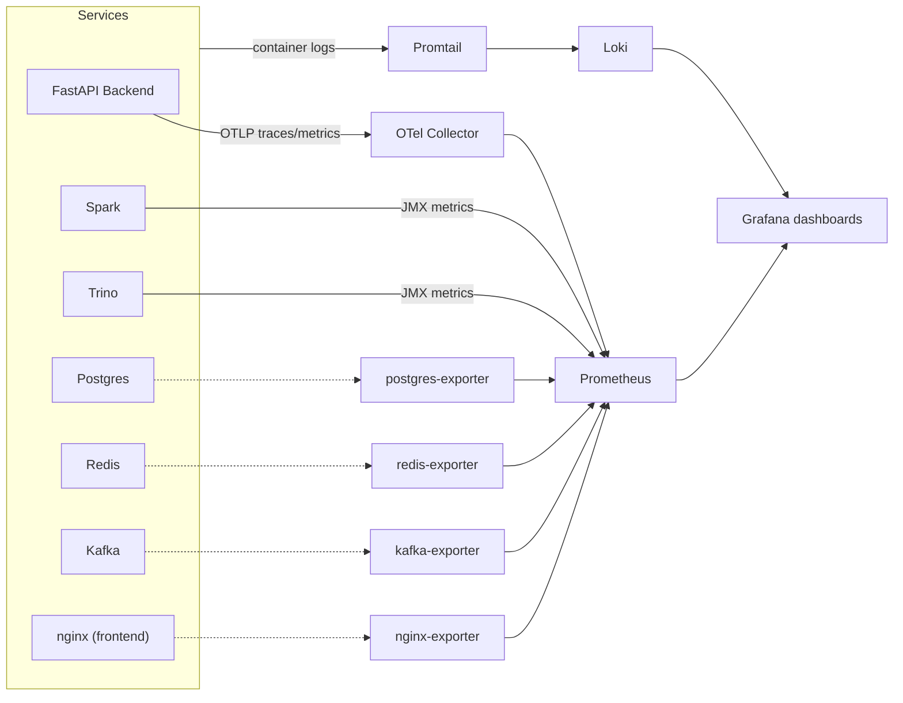
```mermaid
flowchart LR
    subgraph Emitters["Services"]
        BE2["FastAPI Backend"]
        SPARK2["Spark"]
        TRINO2["Trino"]
        PG2["Postgres"]
        RD2["Redis"]
        KFK2["Kafka"]
        NGX2["nginx (frontend)"]
    end

    BE2 -->|OTLP traces/metrics| OTEL2["OTel Collector"]
    OTEL2 --> PROM2["Prometheus"]
    PGEXP["postgres-exporter"] --> PROM2
    RDEXP["redis-exporter"] --> PROM2
    KFKEXP["kafka-exporter"] --> PROM2
    NGXEXP["nginx-exporter"] --> PROM2
    SPARK2 -->|JMX metrics| PROM2
    TRINO2 -->|JMX metrics| PROM2
    PG2 -.-> PGEXP
    RD2 -.-> RDEXP
    KFK2 -.-> KFKEXP
    NGX2 -.-> NGXEXP

    Emitters -->|container logs| PROMTAIL2["Promtail"] --> LOKI2["Loki"]

    PROM2 --> GRAFANA2["Grafana dashboards"]
    LOKI2 --> GRAFANA2
```

## Features

| Area | What you get |
|---|---|
| **Ingestion & Storage** | MinIO (S3-compatible object storage), Iceberg table format via the Apache Polaris REST catalog |
| **Compute** | Apache Spark (Master/Worker/History Server) for batch & structured streaming jobs; a Compute dashboard (`/compute`) shows every live Spark application, Trino query, and Jupyter kernel with the ability to kill a runaway one |
| **SQL Analytics** | Trino querying Iceberg tables directly from the browser, with saved queries & history |
| **Data Explorer** | Catalog → Schema → Table → Columns tree browser plus an advanced SQL editor; click a table to preview it instantly, right-click any catalog/schema/table/column for quick actions (copy name, copy fully-qualified name, copy `SELECT`, run row count), or write SQL by hand and run it against either Trino or a real Spark Thrift Server. A separate "PySpark Code" mode (ADMIN/DATA_ENGINEER only) runs real, hand-written PySpark against a shared SparkSession (with a live status indicator, idle auto-stop, and a manual "Stop session" control), with console-style stdout/stderr output |
| **No-Code Pipelines** | Visual drag-and-drop pipeline builder (drag or click to add nodes, collapsible node-palette categories) with guided per-node forms, live catalog pickers, and color/icon-coded nodes per node kind. Beyond the original source → transform → quality checks → destination flow (compiled to a single Spark SQL statement), pipelines can also use **variable**, **code** (SQL/Python/PySpark), **control flow** (`if`/`for_each`), **API ingestion** (REST GET/POST), and **sub-pipeline** nodes, executed step-by-step by a dedicated engine (Python/PySpark code nodes require the ADMIN/DATA_ENGINEER role) |
| **ER Diagram** | Auto-generated entity-relationship diagram (`/er-diagram`) per catalog/schema — infers foreign-key relationships heuristically from `<entity>_id`-style column names, rendered as a React Flow graph |
| **Orchestration** | Dagster for scheduling and running pipelines/jobs |
| **Streaming & CDC** | Kafka (KRaft mode) + Debezium capturing Postgres changes in real time |
| **Transformations** | dbt-core against Trino (staging → intermediate → marts) |
| **Data Quality** | Pipeline-native quality checks (not-null, unique, range, regex, schema, freshness, row count) with a scored dashboard |
| **Lineage & Catalog** | Auto-derived table-level lineage graph + OpenMetadata catalog integration |
| **BI / Dashboards** | Apache Superset dashboards embedded in the app |
| **Machine Learning** | MLflow experiment tracking & model registry, with a training job you can run out of the box |
| **Notebooks** | Jupyter with PySpark pre-wired to the same Iceberg/Spark cluster |
| **Git** | Self-hosted Gitea for versioning pipelines/notebooks/dbt models |
| **Observability** | Prometheus, Grafana, Loki and an OpenTelemetry collector, all pre-provisioned; the in-app Monitoring page (`/monitoring`) adds an overall-health summary and a per-service grouped status view on top of the raw Prometheus targets list |
| **AI Assistant** | A local LLM (Ollama) wired into the platform for in-app help |
| **Security** | Keycloak (OIDC/JWT, RBAC across 5 roles) + OpenBao for secrets management |
| **Gateway** | Traefik reverse proxy — one entrypoint (`http://localhost`) for the whole platform |

## Screenshots

| | |
|---|---|
| 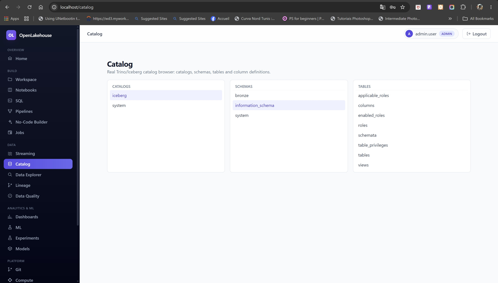 Real Trino/Iceberg catalog browser | 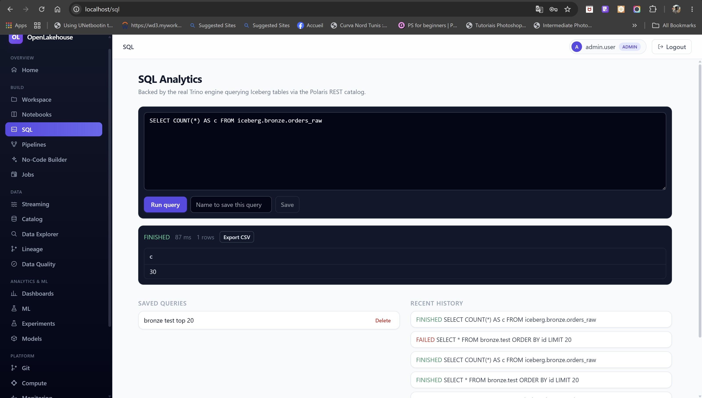 SQL Analytics against live Iceberg tables |
| 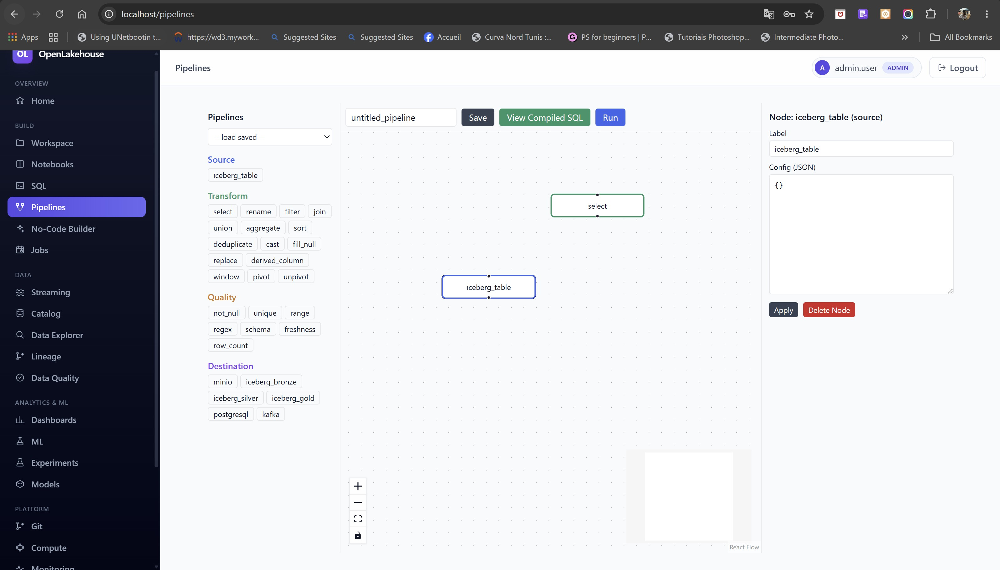 Visual pipeline builder (React Flow) | 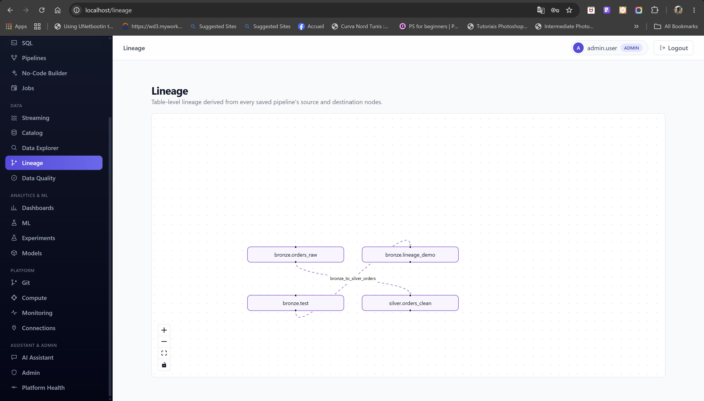 Auto-derived table lineage graph |
| 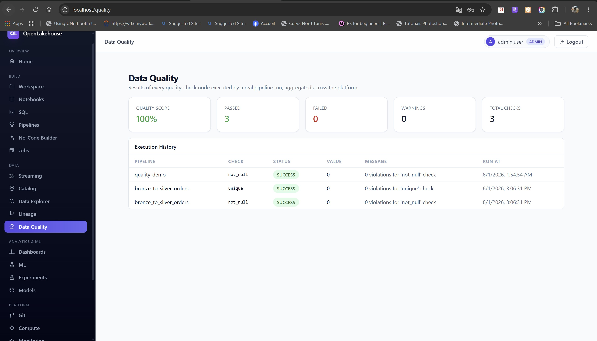 Data quality scoring & execution history | 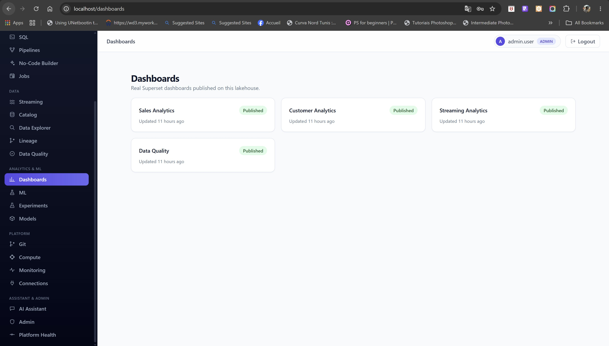 Superset dashboards embedded in-app |
| 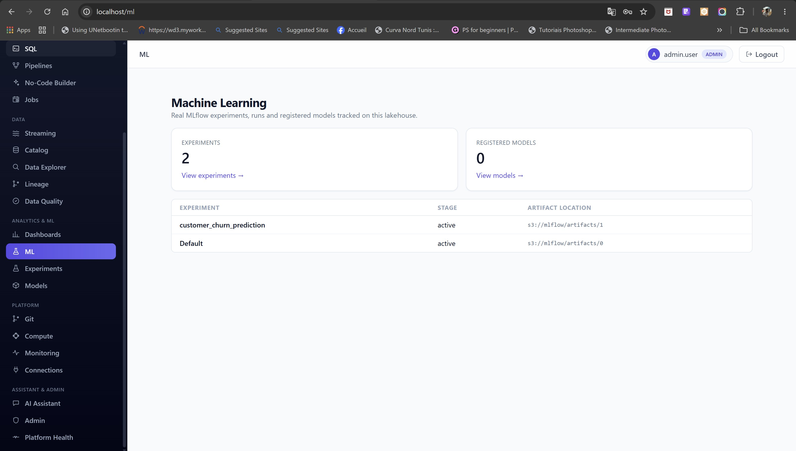 MLflow experiments & registered models | 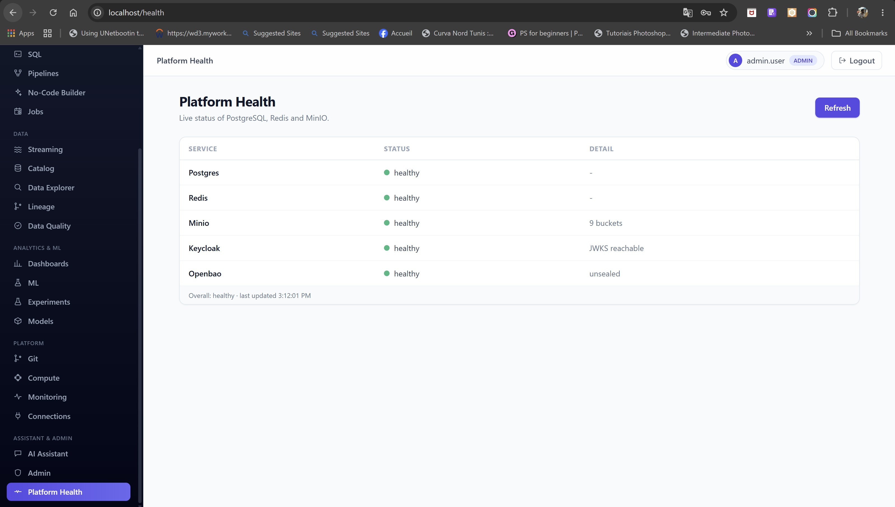 Live platform health checks |

## Docker Compose profiles

Services are grouped into Compose profiles so you can start only what you need. `full` starts everything (39+ containers); `core` gets you a working control plane in under a minute.

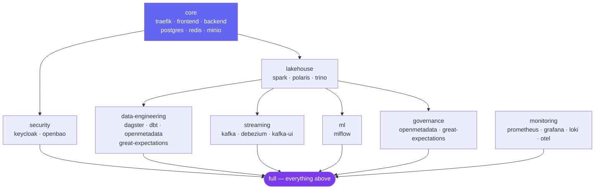
```mermaid
flowchart TB
    core["core<br/>traefik · frontend · backend<br/>postgres · redis · minio"]
    security["security<br/>keycloak · openbao"]
    lakehouse["lakehouse<br/>spark · polaris · trino"]
    dataeng["data-engineering<br/>dagster · dbt · openmetadata<br/>great-expectations"]
    streaming["streaming<br/>kafka · debezium · kafka-ui"]
    ml["ml<br/>mlflow"]
    governance["governance<br/>openmetadata · great-expectations"]
    monitoring["monitoring<br/>prometheus · grafana · loki · otel"]
    full(["full — everything above"])

    core --> security
    core --> lakehouse
    lakehouse --> dataeng
    lakehouse --> streaming
    lakehouse --> ml
    lakehouse --> governance
    security --> full
    dataeng --> full
    streaming --> full
    ml --> full
    governance --> full
    monitoring --> full

    style core fill:#6366f1,color:#fff
    style full fill:#7c3aed,color:#fff
```

| Profile | Services |
|---|---|
| `core` | traefik, frontend, backend, postgres, redis, minio |
| `security` | keycloak, openbao (+ core) |
| `lakehouse` | spark-master, spark-worker, spark-thriftserver, polaris, trino (+ core) |
| `data-engineering` | dagster, dbt, openmetadata, great-expectations (+ lakehouse) |
| `streaming` | kafka, kafka-ui, debezium, flink (+ lakehouse) |
| `ml` | mlflow (+ lakehouse) |
| `governance` | openmetadata, great-expectations (+ lakehouse) |
| `monitoring` | prometheus, grafana, loki, otel-collector |
| `full` | everything |

## Port reference

Everything is reachable through Traefik at `http://localhost` — these direct ports are exposed mainly for debugging, admin UIs, and connecting external tools (e.g. a local SQL client to Trino).

| Service | Host port | What's there |
|---|---|---|
| Traefik | `80` | Main entrypoint — frontend + `/api/*` |
| Traefik dashboard | `8080` | Reverse-proxy routing table |
| Backend (direct) | `8000` | FastAPI, bypasses Traefik |
| Frontend (direct) | `5173` | React app, bypasses Traefik |
| PostgreSQL | `5432` | Control-plane + service metadata DBs |
| Redis | `6379` | Cache / Celery-style task queue |
| MinIO API | `9000` | S3-compatible object storage |
| MinIO Console | `9001` | Web UI for buckets/objects |
| Keycloak | `8081` | Realm `openlakehouse`, OIDC/JWT |
| OpenBao | `8200` | Dev-mode secrets engine |
| Apache Polaris | `8181` / `8182` | Iceberg REST catalog / management |
| Spark Master UI | `8090` | Cluster overview |
| Spark Worker UI | `8091` | Worker status |
| Spark History Server | `18080` | Completed job history |
| Jupyter | `8888` | PySpark-enabled notebooks |
| Trino | `8082` | SQL engine UI + JDBC/REST |
| Spark Thrift Server | `10001` | HiveServer2/Thrift SQL endpoint used by Data Explorer's "Run via Spark" engine |
| Dagster | `3001` | Orchestration UI |
| OpenSearch | `9200` | Backing search index for OpenMetadata |
| OpenMetadata | `8585` | Data catalog UI |
| Kafka (host listener) | `9094` | External Kafka clients |
| Debezium Connect | `8083` | Kafka Connect REST API |
| Superset | `8088` | BI dashboards |
| MLflow | `5000` | Experiment tracking / model registry |
| Gitea | `3010` | Self-hosted git |
| Prometheus | `9090` | Metrics store |
| Loki | `3100` | Log store |
| Grafana | `3300` | Dashboards over Prometheus + Loki |
| Ollama | `11434` | Local LLM API |

## Quick start

Requirements: Docker Desktop with Docker Compose v2, on Windows 10/11 + WSL2 (or Linux/macOS).

```bash
cp .env.example .env

# Core platform only (gateway, frontend, backend, postgres, redis, minio)
docker compose --profile core up -d --build

# The full platform (all 39+ services: lakehouse, streaming, ML, BI, observability, ...)
docker compose --profile full up -d --build
```

Then open **http://localhost** and log in (Keycloak realm `openlakehouse`; demo users `admin.user` / `engineer.user` / `analyst.user` / `viewer.user`, password `openlakehouse`).

Check platform health directly:

```bash
curl http://localhost/api/v1/health
```

API docs: **http://localhost/api/docs**

Shut everything down — **use the same `--profile` flag you started with**, otherwise Compose won't stop the profile-gated containers:

```bash
docker compose --profile full down
```

## Build something on it

Want a hands-on tour instead of just clicking around? Follow **[docs/GUIDED_PROJECT.md](docs/GUIDED_PROJECT.md)** — a guided, end-to-end project that walks you through ingesting data, building a bronze → silver → gold pipeline, querying it with SQL, checking its quality, visualizing it in a dashboard, and training a model, all on this platform.

## Database model

The control plane's core tables, plus what later phases add on top:

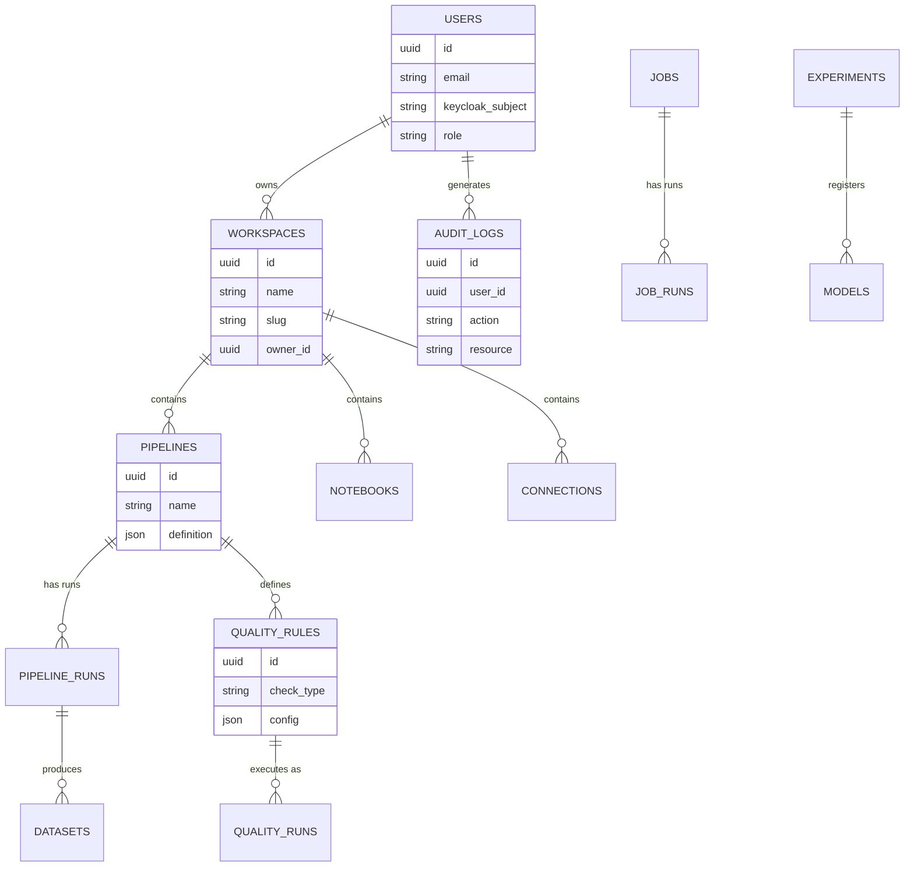
```mermaid
erDiagram
    USERS ||--o{ WORKSPACES : owns
    USERS ||--o{ AUDIT_LOGS : generates
    WORKSPACES ||--o{ PIPELINES : contains
    WORKSPACES ||--o{ NOTEBOOKS : contains
    WORKSPACES ||--o{ CONNECTIONS : contains
    PIPELINES ||--o{ PIPELINE_RUNS : "has runs"
    PIPELINES ||--o{ QUALITY_RULES : defines
    QUALITY_RULES ||--o{ QUALITY_RUNS : "executes as"
    PIPELINE_RUNS ||--o{ DATASETS : produces
    JOBS ||--o{ JOB_RUNS : "has runs"
    EXPERIMENTS ||--o{ MODELS : registers

    USERS {
        uuid id
        string email
        string keycloak_subject
        string role
    }
    WORKSPACES {
        uuid id
        string name
        string slug
        uuid owner_id
    }
    AUDIT_LOGS {
        uuid id
        uuid user_id
        string action
        string resource
    }
    PIPELINES {
        uuid id
        string name
        json definition
    }
    QUALITY_RULES {
        uuid id
        string check_type
        json config
    }
```

## Architecture deep-dive

The diagrams above are the highlights — see **[docs/architecture.md](docs/architecture.md)** for the complete architecture document: repository structure, API strategy, the full database model, and the Docker Compose profile breakdown. See **[docs/IMAGE_PROMPTS.md](docs/IMAGE_PROMPTS.md)** for ready-to-use AI image-generation prompts if you want stylized architecture/marketing visuals to go alongside these diagrams.

## Known limitations

Honest, running log of real quirks discovered while operating the platform (not hypothetical edge cases):

- Spark's `spark-defaults.conf` doesn't support `${ENV_VAR}` interpolation, so the Polaris root secret is hardcoded in `infra/spark/spark-defaults.conf` / `infra/jupyter/spark-defaults.conf` — a dev-only convention, don't reuse those defaults in a real deployment.
- Traefik's file-provider hot-reload is unreliable on Windows bind mounts — after editing `infra/traefik/dynamic.yml`, run `docker compose restart traefik` to guarantee the new routes are picked up.
- Polaris occasionally logs a benign `WARN` ("Table does not exist") right after a commit — a metrics-reporting race that doesn't affect the actual table write.
- JupyterLab's extension manager falls back to read-only mode due to an httpx/jupyterlab version mismatch; doesn't affect notebook creation or execution.
- `docker compose down` must be run with the **same `--profile` flag** used to start the stack, or Compose will silently leave profile-gated containers running (see [Quick start](#quick-start)).
- Flink is intentionally out of scope for this build — Kafka + Spark Structured Streaming cover the streaming use cases the platform demonstrates.

## FAQ

**Does this need internet access after the first build?**
Only for pulling Docker images and the Ollama model on first run. Once images are pulled, you can work fully offline.

**How much RAM/CPU do I need?**
`core` profile is comfortable on 4 CPU / 8 GB RAM. `full` (39+ containers, including Spark, Kafka, OpenSearch, OpenMetadata) is happier with 8+ CPU / 16 GB+ RAM — OpenSearch and the JVM-based services are the heaviest.

**Can I use this in production?**
It's built and tested as a learning/demo/prototyping platform, using dev-mode defaults (hardcoded dev secrets, `start-dev` Keycloak, `-dev` OpenBao). Treat it as a reference architecture to harden, not a production deployment as-is.

**Why do some containers show "unhealthy" briefly after startup?**
Several services (Keycloak, Polaris, OpenMetadata, Trino) have real startup/migration time — healthchecks have generous `start_period`/`retries` for this reason. Give the full profile 2–3 minutes before assuming something is actually broken; check `curl http://localhost/api/v1/health` first.

**Where is my data stored?**
Everything is in named Docker volumes on your machine (`postgres-data`, `minio-data`, etc. — see `docker-compose.yml`). Nothing leaves your machine unless you configure an external connection yourself.

## Documentation

- [docs/architecture.md](docs/architecture.md) — system & network architecture, data flow, DB model

## License

See [LICENSE](LICENSE).
