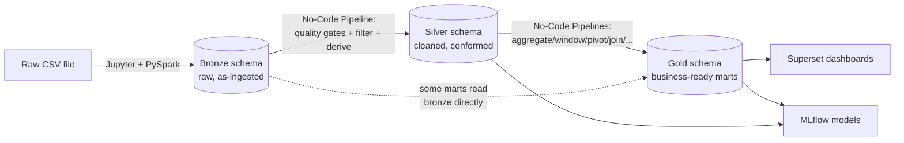

# Part 1 — Orientation, Setup & the Dataset

**[← Guide index](00-README.md)** · Part 1 of 14 · Next: [Part 2 — Loading & Exploring Data →](02-loading-and-exploring-data.md)

---

## Chapter 0 — Orientation: what OpenLakehouse is

OpenLakehouse is a self-hosted, open-source **data lakehouse platform** — it
combines the flexibility of a data lake (cheap object storage, any file
format) with the structure/performance of a data warehouse (ACID tables, SQL
engines, BI tools), plus a full "modern data stack" of orchestration, ML,
observability, and version control wired together and exposed through one
web application. Nothing in this stack is a hosted SaaS product — every
service (Spark, Trino, Iceberg/Polaris, Dagster, Superset, MLflow, Kafka,
Debezium, Gitea, Prometheus/Grafana/Loki, Keycloak, Ollama) runs as its own
Docker container on your machine, and the OpenLakehouse **backend** (FastAPI)
and **frontend** (React) tie them together into one coherent product.

### 0.1 The core idea: table format + query engines, decoupled from storage

At the center of everything is **Apache Iceberg** — an open table format
that turns plain files sitting in object storage (MinIO, an S3-compatible
store, in this stack) into real ACID tables with schema evolution, time
travel, and hidden partitioning. **Apache Polaris** is the REST catalog
service that tracks which files belong to which Iceberg table/schema/
catalog. Because Iceberg is an open *format*, multiple independent engines
can read/write the very same tables:

- **Apache Spark** — used for the heavy-lifting batch/streaming writes
  (loading the CSV, streaming Kafka data, CDC merges).
- **Trino** — used for fast, interactive SQL reads/writes (everything the
  No-Code Builder compiles to, the SQL editor, Superset's queries).

Both engines see the **same physical tables** through **different catalog
aliases** — Spark calls it `catalog`, Trino calls it `iceberg` — but it's the
same underlying warehouse. This is the single most important mental model
for this whole guide: **write with Spark (via Jupyter), read/transform with
Trino (via the No-Code Builder/SQL editor)**, and they always agree because
they're the same table.

### 0.2 The medallion architecture (Bronze / Silver / Gold)

Data flows through three progressively-refined layers/schemas:



- **Bronze** = raw, unmodified, as-ingested data (still has all 54,600 rows,
  including unused substitutes with 0 minutes played).
- **Silver** = cleaned and conformed — quality-checked, filtered to
  meaningful rows, with a couple of derived columns.
- **Gold** = business-ready marts — aggregated, joined, pivoted into the
  exact shape a dashboard or ML model needs.

### 0.3 Every service in the stack, and why it's there

| Service | Role | Where it lives |
|---|---|---|
| **Traefik** | Reverse proxy — routes `http://localhost` traffic to the frontend/backend | port 80 |
| **Frontend (React + Vite)** | The web app you click through all guide long | via Traefik |
| **Backend (FastAPI)** | Single control-plane API — auth, pipelines, catalog, jobs, everything | via Traefik `/api` |
| **Keycloak** | Identity provider — login, roles (`ADMIN`/`DATA_ENGINEER`/`ANALYST`/`VIEWER`) | :8081 |
| **Postgres** | Backend's own control-plane DB (pipelines, runs, connections, audit) + dedicated DBs for Dagster/Superset/MLflow/Gitea/OpenMetadata | internal |
| **MinIO** | S3-compatible object storage — where Iceberg table data files and MLflow artifacts physically live | :9000/:9001 |
| **Apache Polaris** | Iceberg REST catalog — tracks table/schema/catalog metadata | :8181 |
| **Apache Spark** (Master/Worker/History) | Batch + streaming compute engine — used for ingestion, streaming, CDC merges, ad-hoc PySpark | :8090/:8091/:18080 |
| **Trino** | Interactive SQL query engine — everything the No-Code Builder and SQL editor run through | :8082 (UI) |
| **Jupyter** | Notebook environment for hand-written PySpark (the on-ramp for any new raw data) | :8888 |
| **Dagster** | Orchestrator — schedules and tracks pipeline runs | :3001 |
| **Apache Superset** | BI/dashboarding tool | :8088 |
| **MLflow** | ML experiment tracking + model registry | :5000 |
| **Kafka** | Streaming message broker | internal :9092 |
| **Debezium** (Kafka Connect) | Change-data-capture connector — streams Postgres row changes to Kafka | :8083 |
| **Gitea** | Self-hosted Git server — version your pipeline SQL/notebooks | :3010 |
| **Prometheus** | Metrics collection/storage | :9090 |
| **Grafana** | Metrics/log dashboards | :3300 |
| **Loki + Promtail** | Log aggregation | :3100 |
| **OpenTelemetry Collector** | Trace/metric pipeline from the backend | internal |
| **Ollama** | Local LLM runtime backing the AI Assistant | :11434 |
| **OpenMetadata** | (Optional/advanced) external data catalog with its own ingestion | :8585 |

You do not need to memorize this table — refer back to it as each chapter
introduces the service it's built on.

### 0.4 Roles and what they can do (preview — full detail in Part 12, Chapter 23)

| Role | Can browse/query | Can build/run pipelines | Can run `python`/`pyspark` code | Can administer users |
|---|---|---|---|---|
| `VIEWER` | ✅ | ❌ | ❌ | ❌ |
| `ANALYST` | ✅ | ✅ (basic node kinds) | ❌ | ❌ |
| `DATA_ENGINEER` | ✅ | ✅ (all node kinds, including advanced) | ✅ | ❌ |
| `ADMIN` | ✅ | ✅ | ✅ | ✅ |

---

## Chapter 1 — Environment setup and access matrix

Start (or confirm) the full stack is up. Run this from the repository root:

```powershell
docker compose --profile full up -d --build
docker compose ps
```

Wait until every service shows `Up`/`healthy`. One cosmetic exception:
`redis-exporter` often shows `unhealthy` due to a bug baked into its own
Docker image's healthcheck — its `/metrics` endpoint works fine regardless,
ignore it.

> 🧪 **Test it:** `docker compose ps` should list 35+ containers. Pick any
> one (e.g. `trino`) and run `docker compose logs trino --tail 20` — real,
> live log output, proving these aren't placeholder/stub containers.

### 1.1 Full access matrix

| Service | URL | Credentials | Auth backing |
|---|---|---|---|
| OpenLakehouse app | http://localhost | `admin.user` / `openlakehouse` (**ADMIN**) or `engineer.user` / `openlakehouse` (**DATA_ENGINEER**) | Keycloak |
| Jupyter | http://localhost:8888/jupyter/?token=openlakehouse | token `openlakehouse` | static token |
| Apache Superset | http://localhost:8088 | `admin` / `openlakehouse_dev_password` | Superset's own auth |
| MLflow | http://localhost:5000 | none | — |
| Dagster | http://localhost:3001 | none | — |
| Gitea | http://localhost:3010 | `olh-admin` / `openlakehouse_dev_password` | Gitea's own auth |
| Grafana | http://localhost:3300 | `admin` / `openlakehouse_dev_password` | Grafana's own auth |
| Spark Master UI | http://localhost:8090 | none | — |
| Spark Worker UI | http://localhost:8091 | none | — |
| Spark History Server | http://localhost:18080 | none | — |
| Trino UI | http://localhost:8082 | none | — |
| Prometheus | http://localhost:9090 | none | — |
| Kafka Connect (Debezium) REST | http://localhost:8083 | none | — |

> **Critical rule:** always browse the OpenLakehouse app itself via
> **http://localhost** (port 80, through Traefik) — never the frontend
> container's own dev port. The frontend's nginx only serves static files
> and does not proxy `/api/*`, so any POST/PUT/DELETE from a direct-port URL
> silently fails with HTTP 405.

### 1.2 Logging in for the first time

1. Navigate to http://localhost.
2. You're redirected to Keycloak's login page (realm `openlakehouse`,
   client `openlakehouse-web`).
3. Log in as `admin.user` / `openlakehouse` for full access throughout this
   guide (you'll deliberately switch to a lower-privileged account in
   Part 12's Chapter 23 to see RBAC enforcement first-hand).
4. You land on the app's **Home** page, with a left sidebar listing every
   feature area covered in this guide's chapters.

> 🧪 **Test it:** open DevTools → Network tab, reload the page, and find the
> POST to Keycloak's `/protocol/openid-connect/token` endpoint — a real
> OAuth2 token exchange, not a mocked session cookie.

---

## Chapter 2 — The dataset and the medallion architecture

### 2.1 The dataset

File:
[docs/guided_project/fifa_world_cup_2026_player_performance.csv](../guided_project/fifa_world_cup_2026_player_performance.csv)
— **54,600 rows**, one row per player per match (52 players × 1,050
matches — two 26-man squads per match, including unused substitutes with
`minutes_played = 0`). Already mounted read-only into both Jupyter
(`/opt/notebooks/guided_project/…csv`) and Spark
(`/opt/spark-data/…csv`) — no manual upload needed (17 MB, too large for a
comfortable browser drag-and-drop).

**Full column reference** (71 columns total; key ones used throughout this
guide):

| Column | Type | Meaning |
|---|---|---|
| `player_id` | numeric | unique player identifier |
| `player_name` | string | player's display name |
| `team` | string | one of 48 national teams |
| `position` | string | `Goalkeeper` / `Defender` / `Midfielder` / `Forward` |
| `age`, `nationality`, `club_name`, `preferred_foot`, `market_value_eur` | mixed | static bio/market attributes |
| `match_id` | numeric | unique match identifier (1,050 total) |
| `match_date` | string (`YYYY-MM-DD`) | date of the match |
| `tournament_stage` | string | Group Stage / Round of 32 / Round of 16 / Quarter Finals / Semi Finals / Third Place Match / Final |
| `match_result` | string | `W` / `D` / `L` (from this player's team's perspective) |
| `goals_team` / `goals_opponent` | numeric | final scoreline |
| `minutes_played` | numeric | 0 for unused substitutes |
| `goals`, `assists`, `shots`, `expected_goals_xg`, `expected_assists_xa` | numeric | attacking output |
| `pass_accuracy`, `tackles`, `interceptions` | numeric | general play stats |
| `distance_covered_km`, `sprint_distance_km`, `top_speed_kmh`, `stamina_score` | numeric | physical stats |
| `saves`, `save_percentage`, `clean_sheet`, `goals_conceded`, `penalty_saves` | numeric | goalkeeper-only stats (mostly 0 for outfield players) |
| `offensive_contribution`, `defensive_contribution`, `possession_impact`, `pressure_resistance`, `creativity_score`, `consistency_score` | numeric | pre-computed composite scores (used in Part 10's richer ML model) |
| `player_rating` | numeric | overall match rating |
| `total_goals_tournament`, `total_assists_tournament`, `player_of_match_awards`, `tournament_rating` | numeric | **untrustworthy pre-aggregated noise — see below** |

> ⚠️ **The single most important data-quality lesson in this guide:** those
> last four "tournament total" columns *look* like running totals but are
> actually **random per-row noise** — the same player's
> `total_goals_tournament` jumps `0 → 2 → 0 → 3` across successive matches,
> which is impossible for a real cumulative total. **Never trust a
> pre-aggregated column from a raw source.** Every pipeline in this guide
> recomputes aggregates itself from the granular per-match facts
> (`SUM(goals)` etc.) and never touches these four columns — this is
> deliberate, and it's exactly the kind of check a real data engineer does
> before building on top of any new source.

### 2.2 Why the medallion split matters (concretely, with this data)

- Bronze has 54,600 rows, including ~23,000 unused-substitute rows
  (`minutes_played = 0`) — useful for squad-composition questions, useless
  for performance analytics (a 0-everything row would drag down every
  average).
- Silver drops those substitute rows and adds a `goal_contribution`
  (`goals + assists`) column every gold pipeline can reuse instead of
  recomputing it — this is "clean once, reuse everywhere."
- Gold tables are shaped for a *specific consumer* — a dashboard chart, an
  ML feature table — not for general-purpose querying. You'll build 10 of
  them, one per analytical question, in Part 4.

---

**[← Guide index](00-README.md)** · Part 1 of 14 · Next: [Part 2 — Loading & Exploring Data →](02-loading-and-exploring-data.md)
