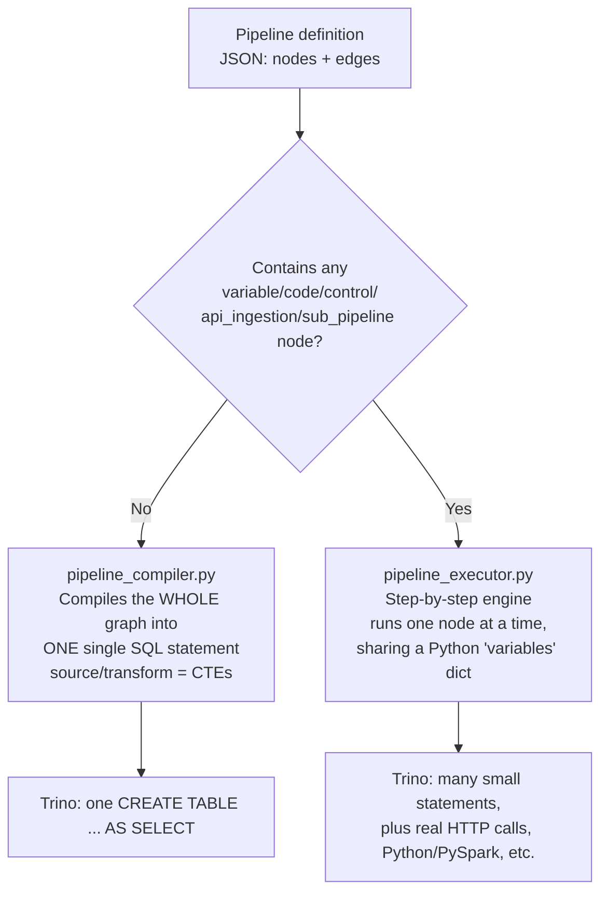
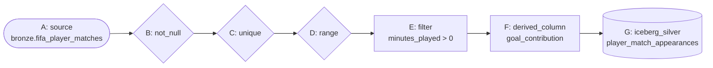

# Part 3 — No-Code Pipeline Builder Fundamentals

**[← Guide index](00-README.md)** · Part 3 of 14 · Previous: [Part 2 — Loading & Exploring Data](02-loading-and-exploring-data.md) · Next: [Part 4 — The 10 Gold Pipelines →](04-gold-pipelines.md)

---

## Chapter 6 — No-Code Pipeline Builder: the fundamentals

**Depends on:** Chapter 3.

### 6.1 What the No-Code Builder is, and the two engines behind it

Open **No-Code Builder** (`/pipelines`). This is a visual, drag-and-drop DAG
editor (built on React Flow) for defining ETL pipelines without writing SQL
by hand — though every pipeline *does* ultimately become real SQL (or a
sequence of real operations) executed against Trino.

There are actually **two different execution engines** behind this one UI,
chosen automatically based on which node kinds you use:

- **Basic node kinds** (`source`, `transform`, `quality`, `destination`) —
  Part 3–4 — always compile into **one single SQL statement** (a CTE
  chain). Fast, atomic, but can't express loops/branches/external calls.
- **Advanced node kinds** (`variable`, `code`, `control`, `api_ingestion`,
  `sub_pipeline`) — Part 6–8 — switch the *entire pipeline* to a
  step-by-step engine the moment even one such node is present.

### 6.2 The builder's UI, piece by piece

- **Node palette** (left): grouped by kind (`source`/`transform`/`quality`/
  `destination`/`variable`/`code`/`control`/`api_ingestion`/`sub_pipeline`).
  Click a group name to fold/unfold it. Every node button is **draggable**
  — drop it anywhere on the canvas to place it exactly there (clicking
  instead places it at a semi-random default position, sometimes hidden
  behind the minimap/controls — use **Fit View** to recover it).
- **Canvas** (center): your pipeline's DAG. Each node renders as a colored,
  icon-coded card: **blue** = source, **emerald** = transform, **amber** =
  quality, **violet** = destination. Draw edges by dragging from a node's
  right-hand handle to another node's left-hand handle.
- **Config panel** (right): appears when you select a node. Shows the
  node's **kind**, **type** (dropdown), a **Label** field, and per-type
  **labeled form fields** (dropdowns/list/dict editors) — not raw JSON,
  though an **Advanced: raw JSON** section always lets you inspect/hand-edit
  the exact same config. The panel header also shows the node's real
  **id** (e.g. `variable_1785717918796_1`) with a one-click **Copy ID**
  button — needed later for any config field that references another node
  by id (`if`/`for_each`/`join`/`union`/`sub_pipeline`).
- **Top bar**: pipeline name, **Save**, **Run**, **View Compiled SQL**
  (basic pipelines only), **Duplicate**, **Delete**, and a **Schedule**
  picker (Part 9).
- **Sidebar collapse**: the whole left app-nav has a **Collapse** button at
  its bottom, for more canvas width on a wide pipeline.

### 6.3 The full list of node types you'll use in this guide

| Kind | Type | Compiles to |
|---|---|---|
| source | `iceberg_table` | reads an existing Iceberg table |
| transform | `select`, `rename`, `filter`, `join`, `union`, `aggregate`, `sort`, `deduplicate`, `cast`, `fill_null`, `replace`, `derived_column`, `window`, `pivot`, `unpivot` | one CTE each |
| quality | `not_null`, `unique`, `range`, `regex`, `row_count`, `freshness` | a standalone violation-count check, gating downstream writes |
| destination | `iceberg_bronze` / `iceberg_silver` / `iceberg_gold` | `CREATE TABLE IF NOT EXISTS ... AS SELECT` |
| variable | `literal`, `from_query` | sets a value in a shared `variables` dict (Part 6) |
| code | `sql`, `python`, `pyspark` | runs one statement/script (Part 6) |
| control | `if`, `for_each` | conditional skip / loop (Part 6) |
| api_ingestion | `rest_get`, `rest_post` | a real outbound HTTP call (Part 6) |
| sub_pipeline | `call` | runs another saved pipeline inline (Part 6) |

You will build a total of **11 basic pipelines** (Part 3–4) exercising
every transform/quality/destination type, then **5 advanced project
pipelines** (Part 7) exercising all 5 advanced kinds — `variable`,
`code`, `control`, `api_ingestion`, `sub_pipeline` — across real,
project-specific use cases (including 2 that deliberately mix basic and
advanced node kinds) rather than one generic demo.

---

## Chapter 7 — Building Bronze → Silver (quality gates in depth)

**Depends on:** Chapters 3, 6.

### 7.1 Why quality gates come *before* transforms

A quality gate's entire purpose is to stop bad data from silently
propagating downstream. Putting them first — checking the **raw** bronze
data — means you catch problems at the earliest possible point, before any
transform has a chance to mask or amplify them.

### 7.2 Build it: `fifa_bronze_to_silver_appearances`

Create a new pipeline named `fifa_bronze_to_silver_appearances` with 7 nodes
chained in a straight line **A → B → C → D → E → F → G**:

| # | Kind | Type | Config JSON | What it checks/does |
|---|---|---|---|---|
| A | source | `iceberg_table` | `{"schema": "bronze", "table": "fifa_player_matches"}` | reads the raw table |
| B | quality | `not_null` | `{"columns": ["player_id", "match_id", "team", "position"]}` | these 4 columns must never be null |
| C | quality | `unique` | `{"columns": ["player_id", "match_id"]}` | no duplicate (player, match) rows |
| D | quality | `range` | `{"column": "pass_accuracy", "min": 0, "max": 1}` | pass accuracy must be a valid 0–1 ratio |
| E | transform | `filter` | `{"condition": "minutes_played > 0"}` | drop ~23,000 unused-substitute rows |
| F | transform | `derived_column` | `{"name": "goal_contribution", "expression": "goals + assists"}` | precompute a reusable metric |
| G | destination | `iceberg_silver` | `{"table": "player_match_appearances"}` | materialize the result |

**Save → View Compiled SQL** first — read through the generated CTE chain
so you understand exactly what will run before you run it (this is a good
habit for every pipeline in this guide). Then **Run**.

**Expected result:** `iceberg.silver.player_match_appearances` with
**31,558 rows** (54,600 minus the 0-minute rows).

> 🧪 **Test it — while the run is `RUNNING`:** open the **Trino UI**
> (http://localhost:8082) → **Query Details** and find the live
> `CREATE TABLE ... AS SELECT` — proof your no-code pipeline compiled to a
> real, inspectable SQL statement with real stage/split progress, not a
> pre-canned "success" response.
>
> 🧪 **Test the delete/duplicate/node-delete UX too:** select node **D**
> (`range`) and press **Delete**/**Backspace** — confirm a confirmation
> prompt appears, then **Cancel** it. Instead, click **Duplicate** (top bar)
> to make a scratch copy of the whole pipeline you can safely experiment on,
> then **Delete** the copy when done.

> **Gotcha:** destinations compile to `CREATE TABLE IF NOT EXISTS ... AS
> SELECT` — re-running a pipeline after its table already exists is a
> silent no-op. Run `DROP TABLE iceberg.silver.player_match_appearances`
> from the SQL page first if you want to force a full rebuild.

---

**[← Guide index](00-README.md)** · Part 3 of 14 · Previous: [Part 2 — Loading & Exploring Data](02-loading-and-exploring-data.md) · Next: [Part 4 — The 10 Gold Pipelines →](04-gold-pipelines.md)
