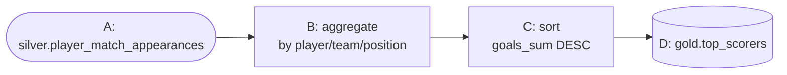
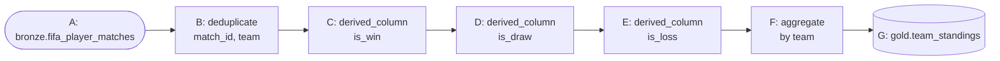
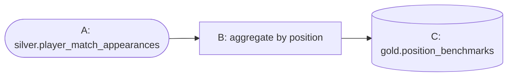
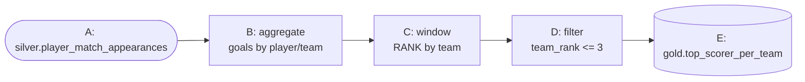
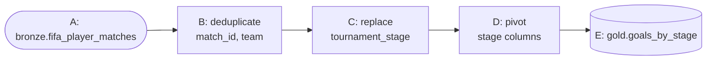
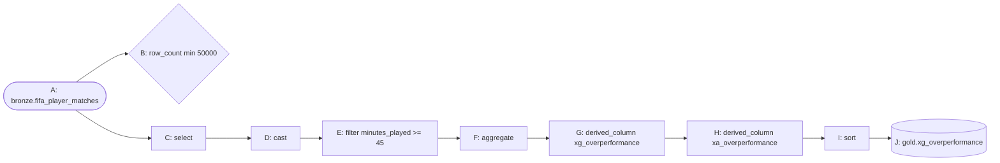
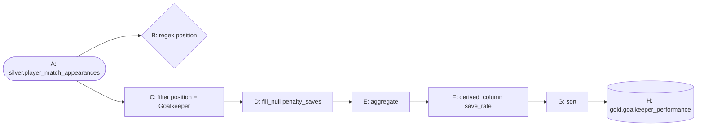
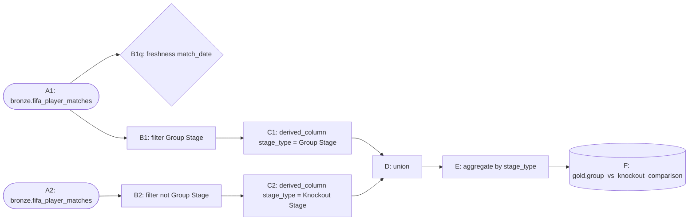
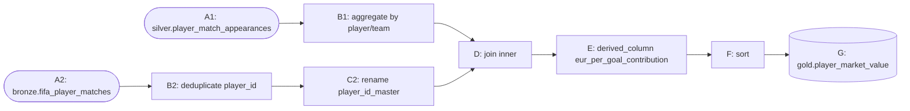
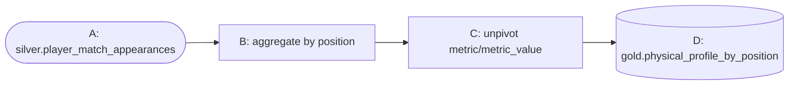

# Part 4 — The 10 Gold Pipelines

**[← Guide index](00-README.md)** · Part 4 of 14 · Previous: [Part 3 — No-Code Pipeline Builder Fundamentals](03-pipeline-builder-fundamentals.md) · Next: [Part 5 — Data Quality, Lineage & ER Diagram →](05-quality-lineage-and-er-diagram.md)

---

## Chapter 8 — Building the 10 Gold pipelines (every transform/quality type)

**Depends on:** [Part 3](03-pipeline-builder-fundamentals.md)'s Chapter 7 (silver table must exist for several of these).

This is the single largest chapter — 10 independent pipelines, deliberately
designed so that by the end you've used **every** transform, quality, and
destination type the compiler implements at least once. Each subsection is
a full pipeline: config table, diagram, expected result, and any gotcha.

### 8.1 `fifa_gold_top_scorers` — aggregate + sort

| # | Kind | Type | Config JSON |
|---|---|---|---|
| A | source | `iceberg_table` | `{"schema": "silver", "table": "player_match_appearances"}` |
| B | transform | `aggregate` | `{"group_by": ["player_id", "player_name", "team", "position"], "aggregations": {"goals": "sum", "assists": "sum", "shots": "sum", "minutes_played": "sum", "player_rating": "avg"}}` |
| C | transform | `sort` | `{"columns": ["goals_sum DESC"]}` |
| D | destination | `iceberg_gold` | `{"table": "top_scorers"}` |



**Concept explained:** `aggregate` output columns follow the
`<input_column>_<function>` naming convention (`goals_sum`, `assists_sum`,
`player_rating_avg`, …) — never the bare input name, since a single column
could be aggregated multiple ways in the same node. `sort` then orders by
one of those generated names. Chain **A→B→C→D**. Expected: **1,248 rows**
(one per player).

### 8.2 `fifa_gold_team_standings` — dedup + multi-step derive + aggregate

Player rows repeat `match_result`/`goals_team`/`goals_opponent` once per
player on that team — you must **dedupe to one row per (match, team)**
before aggregating team-level results, or every sum would be inflated
~22x (26 players per squad).

| # | Kind | Type | Config JSON |
|---|---|---|---|
| A | source | `iceberg_table` | `{"schema": "bronze", "table": "fifa_player_matches"}` |
| B | transform | `deduplicate` | `{"columns": ["match_id", "team"]}` |
| C | transform | `derived_column` | `{"name": "is_win", "expression": "CASE WHEN match_result = 'W' THEN 1 ELSE 0 END"}` |
| D | transform | `derived_column` | `{"name": "is_draw", "expression": "CASE WHEN match_result = 'D' THEN 1 ELSE 0 END"}` |
| E | transform | `derived_column` | `{"name": "is_loss", "expression": "CASE WHEN match_result = 'L' THEN 1 ELSE 0 END"}` |
| F | transform | `aggregate` | `{"group_by": ["team"], "aggregations": {"is_win": "sum", "is_draw": "sum", "is_loss": "sum", "goals_team": "sum", "goals_opponent": "sum"}}` |
| G | destination | `iceberg_gold` | `{"table": "team_standings"}` |



Chain **A→B→C→D→E→F→G**. Expected: **48 rows** (one per team), columns
`team`, `is_win_sum`, `is_draw_sum`, `is_loss_sum`, `goals_team_sum`,
`goals_opponent_sum`.

### 8.3 `fifa_gold_position_benchmarks` — a minimal aggregate

| # | Kind | Type | Config JSON |
|---|---|---|---|
| A | source | `iceberg_table` | `{"schema": "silver", "table": "player_match_appearances"}` |
| B | transform | `aggregate` | `{"group_by": ["position"], "aggregations": {"player_rating": "avg", "pass_accuracy": "avg", "distance_covered_km": "avg", "goals": "sum", "assists": "sum"}}` |
| C | destination | `iceberg_gold` | `{"table": "position_benchmarks"}` |



Chain **A→B→C**. Expected: **4 rows** (Goalkeeper/Defender/Midfielder/Forward)
— the simplest pipeline in the guide, a good baseline to compare the
others against.

### 8.4 `fifa_gold_top_scorer_per_team` — aggregate + window + filter

Introduces **`window`** — a SQL window function attached as a new column,
not a row-reducing aggregate.

| # | Kind | Type | Config JSON |
|---|---|---|---|
| A | source | `iceberg_table` | `{"schema": "silver", "table": "player_match_appearances"}` |
| B | transform | `aggregate` | `{"group_by": ["player_id", "player_name", "team"], "aggregations": {"goals": "sum"}}` |
| C | transform | `window` | `{"name": "team_rank", "expression": "RANK() OVER (PARTITION BY team ORDER BY goals_sum DESC)"}` |
| D | transform | `filter` | `{"condition": "team_rank <= 3"}` |
| E | destination | `iceberg_gold` | `{"table": "top_scorer_per_team"}` |



Chain **A→B→C→D→E**. Expected: **173 rows** — more than 48×3=144 because
`RANK()` gives **tied** players the same rank (e.g. several 0-goal players
tied for rank 1 on a low-scoring team), so ties over-fill the "top 3".

### 8.5 `fifa_gold_goals_by_stage` — dedup + replace + pivot

Introduces **`replace`** (value recoding) and **`pivot`** (rows → columns).

| # | Kind | Type | Config JSON |
|---|---|---|---|
| A | source | `iceberg_table` | `{"schema": "bronze", "table": "fifa_player_matches"}` |
| B | transform | `deduplicate` | `{"columns": ["match_id", "team"]}` |
| C | transform | `replace` | `{"column": "tournament_stage", "cases": {"'Group Stage'": "'Group_Stage'", "'Round of 32'": "'Round_of_32'", "'Round of 16'": "'Round_of_16'", "'Quarter Finals'": "'Quarter_Finals'", "'Semi Finals'": "'Semi_Finals'", "'Third Place Match'": "'Third_Place_Match'"}, "keep": ["match_id", "team", "goals_team"]}` |
| D | transform | `pivot` | `{"group_by": ["team"], "pivot_column": "tournament_stage", "value_column": "goals_team", "values": ["'Group_Stage'", "'Round_of_32'", "'Round_of_16'", "'Quarter_Finals'", "'Semi_Finals'", "'Final'", "'Third_Place_Match'"], "agg": "sum"}` |
| E | destination | `iceberg_gold` | `{"table": "goals_by_stage"}` |



Chain **A→B→C→D→E**. Expected: **48 rows**, one per team, with a column
per tournament stage holding total goals scored in it.

> **Gotcha:** `pivot` turns each `values` entry into a column name via
> `CASE WHEN pivot_column = value THEN ... END`, and that generated alias
> must be a valid SQL identifier. `tournament_stage`'s raw values (e.g.
> "Group Stage") contain spaces and would break this. That's why step C's
> `replace` recodes every stage name to an underscored form first (`Final`
> already has no space, so it's simply passed through by the `ELSE` branch,
> not listed in `cases`) — always sanitize categorical values into valid
> identifiers **before** pivoting on them.

### 8.6 `fifa_gold_xg_overperformance` — select + cast + row_count gate

A finishing-quality metric: how many more (or fewer) goals a player scored
than their shots' quality (`expected_goals_xg`) predicted. Introduces
**`select`** (explicit column projection), **`cast`** (type coercion), and
the **`row_count`** quality gate (a numeric bound, not a violations count).

| # | Kind | Type | Config JSON |
|---|---|---|---|
| A | source | `iceberg_table` | `{"schema": "bronze", "table": "fifa_player_matches"}` |
| B | quality | `row_count` | `{"min": 50000}` |
| C | transform | `select` | `{"columns": ["player_id", "player_name", "team", "position", "goals", "expected_goals_xg", "assists", "expected_assists_xa", "minutes_played"]}` |
| D | transform | `cast` | `{"casts": {"expected_goals_xg": "DOUBLE", "expected_assists_xa": "DOUBLE"}, "keep": ["player_id", "player_name", "team", "position", "goals", "assists", "minutes_played"]}` |
| E | transform | `filter` | `{"condition": "minutes_played >= 45"}` |
| F | transform | `aggregate` | `{"group_by": ["player_id", "player_name", "team", "position"], "aggregations": {"goals": "sum", "expected_goals_xg": "sum", "assists": "sum", "expected_assists_xa": "sum", "minutes_played": "sum"}}` |
| G | transform | `derived_column` | `{"name": "xg_overperformance", "expression": "goals_sum - expected_goals_xg_sum"}` |
| H | transform | `derived_column` | `{"name": "xa_overperformance", "expression": "assists_sum - expected_assists_xa_sum"}` |
| I | transform | `sort` | `{"columns": ["xg_overperformance DESC"]}` |
| J | destination | `iceberg_gold` | `{"table": "xg_overperformance"}` |



**Note the branch shape:** `B` and `C` both connect **from `A`** — the
quality gate runs *in parallel* with the main branch, not inline in it (a
quality node never transforms rows, only checks and gates). Then
**C→D→E→F→G→H→I→J**. Positive `xg_overperformance` = clinical finisher
(scored more than expected); negative = wasteful.

### 8.7 `fifa_gold_goalkeeper_performance` — regex gate + filter + fill_null

Goalkeepers have their own stat block (`saves`, `save_percentage`,
`clean_sheet`, `goals_conceded`, `penalty_saves`) mostly zero for outfield
players — worth its own gold table. Introduces the **`regex`** quality gate
and **`fill_null`**.

| # | Kind | Type | Config JSON |
|---|---|---|---|
| A | source | `iceberg_table` | `{"schema": "silver", "table": "player_match_appearances"}` |
| B | quality | `regex` | `{"column": "position", "pattern": "^(Goalkeeper\|Defender\|Midfielder\|Forward)$"}` |
| C | transform | `filter` | `{"condition": "position = 'Goalkeeper'"}` |
| D | transform | `fill_null` | `{"fills": {"penalty_saves": "0"}, "keep": ["player_id", "player_name", "team", "saves", "goals_conceded", "clean_sheet"]}` |
| E | transform | `aggregate` | `{"group_by": ["player_id", "player_name", "team"], "aggregations": {"saves": "sum", "goals_conceded": "sum", "clean_sheet": "sum", "penalty_saves": "sum"}}` |
| F | transform | `derived_column` | `{"name": "save_rate", "expression": "CAST(saves_sum AS DOUBLE) / NULLIF(saves_sum + goals_conceded_sum, 0)"}` |
| G | transform | `sort` | `{"columns": ["clean_sheet_sum DESC"]}` |
| H | destination | `iceberg_gold` | `{"table": "goalkeeper_performance"}` |



Chain: `B` connects from `A` (parallel gate); **A→C→D→E→F→G→H**. `regex`
confirms every `position` value matches the 4 allowed labels (0 violations
expected — this catches a bad source value *before* it corrupts a filter
downstream). `fill_null` compiles to `COALESCE(penalty_saves, 0)` — 0
violations here too since the source CSV has no true nulls, but the
mechanism is fully real. `save_rate = saves / (saves + goals_conceded)`.

### 8.8 `fifa_gold_group_vs_knockout_comparison` — two branches + union

Compares average performance in the low-stakes Group Stage against every
knockout round, using **two independent branches off the same source
table** joined back together with `union` — the first pipeline in this
guide whose graph is *not* a straight line. Also introduces the
**`freshness`** quality gate.

| # | Kind | Type | Config JSON |
|---|---|---|---|
| A1 | source | `iceberg_table` | `{"schema": "bronze", "table": "fifa_player_matches"}` |
| B1q | quality | `freshness` | `{"column": "CAST(match_date AS TIMESTAMP)", "max_age_minutes": 129600}` |
| B1 | transform | `filter` | `{"condition": "tournament_stage = 'Group Stage'"}` |
| C1 | transform | `derived_column` | `{"name": "stage_type", "expression": "'Group Stage'"}` |
| A2 | source | `iceberg_table` | `{"schema": "bronze", "table": "fifa_player_matches"}` |
| B2 | transform | `filter` | `{"condition": "tournament_stage <> 'Group Stage'"}` |
| C2 | transform | `derived_column` | `{"name": "stage_type", "expression": "'Knockout Stage'"}` |
| D | transform | `union` | `{"union_node": "C2"}` |
| E | transform | `aggregate` | `{"group_by": ["stage_type"], "aggregations": {"goals": "avg", "assists": "avg", "player_rating": "avg", "pass_accuracy": "avg", "minutes_played": "avg"}}` |
| F | destination | `iceberg_gold` | `{"table": "group_vs_knockout_comparison"}` |



Two parallel chains **A1→B1→C1** (with `B1q` also connected from `A1` as a
passthrough gate alongside the main branch) and **A2→B2→C2**, both feeding
`D` — draw an edge from **both** `C1→D` and `C2→D`; `D`'s `union_node`
config points at `C2`, and the edge from `C1` supplies `D`'s main upstream
input. Then **D→E→F**. Expected: **2 rows** (`Group Stage`, `Knockout
Stage`). `B1q`'s `freshness` gate checks no `match_date` is older than
129,600 minutes (90 days) — a pattern more suited to a live/streaming
source than this historical dataset, but its mechanism (and "0 violations"
pass) is real and demonstrated here regardless.

> **Gotcha (type mismatch, only surfaces on Run):** `match_date` is ingested
> as `VARCHAR` (e.g. `"2026-07-10"`), and `freshness` does a raw
> `WHERE {column} < current_timestamp - INTERVAL '...' MINUTE` comparison —
> a bare `varchar` column fails with Trino's
> `TYPE_MISMATCH: Cannot apply operator: varchar < timestamp(3) with time zone`.
> The `column` config value isn't restricted to a plain column name though
> — it's interpolated directly into the generated SQL — so
> `CAST(match_date AS TIMESTAMP)` (used above) fixes it. Dry-run **Compile**
> only validates the graph/config shape, not real column types against the
> live table, so this kind of error only appears on an actual **Run**.

> **Gotcha:** `union` needs *matching column order* on both sides (Trino's
> `UNION ALL` is positional, not name-based). Both branches here start from
> the same source and each adds exactly one derived column at the end, so
> their column lists line up automatically — for differently-shaped
> branches, add a `select` node on each side first to force identical
> column lists/order.

### 8.9 `fifa_gold_player_market_value` — join two branches + rename

Joins each player's aggregated on-pitch output (from Silver) against their
static bio/market attributes (from Bronze) — the first pipeline combining
two different aggregation levels via **`join`** instead of `union`.

| # | Kind | Type | Config JSON |
|---|---|---|---|
| A1 | source | `iceberg_table` | `{"schema": "silver", "table": "player_match_appearances"}` |
| B1 | transform | `aggregate` | `{"group_by": ["player_id", "player_name", "team"], "aggregations": {"goals": "sum", "assists": "sum", "goal_contribution": "sum", "minutes_played": "sum"}}` |
| A2 | source | `iceberg_table` | `{"schema": "bronze", "table": "fifa_player_matches"}` |
| B2 | transform | `deduplicate` | `{"columns": ["player_id"]}` |
| C2 | transform | `rename` | `{"mapping": {"player_id": "player_id_master"}, "keep": ["age", "nationality", "market_value_eur", "club_name", "preferred_foot"]}` |
| D | transform | `join` | `{"right_node": "C2", "on": "n_B1.player_id = n_C2.player_id_master", "join_type": "inner"}` |
| E | transform | `derived_column` | `{"name": "eur_per_goal_contribution", "expression": "CASE WHEN goal_contribution_sum > 0 THEN market_value_eur / goal_contribution_sum ELSE NULL END"}` |
| F | transform | `sort` | `{"columns": ["market_value_eur DESC"]}` |
| G | destination | `iceberg_gold` | `{"table": "player_market_value"}` |



Chain **A1→B1** (left branch, per-player stats) and **A2→B2→C2** (right
branch, one row per player's bio data), both feeding **D** (edge `B1→D`
sets `D`'s main input; edge `C2→D` ensures `C2` is compiled before `D`
references it in `right_node`). Then **D→E→F→G**.

> **Gotcha (important):** the `join` node's `on` condition must reference
> the compiler's own generated CTE aliases, always `n_<node id>` — that's
> why `on` reads `n_B1.player_id = n_C2.player_id_master`, using each
> node's real **id** (copied from its config panel, [Part 3, §6.2](03-pipeline-builder-fundamentals.md)), not its label.
> Also note `C2` renames `player_id` → `player_id_master` on the right side
> *before* the join, since both branches otherwise have a `player_id`
> column and an un-renamed `SELECT *` join would produce two ambiguous
> same-named output columns.

### 8.10 `fifa_gold_physical_profile_by_position` — unpivot to long format

Turns 4 wide per-position physical-metric columns into one tidy
`(position, metric, metric_value)` table — the shape Superset needs for a
faceted/small-multiples chart, and the mirror image of `pivot` (§8.5).

| # | Kind | Type | Config JSON |
|---|---|---|---|
| A | source | `iceberg_table` | `{"schema": "silver", "table": "player_match_appearances"}` |
| B | transform | `aggregate` | `{"group_by": ["position"], "aggregations": {"distance_covered_km": "avg", "sprint_distance_km": "avg", "top_speed_kmh": "avg", "stamina_score": "avg"}}` |
| C | transform | `unpivot` | `{"id_columns": ["position"], "value_columns": ["distance_covered_km_avg", "sprint_distance_km_avg", "top_speed_kmh_avg", "stamina_score_avg"], "key_name": "metric", "value_name": "metric_value"}` |
| D | destination | `iceberg_gold` | `{"table": "physical_profile_by_position"}` |



Chain **A→B→C→D**. Expected: **16 rows** (4 positions × 4 metrics) — one
long, narrow table instead of a wide 5-column one.

### 8.11 Verify all 10 gold tables

```sql
SELECT * FROM iceberg.gold.top_scorers ORDER BY goals_sum DESC LIMIT 10;
SELECT * FROM iceberg.gold.team_standings ORDER BY is_win_sum DESC;
SELECT * FROM iceberg.gold.position_benchmarks;
SELECT * FROM iceberg.gold.top_scorer_per_team WHERE team = 'Spain';
SELECT * FROM iceberg.gold.goals_by_stage;
SELECT * FROM iceberg.gold.xg_overperformance ORDER BY xg_overperformance DESC LIMIT 10;
SELECT * FROM iceberg.gold.goalkeeper_performance ORDER BY clean_sheet_sum DESC;
SELECT * FROM iceberg.gold.group_vs_knockout_comparison;
SELECT * FROM iceberg.gold.player_market_value ORDER BY market_value_eur DESC LIMIT 10;
SELECT * FROM iceberg.gold.physical_profile_by_position;
```

---

**[← Guide index](00-README.md)** · Part 4 of 14 · Previous: [Part 3 — No-Code Pipeline Builder Fundamentals](03-pipeline-builder-fundamentals.md) · Next: [Part 5 — Data Quality, Lineage & ER Diagram →](05-quality-lineage-and-er-diagram.md)
