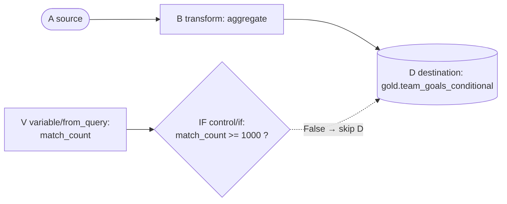

# Part 6 — Advanced Pipeline Engine: Fundamentals

**[← Guide index](00-README.md)** · Part 6 of 14 · Previous: [Part 5 — Data Quality, Lineage & ER Diagram](05-quality-lineage-and-er-diagram.md) · Next: [Part 7 — Advanced Pipeline Engine: 5 Project Pipelines →](07-advanced-pipeline-project-pipelines.md)

---

## Chapter 12 — The Advanced Pipeline Execution Engine

**Depends on:** [Part 3](03-pipeline-builder-fundamentals.md) Chapter 6 (builder fundamentals), Chapter 7 (silver table),
[Part 4](04-gold-pipelines.md) Chapter 8 (all 10 gold tables — this chapter's pipelines directly
reuse/extend them, they are not generic toy demos).

This is the most powerful — and most different — part of the No-Code
Builder, and gets the deepest treatment in this guide because it's easy to
misuse if you don't understand its execution model. Rather than one
abstract "kick the tires" walkthrough, this chapter builds **five real
pipelines that plug into the FIFA project you already built** — including
two that deliberately *mix* basic and advanced node kinds together. This
part covers the mental model and reference tables; the five pipelines
themselves are built in [Part 7](07-advanced-pipeline-project-pipelines.md), and the execution-order rule plus real bugs
found are covered in [Part 8](08-advanced-pipeline-execution-rules-and-bugs.md).

| § | Pipeline | Advanced nodes used | What it actually does for this project |
|---|---|---|---|
| 12.4 | `fifa_adv_scouting_report` | `variable`, `code/sql`, `control/for_each`, `control/if` | Dynamically finds this tournament's current top-5 rated teams (no hardcoded team names) and writes a live scouting stat line per team, with an automated row-count health check |
| 12.5 | `fifa_adv_market_value_usd_enrichment` | `api_ingestion`, `code/python`, `code/sql` | Calls a real live foreign-exchange API and re-denominates §8.9's `gold.player_market_value` table into USD, at the actual rate in effect right now |
| 12.6 | `fifa_master_orchestration` | `sub_pipeline` (×11) | Rebuilds the **entire** medallion chain (silver + all 10 gold marts from Chapters 7–8) in one click, in the correct dependency order, without opening Dagster |
| 12.7 | `fifa_adv_milestone_alert_pipeline` **(mixed)** | `source`/`transform`/`quality`/`destination` **+** `variable`, `control/if`, `api_ingestion` | A real basic ETL chain (like Chapter 8's) whose freshly-written gold table feeds an advanced tail that conditionally fires a real webhook alert |
| 12.8 | `fifa_adv_team_health_scorecard` | `variable`, `code/sql` ×2 loop body, `control/for_each`, `code/python`, `control/if`, `api_ingestion` | Scores all 48 teams with a two-step, stateful loop body that accumulates a running classification, then conditionally alerts |

Every node type reference table you need while building these lives in
§12.3. Read §12.1–§12.3 once for the mental model, then build 12.4–12.8 in
order ([Part 7](07-advanced-pipeline-project-pipelines.md); 12.6 reuses pipeline names from Chapters 7–8, so those must already
exist).

### 12.1 The mental model: shared variables, not shared SQL

Recall from Chapter 6 ([Part 3](03-pipeline-builder-fundamentals.md), §6.1): the moment a pipeline contains **any** `variable`/`code`/
`control`/`api_ingestion`/`sub_pipeline` node, the *entire* pipeline stops
compiling to one SQL statement and instead runs through
`pipeline_executor.py` — a step-by-step engine that executes nodes **one at
a time**, in a computed order, each node able to read and write one shared
Python dictionary called `variables`.

```mermaid
flowchart TD
    subgraph "Advanced pipeline run"
    direction TB
    V1[variable: literal\nsets variables['min_minutes'] = 1] --> C1[code: sql\nreads {{min_minutes}},\nsets variables['appearance_count']]
    C1 --> API[api_ingestion: rest_get\nsets variables['iceberg_repo_info']]
    API --> V2[variable: from_query\nsets variables['teams_json'] = real list]
    V2 --> FE[control: for_each\nloops variables['teams_json'],\nre-runs body node per item]
    FE --> IF[control: if\nreads variables['appearance_count'],\nskips true_/false_skip_nodes]
    IF --> COND[code: sql\nif-branch target]
    COND --> SUB[sub_pipeline: call\nruns another saved pipeline,\nsharing this same variables dict]
    end
```

This is fundamentally different from the basic-node model ([Part 3](03-pipeline-builder-fundamentals.md)–[Part 4](04-gold-pipelines.md)'s), where
nodes only communicate through **columns flowing through CTEs**. Here,
nodes communicate through **named variables**, and there is no "row-level"
data flowing between them at all (until a `code`/`sql` node queries a real
table).

**Can you mix basic and advanced node kinds in the same pipeline?** Yes —
confirmed directly in `pipeline_executor.py`'s `_run_simple_node`, which
still fully handles `source`/`transform`/`quality`/`destination` nodes
inside the step-by-step engine (each just becomes its own materialized
Trino view/table instead of a CTE). Two rules follow from that:

- **Basic nodes still need real edges between them** — `source→transform→
  quality→destination` edges are how they pass data (via view aliases),
  exactly as in Chapters 7–8. Only *advanced-to-advanced* edges are
  order-only/optional ([Part 8](08-advanced-pipeline-execution-rules-and-bugs.md), §12.9) — basic-to-basic (and basic-to-advanced)
  edges still carry real meaning.
- **An advanced node can control a basic one.** An `if` node's
  `true_skip_nodes`/`false_skip_nodes` can name a `destination` node's id —
  letting you conditionally skip a real gold-table write based on a
  variable, e.g. one computed via `api_ingestion` or `variable/from_query`.

**Worked example — a conditional publish gate:**

| # | Kind | Type | Config JSON |
|---|---|---|---|
| A | source | `iceberg_table` | `{"schema": "silver", "table": "player_match_appearances"}` |
| B | transform | `aggregate` | `{"group_by": ["team"], "aggregations": {"goals": "sum"}}` |
| D | destination | `iceberg_gold` | `{"table": "team_goals_conditional"}` |
| V | variable | `from_query` | `{"name": "match_count", "query": "SELECT COUNT(DISTINCT match_id) FROM iceberg.bronze.fifa_player_matches"}` |
| IF | control | `if` | `{"condition": "match_count >= 1000", "true_skip_nodes": [], "false_skip_nodes": ["<D's id>"]}` |



Add nodes to the canvas in the order **A, B, D, V, IF**, with the ordinary
`A→B→D` edges drawn but **no edge at all** from `V`/`IF` to anything
([Part 8](08-advanced-pipeline-execution-rules-and-bugs.md)'s §12.9 rule for advanced nodes). `D` inherits an incoming edge from `B`,
so it's deferred to the end of the top-level execution queue — which is
exactly what makes this safe: `V` and `IF` (both zero-indegree) run *before*
`D`'s turn comes up, so `IF`'s skip decision is already registered by the
time the engine would otherwise write to `D`. If `match_count < 1000`
(condition `False`), `false_skip_nodes` applies and `D` is **SKIPPED** —
`gold.team_goals_conditional` simply doesn't get (re)written that run.

### 12.2 RBAC for this engine

Running (not just creating/saving) a pipeline containing a `python`/
`pyspark` **code** node requires `ADMIN` or `DATA_ENGINEER` — the same
trust level as the PySpark Code Explorer mode ([Part 2](02-loading-and-exploring-data.md), §5.2), since it executes
arbitrary code server-side. A `VIEWER`/`ANALYST` account gets a clean 403,
checked server-side **before** the run is even created — not just a
disabled button in the UI.

### 12.3 Node-type quick reference

Consult this while building §12.4–§12.8 ([Part 7](07-advanced-pipeline-project-pipelines.md)) — it won't repeat itself in each
walkthrough.

| Kind | Type | Key config fields | What it does internally |
|---|---|---|---|
| `variable` | `literal` | `name`, `value` | Sets `variables[name] = value` as a **plain string**, always — even if `value` looks like a number/list. Supports `{{other_var}}` templating in `value`. |
| `variable` | `from_query` | `name`, `query` | Runs `query` against Trino, stores the **first cell of the first row** into `variables[name]`. This is the **only** way to get a real Python **list** — a Trino `ARRAY` result (e.g. from `ARRAY_AGG(...)`) decodes as a native list, not a string. |
| `code` | `sql` | `query`, `result_variable` (optional) | Runs `query` **verbatim** — any statement (`SELECT`/`INSERT`/`CREATE`/`DROP`, anything Trino accepts), with `{{var}}` templating. If it returns rows and `result_variable` is set, stores the first row's first cell (or the whole first row as a list, if multi-column). |
| `code` | `python` | `code` | Runs `exec()` on `code` with only a `variables` dict bound (by reference — mutations persist). **No Trino cursor is exposed to this node type** — it can only compute over data already sitting in `variables` (e.g. parse a prior `api_ingestion` response). Captured stdout/stderr becomes the run's message. |
| `code` | `pyspark` | `code` | Same as `python`, but also gets a live shared Spark session (same infra as §5.2). Can run real Spark jobs and write results back into `variables`. |
| `api_ingestion` | `rest_get` / `rest_post` | `url`, `headers`, `json_body`, `result_variable` | A real `httpx` HTTP call from the backend container. The parsed JSON response (dict/list) is stored directly into `variables[result_variable]` — not stringified. |
| `control` | `if` | `condition`, `true_skip_nodes`, `false_skip_nodes` | Evaluates `condition` as a restricted `eval()` (no builtins/functions — only variable names from `variables`, literals, comparisons, operators, indexing). Skips the node ids in `true_skip_nodes` when `condition` is `True`, or `false_skip_nodes` when `False`. |
| `control` | `for_each` | `items_variable`, `item_variable` (default `item`), `body_node_ids` | Iterates the list in `variables[items_variable]`, re-running every id in `body_node_ids` once per item (with `variables[item_variable]` set to the current item). Body node ids are automatically excluded from the pipeline's normal top-level run. |
| `sub_pipeline` | `call` | `pipeline_id`, `pass_variables` (default `true`) | Looks up another saved pipeline by UUID and runs it **inline**, in the same Trino session/run. When `pass_variables` is `true`, the sub-pipeline reads/writes the **same** `variables` dict. A call-stack guard blocks (in)direct self-calls. |

> **Finding a node's id / another pipeline's UUID:** every node's config
> panel has a **Copy ID** button ([Part 3](03-pipeline-builder-fundamentals.md), §6.2) — that's what goes into
> `body_node_ids`/`true_skip_nodes`/etc. For another *pipeline's* UUID (for
> `sub_pipeline`), the builder has no picker — look it up directly:
> ```powershell
> docker compose exec postgres psql -U openlakehouse -d openlakehouse -c "select id, name from pipelines where name='<pipeline_name>';"
> ```

---

**[← Guide index](00-README.md)** · Part 6 of 14 · Previous: [Part 5 — Data Quality, Lineage & ER Diagram](05-quality-lineage-and-er-diagram.md) · Next: [Part 7 — Advanced Pipeline Engine: 5 Project Pipelines →](07-advanced-pipeline-project-pipelines.md)
