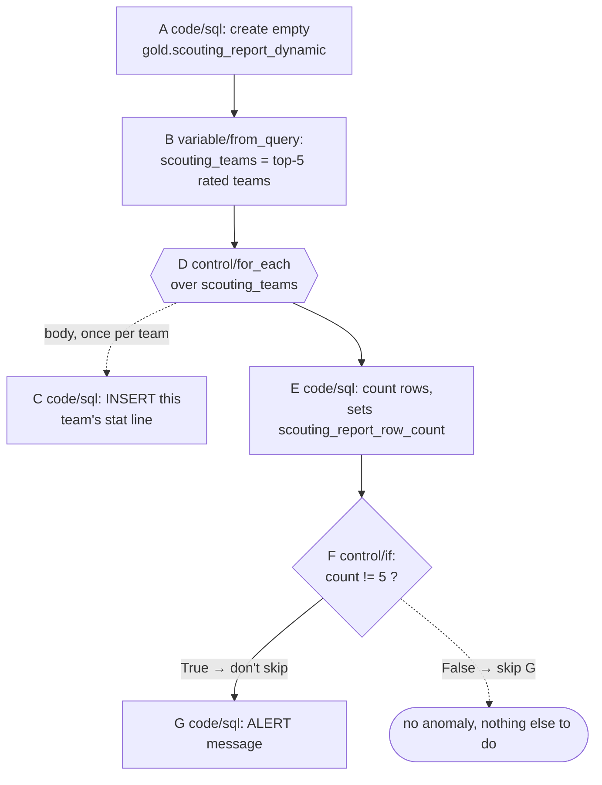
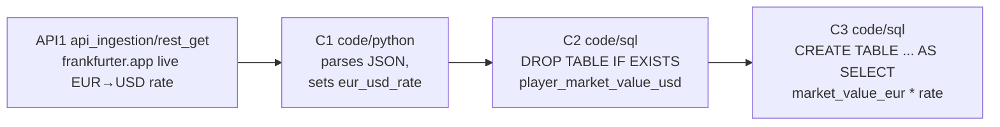
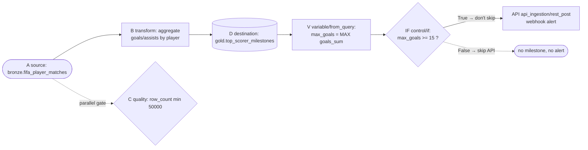
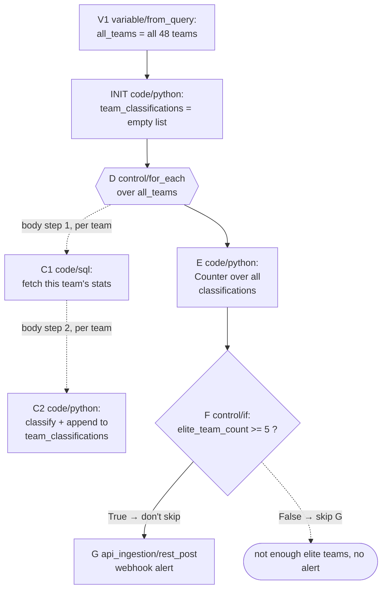

# Part 7 — Advanced Pipeline Engine: 5 Project Pipelines

**[← Guide index](00-README.md)** · Part 7 of 14 · Previous: [Part 6 — Advanced Pipeline Engine: Fundamentals](06-advanced-pipeline-engine-fundamentals.md) · Next: [Part 8 — Advanced Pipeline Engine: Execution Rules & Real Bugs →](08-advanced-pipeline-execution-rules-and-bugs.md)

---

This part continues [Chapter 12](06-advanced-pipeline-engine-fundamentals.md) — read its mental model (§12.1), RBAC note (§12.2), and
node-type reference (§12.3) first if you haven't already. Here you'll build
all 5 project pipelines listed in that chapter's summary table.

### 12.4 Project pipeline A — `fifa_adv_scouting_report` (dynamic per-team scouting report)

**The real problem this solves:** [Part 4](04-gold-pipelines.md)'s Chapter 8 gold pipelines all target a
**fixed** shape (every team, every position). A scouting department instead
wants a report on *whichever teams are performing best right now* —
computed fresh each run, with no hardcoded team names — plus an automatic
check that the report actually got written correctly. That "figure out
*which* teams, then loop, then self-check" shape is exactly what
`variable`/`for_each`/`if` are for.

| # | Kind | Type | Config JSON |
|---|---|---|---|
| A | code | `sql` | `{"query": "CREATE TABLE IF NOT EXISTS iceberg.gold.scouting_report_dynamic AS SELECT team, CAST(NULL AS BIGINT) AS matches, CAST(NULL AS BIGINT) AS goals, CAST(NULL AS BIGINT) AS assists, CAST(NULL AS DOUBLE) AS avg_rating FROM iceberg.silver.player_match_appearances WHERE 1=0"}` |
| B | variable | `from_query` | `{"name": "scouting_teams", "query": "SELECT ARRAY_AGG(team ORDER BY avg_rating DESC) FROM (SELECT team, AVG(player_rating) AS avg_rating FROM iceberg.silver.player_match_appearances GROUP BY team ORDER BY avg_rating DESC LIMIT 5)"}` |
| C *(loop body — not on canvas top level)* | code | `sql` | `{"query": "INSERT INTO iceberg.gold.scouting_report_dynamic SELECT team, COUNT(DISTINCT match_id) AS matches, SUM(goals) AS goals, SUM(assists) AS assists, AVG(player_rating) AS avg_rating FROM iceberg.silver.player_match_appearances WHERE team = '{{scout_team}}' GROUP BY team"}` |
| D | control | `for_each` | `{"items_variable": "scouting_teams", "item_variable": "scout_team", "body_node_ids": ["<C's id>"]}` |
| E | code | `sql` | `{"query": "SELECT COUNT(*) FROM iceberg.gold.scouting_report_dynamic", "result_variable": "scouting_report_row_count"}` |
| F | control | `if` | `{"condition": "scouting_report_row_count != 5", "true_skip_nodes": [], "false_skip_nodes": ["<G's id>"]}` |
| G | code | `sql` | `{"query": "SELECT 'ALERT: scouting_report_dynamic has {{scouting_report_row_count}} rows, expected 5' AS message", "result_variable": "alert_message"}` |



> **Build order matters more than edges here.** Add nodes to the canvas in
> exactly this order — **A, B, C, D, E, F, G** — and **draw no edges at
> all** between them (per [Part 8](08-advanced-pipeline-execution-rules-and-bugs.md)'s §12.9 rule, they're all `variable`/`code`/
> `control` kinds that only need the shared `variables` dict, not edges).
> With zero edges, every one of A/B/D/E/F/G is "zero-indegree" and the
> engine runs them in exactly the order they appear in the pipeline's node
> array — which is why the creation order above is not cosmetic.

**Expected result:** `A` creates `gold.scouting_report_dynamic` (0 rows,
correct schema). `B` resolves the real top-5 teams by average
`player_rating` into `variables['scouting_teams']` — a genuine 5-element
Python list (via `ARRAY_AGG`, per §12.3's `from_query` mechanism, not a
hardcoded literal). `D` reports **"Iterated 5 item(s) over
'scouting_teams'"**, having run `C` five times — once per team, each time
with `{{scout_team}}` correctly templated to that iteration's team name,
inserting one real aggregated row. `E` reports **"Query executed"** with
`scouting_report_row_count = 5`. `F` reports **"Condition evaluated to
False"** (5 != 5 is false) — so `false_skip_nodes` applies and `G` is
**SKIPPED**, meaning the alert correctly never fires when the report is
healthy. Query the result:

```sql
SELECT * FROM iceberg.gold.scouting_report_dynamic ORDER BY avg_rating DESC;
```

> 🧪 **Test the alert path for real:** temporarily change `D`'s
> `items_variable` list by editing `B`'s query to `LIMIT 4` instead of
> `LIMIT 5` (so only 4 rows get inserted), re-run. `F` now evaluates
> **"Condition evaluated to True"** (`4 != 5`), so `true_skip_nodes` (empty)
> applies and `G` **runs**, its message literally reading `"ALERT:
> scouting_report_dynamic has 4 rows, expected 5"` — proof the `{{var}}`
> template substitution works inside a `code/sql` node's query string, not
> just in table/column references. Set `LIMIT` back to `5` and `DROP TABLE
> iceberg.gold.scouting_report_dynamic` before re-running cleanly.

> **Limitation worth knowing:** the Lineage graph ([Part 5](05-quality-lineage-and-er-diagram.md), Chapter 10) only derives
> edges from `iceberg_table`/`iceberg_bronze`/`iceberg_silver`/`iceberg_gold`
> *node kinds* — it has no idea `scouting_report_dynamic` exists, because
> it was created by a plain `code/sql` statement, not a `destination` node.
> Any table an advanced pipeline creates via raw SQL is **invisible to
> Lineage** — a real gap, not a bug, since Lineage is definition-derived,
> not a live catalog scan.

### 12.5 Project pipeline B — `fifa_adv_market_value_usd_enrichment` (live FX-rate enrichment)

**The real problem this solves:** [Part 4](04-gold-pipelines.md)'s §8.9 `gold.player_market_value` table
prices every player in EUR (the CSV's native currency), which is unusable
for a USD-speaking stakeholder without a currency conversion — and a
conversion rate hardcoded at build time goes stale immediately. This
pipeline calls a **real, live exchange-rate API** at run time and produces
a second, USD-denominated version of that same gold table using whatever
the rate actually is *right now*.

| # | Kind | Type | Config JSON |
|---|---|---|---|
| API1 | api_ingestion | `rest_get` | `{"url": "https://api.frankfurter.app/latest?from=EUR&to=USD", "result_variable": "fx_response"}` |
| C1 | code | `python` | `{"code": "rate = variables['fx_response']['rates']['USD']\nvariables['eur_usd_rate'] = rate\nprint(f'EUR/USD rate resolved to {rate}')"}` |
| C2 | code | `sql` | `{"query": "DROP TABLE IF EXISTS iceberg.gold.player_market_value_usd"}` |
| C3 | code | `sql` | `{"query": "CREATE TABLE iceberg.gold.player_market_value_usd AS SELECT *, market_value_eur * {{eur_usd_rate}} AS market_value_usd FROM iceberg.gold.player_market_value"}` |



Draw real edges **API1→C1→C2→C3** here — this is safe (unlike §12.4)
*because it's the pipeline's only chain*: there is no other independent
zero-indegree advanced node competing for the front of the execution
queue, so the edges simply enforce the one order that was already correct
(see [Part 8](08-advanced-pipeline-execution-rules-and-bugs.md), §12.9, for exactly when edges are/aren't safe).

**Expected result:** `API1` calls the free, no-API-key
[frankfurter.app](https://frankfurter.app) exchange-rate API and stores the
parsed JSON (e.g. `{"amount": 1, "base": "EUR", "date": "...", "rates":
{"USD": 1.08}}`) into `variables['fx_response']` — status **SUCCESS**,
message **"Stored response in variable 'fx_response'"**. `C1` has no
Trino access (per §12.3 — `python` nodes only see `variables`), reads the
nested `rates.USD` value, and prints `"EUR/USD rate resolved to 1.08"` (or
whatever today's real rate is) as its message. `C2`/`C3` then run two plain
SQL statements that rebuild `gold.player_market_value_usd` from scratch
each run, at today's real rate:

```sql
SELECT player_name, team, market_value_eur, market_value_usd
FROM iceberg.gold.player_market_value_usd
ORDER BY market_value_eur DESC LIMIT 10;
```

> **If your environment has no outbound internet access**, swap `API1`'s
> `url` for any reachable JSON exchange-rate/reference API you have — the
> mechanism (real HTTP call → parse in `python` → use the result in `sql`)
> is the point, not this specific provider.

> **Gotcha:** `C1` is a `python` node, not `sql` — it genuinely cannot run
> `SELECT`/`INSERT` itself (no cursor is bound into its namespace, per
> §12.3's table). If you need a `python`/`pyspark` node to *also* touch
> real Iceberg data, that's exactly what the `pyspark` type is for (it gets
> a live Spark session) — `python` is Trino-blind by design, pure
> in-memory computation over already-fetched `variables`.

### 12.6 Project pipeline C — `fifa_master_orchestration` (one-click full medallion rebuild)

**The real problem this solves:** rebuilding the whole project from a clean
slate today means opening 11 pipelines one at a time ([Part 3](03-pipeline-builder-fundamentals.md), §7; [Part 4](04-gold-pipelines.md), §8.1–§8.10) and
clicking **Run** on each, in the right order, by hand. `sub_pipeline` lets
you compose all 11 into **one** pipeline that reruns the entire medallion
chain — bronze → silver → all 10 gold marts — with a single click, no
Dagster job needed (though [Part 9](09-orchestration-and-bi-dashboards.md)'s Chapter 13 remains the right tool for
**scheduled**/cron runs — this is for on-demand "rebuild everything now").

| # | Kind | Type | Config JSON |
|---|---|---|---|
| S1 | sub_pipeline | `call` | `{"pipeline_id": "<UUID of fifa_bronze_to_silver_appearances>", "pass_variables": false}` |
| S2 | sub_pipeline | `call` | `{"pipeline_id": "<UUID of fifa_gold_top_scorers>", "pass_variables": false}` |
| S3 | sub_pipeline | `call` | `{"pipeline_id": "<UUID of fifa_gold_team_standings>", "pass_variables": false}` |
| S4 | sub_pipeline | `call` | `{"pipeline_id": "<UUID of fifa_gold_position_benchmarks>", "pass_variables": false}` |
| S5 | sub_pipeline | `call` | `{"pipeline_id": "<UUID of fifa_gold_top_scorer_per_team>", "pass_variables": false}` |
| S6 | sub_pipeline | `call` | `{"pipeline_id": "<UUID of fifa_gold_goals_by_stage>", "pass_variables": false}` |
| S7 | sub_pipeline | `call` | `{"pipeline_id": "<UUID of fifa_gold_xg_overperformance>", "pass_variables": false}` |
| S8 | sub_pipeline | `call` | `{"pipeline_id": "<UUID of fifa_gold_goalkeeper_performance>", "pass_variables": false}` |
| S9 | sub_pipeline | `call` | `{"pipeline_id": "<UUID of fifa_gold_group_vs_knockout_comparison>", "pass_variables": false}` |
| S10 | sub_pipeline | `call` | `{"pipeline_id": "<UUID of fifa_gold_player_market_value>", "pass_variables": false}` |
| S11 | sub_pipeline | `call` | `{"pipeline_id": "<UUID of fifa_gold_physical_profile_by_position>", "pass_variables": false}` |



```mermaid
flowchart LR
    S1[S1 call: fifa_bronze_to_silver_appearances\n§7] --> S2[S2 call: fifa_gold_top_scorers\n§8.1]
    S2 --> S3[S3 call: fifa_gold_team_standings\n§8.2]
    S3 --> S4[S4 call: fifa_gold_position_benchmarks\n§8.3]
    S4 --> S5[S5 call: fifa_gold_top_scorer_per_team\n§8.4]
    S5 --> S6[S6 call: fifa_gold_goals_by_stage\n§8.5]
    S6 --> S7[S7 call: fifa_gold_xg_overperformance\n§8.6]
    S7 --> S8[S8 call: fifa_gold_goalkeeper_performance\n§8.7]
    S8 --> S9[S9 call: fifa_gold_group_vs_knockout_comparison\n§8.8]
    S9 --> S10[S10 call: fifa_gold_player_market_value\n§8.9]
    S10 --> S11[S11 call: fifa_gold_physical_profile_by_position\n§8.10]
```

Draw real edges **S1→S2→…→S11** — safe for the same reason as §12.5 (one
unbroken chain, no competing zero-indegree node). `pass_variables: false`
on every call since none of these 11 target pipelines read/write
`variables` at all — they're pure basic (compiler-engine) pipelines.

**Expected result:** each `Sx` node reports **Status: SUCCESS**, **Message:
"Sub-pipeline '<name>' SUCCEEDED"**, in order S1→S11 — one real, independent
pipeline run per node, sharing this outer run's single Trino session.

> **Real mechanical gotcha (source-verified in `pipeline_executor.py`):**
> even though `fifa_gold_top_scorers` etc. are pure **basic** pipelines that
> compile to one single SQL statement when you run them *directly*,
> `sub_pipeline` always re-executes the target through the **step-by-step**
> engine (`execute_pipeline_definition`), never through the single-SQL
> compiler. Practically: while `S2` runs, the Trino UI ([Part 1](01-orientation-setup-and-dataset.md), §1.1) shows several
> small per-node `CREATE OR REPLACE VIEW`/`CREATE TABLE` statements instead
> of the one big CTE statement you'd see running `fifa_gold_top_scorers`
> on its own — same final table, different execution path.
>
> **Follow-on gotcha:** those per-node views are created under a scratch
> `iceberg.tmp` schema and are **never dropped** by the engine — every
> `sub_pipeline` call (and every advanced-pipeline run in general) leaves a
> handful of orphaned views behind permanently. Running this master
> pipeline repeatedly grows `iceberg.tmp` without bound. Periodically
> check and clean it up:
> ```sql
> SHOW TABLES FROM iceberg.tmp;
> -- then, for any you no longer need:
> DROP VIEW iceberg.tmp.<view_name>;
> ```

> **Failure semantics:** if `S1` (bronze→silver) fails — e.g. a quality
> gate trips — every subsequent `Sx` is marked **SKIPPED**, not run. This
> is the same fail-fast behavior as a single compiled pipeline (§7's
> `_run_node_sequence` fail-fast) — correct, since there's no point
> rebuilding 10 gold marts against a silver table that never got rebuilt.

### 12.7 Project pipeline D — `fifa_adv_milestone_alert_pipeline` (a genuinely *mixed* basic + advanced pipeline)

§12.1's "conditional publish gate" was a small taste of mixing. This is the
full-size version: a real `source→transform→quality→destination` ETL chain
(exactly like [Part 4](04-gold-pipelines.md)'s Chapter 8 gold pipelines), whose freshly-written output then
feeds an advanced tail that reads the result back out and fires a real
external alert — but only when a real business condition is met.

| # | Kind | Type | Config JSON |
|---|---|---|---|
| A | source | `iceberg_table` | `{"schema": "bronze", "table": "fifa_player_matches"}` |
| B | transform | `aggregate` | `{"group_by": ["player_id", "player_name", "team"], "aggregations": {"goals": "sum", "assists": "sum"}}` |
| C | quality | `row_count` | `{"min": 50000}` |
| D | destination | `iceberg_gold` | `{"table": "top_scorer_milestones"}` |
| V | variable | `from_query` | `{"name": "max_goals", "query": "SELECT MAX(goals_sum) FROM iceberg.gold.top_scorer_milestones"}` |
| IF | control | `if` | `{"condition": "max_goals >= 15", "true_skip_nodes": [], "false_skip_nodes": ["<API's id>"]}` |
| API | api_ingestion | `rest_post` | `{"url": "https://httpbin.org/post", "json_body": {"alert": "New tournament goal milestone reached", "max_goals": "{{max_goals}}"}, "result_variable": "webhook_response"}` |



**Draw every edge shown, including `D→V→IF→API`.** This is the *opposite*
direction from §12.1's example (there, the advanced nodes had to run
*before* the basic destination; here, the advanced tail must run *after*
it) — and it's safe to wire with real edges for the same reason §12.5/§12.6
were safe: **once you include `D→V`, `V→IF`, and `IF→API`, the whole
graph — `A`/`B`/`C`/`D`/`V`/`IF`/`API` — collapses into one single chain**
(with `C` as a short side-branch off `A`, not a competing top-level
start-point). There is no bystander zero-indegree node left to jump the
queue, so [Part 8](08-advanced-pipeline-execution-rules-and-bugs.md)'s §12.9 rule below is satisfied.

> **Why `IF→API` matters even though `if` never passes data through an
> edge:** `API` is only *referenced* inside `IF`'s `false_skip_nodes` list —
> nothing about that reference gives `API` an incoming edge. Without the
> explicit `IF→API` edge, `API` would have **zero incoming edges**,
> making it eligible to run in the very first ready-queue batch — *before*
> `IF` has even evaluated its condition, let alone decided whether to skip
> it. Drawing `IF→API` is what removes `API` from that initial batch and
> defers it until right after `IF` runs, precisely when its fate is decided.

**Expected result:** `A→B→C→D` runs exactly like any Chapter 8 gold
pipeline, materializing `gold.top_scorer_milestones` (one row per player,
`goals_sum`/`assists_sum` columns per the aggregate naming convention,
§8.1). `V` then queries that freshly-written table and stores its real
maximum `goals_sum` into `variables['max_goals']`. `IF` evaluates
`max_goals >= 15` against that real number — check what your data actually
produced first (`SELECT MAX(goals_sum) FROM iceberg.gold.top_scorer_milestones`)
and adjust the `15` threshold so you can deliberately observe **both**
branches: with the condition `True`, `API` **runs**, POSTing a real JSON
body to [httpbin.org/post](https://httpbin.org/post) (a public echo/testing
endpoint — swap in your own webhook URL for a real integration), with
`{{max_goals}}` correctly templated into the JSON payload, and its message
reads **"Stored response in variable 'webhook_response'"**; with the
condition `False`, `API` is **SKIPPED** and no external call is made at
all.

> 🧪 **Test it:** open `variables['webhook_response']`'s stored value (via
> a follow-up `code/python` node printing `variables['webhook_response']`,
> or by re-running with a `result_variable` you inspect in the node's
> detail panel) — httpbin.org echoes your exact POST body back in its
> `json` field, so you can confirm `max_goals` really was substituted with
> the real number, not the literal string `"{{max_goals}}"`.

### 12.8 Project pipeline E — `fifa_adv_team_health_scorecard` (deeper: multi-step loop bodies + cross-iteration state)

§12.4's `for_each` only ever re-ran **one** node per iteration. `for_each`
actually accepts a whole **list** of `body_node_ids`, executed as an
ordered sequence once per item — and a `python` node's `variables` dict
persists *across* iterations, so a loop body can genuinely accumulate
state as it goes (not just overwrite the same variable each time). This
pipeline scores **all 48 teams** (not just the top 5) and builds a running
classification as it loops.

| # | Kind | Type | Config JSON |
|---|---|---|---|
| V1 | variable | `from_query` | `{"name": "all_teams", "query": "SELECT ARRAY_AGG(DISTINCT team) FROM iceberg.silver.player_match_appearances"}` |
| INIT | code | `python` | `{"code": "variables['team_classifications'] = []"}` |
| C1 *(loop body step 1)* | code | `sql` | `{"query": "SELECT team, COUNT(DISTINCT match_id) AS matches, SUM(goals) AS goals, AVG(player_rating) AS avg_rating FROM iceberg.silver.player_match_appearances WHERE team = '{{team}}' GROUP BY team", "result_variable": "team_stat_row"}` |
| C2 *(loop body step 2)* | code | `python` | `{"code": "team, matches, goals, avg_rating = variables['team_stat_row']\nlabel = 'elite' if avg_rating >= 7.0 else ('solid' if avg_rating >= 6.0 else 'developing')\nvariables['team_classifications'].append({'team': team, 'avg_rating': avg_rating, 'label': label})\nprint(f'{team}: {label} (avg_rating={avg_rating})')"}` |
| D | control | `for_each` | `{"items_variable": "all_teams", "item_variable": "team", "body_node_ids": ["<C1's id>", "<C2's id>"]}` |
| E | code | `python` | `{"code": "from collections import Counter\ncounts = Counter(c['label'] for c in variables['team_classifications'])\nvariables['elite_team_count'] = counts.get('elite', 0)\nprint(f'Classification counts: {dict(counts)}')"}` |
| F | control | `if` | `{"condition": "elite_team_count >= 5", "true_skip_nodes": [], "false_skip_nodes": ["<G's id>"]}` |
| G | api_ingestion | `rest_post` | `{"url": "https://httpbin.org/post", "json_body": {"alert": "Strong tournament: 5+ elite teams", "elite_team_count": "{{elite_team_count}}"}, "result_variable": "webhook_response"}` |



**Build order, zero edges among the top-level nodes:** add **V1, INIT, D,
E, F, G** to the canvas in exactly that order (plus `C1`/`C2` whenever
convenient — they're excluded from top-level ordering as `D`'s body) and
draw **no edges** between any of V1/INIT/D/E/F/G — this is the same
"pure array-order" pattern as §12.4, chosen here because `E` needs
`INIT`+every loop iteration to have already run, `F` needs `E`, and `G` is
only referenced via `F`'s skip list (exactly [Part 8](08-advanced-pipeline-execution-rules-and-bugs.md)'s §12.9 mixed-graph danger
zone) — the safest fix is the one already established: no edges at all
among these, correct order guaranteed purely by canvas/array position.

**Expected result:** `V1` resolves all 48 real team names into
`variables['all_teams']`. `INIT` sets a real, empty Python list. `D`
reports **"Iterated 48 item(s) over 'all_teams'"**, having run **both**
`C1` and `C2`, in that order, once per team (96 total node executions
inside the loop) — `C1` fetches that team's real aggregate stat row via
Trino (stored as a 4-element list, per §12.3's "whole first row as a list"
rule, since the query returns 4 columns), and `C2` reads that same-iteration
list back out, classifies it, and **appends** a dict onto the *same*
`team_classifications` list every single iteration — proving `variables`
mutations genuinely persist and accumulate across `for_each` iterations,
not just within one. After the loop, `E` runs a real `Counter` over all 48
accumulated classifications and sets `elite_team_count`. `F` gates the
final webhook exactly like §12.7's `IF`.

> **Gotcha (a real, source-verified limitation):** only `code`
> (`sql`/`python`/`pyspark`), `variable`, and `api_ingestion` node configs
> get `{{variable}}` templating applied by the engine (`_render_template`
> is called explicitly on their specific config fields). A
> `transform`/`filter`/`source`/`destination` node's config is compiled
> **completely literally**, with no substitution at all — so you cannot,
> for example, put a raw `transform/filter` node directly inside a
> `for_each` body and expect `{{team}}` to work in its `condition` field.
> This is exactly why both this pipeline's loop body (`C1`/`C2`) and
> §12.4's (its `C` node) route all per-iteration values through `code/sql`/
> `code/python` nodes instead of a plain `transform`.
>
> **Related fact:** `body_node_ids` runs in the **exact list order you
> provide**, not re-sorted — `_run_node_sequence` simply iterates that list
> directly, which is why `C1` (fetch) must be listed before `C2` (classify)
> in `D`'s config.

---

**[← Guide index](00-README.md)** · Part 7 of 14 · Previous: [Part 6 — Advanced Pipeline Engine: Fundamentals](06-advanced-pipeline-engine-fundamentals.md) · Next: [Part 8 — Advanced Pipeline Engine: Execution Rules & Real Bugs →](08-advanced-pipeline-execution-rules-and-bugs.md)
