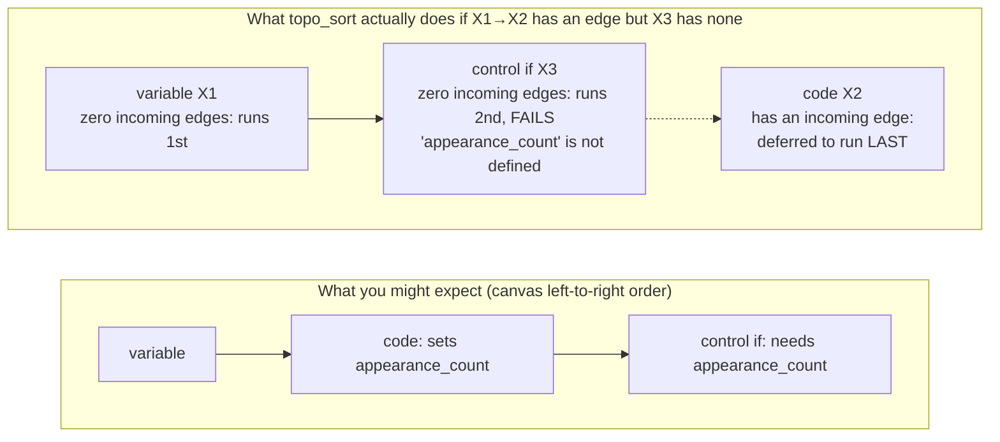

# Part 8 — Advanced Pipeline Engine: Execution Rules & Real Bugs

**[← Guide index](00-README.md)** · Part 8 of 14 · Previous: [Part 7 — Advanced Pipeline Engine: 5 Project Pipelines](07-advanced-pipeline-project-pipelines.md) · Next: [Part 9 — Orchestration (Dagster) & BI Dashboards (Superset) →](09-orchestration-and-bi-dashboards.md)

---

This part concludes [Chapter 12](06-advanced-pipeline-engine-fundamentals.md), covering the execution-order rule referenced throughout
[Part 7](07-advanced-pipeline-project-pipelines.md)'s five project pipelines, two real bugs found while verifying this guide, and a
few remaining builder-behavior notes specific to advanced pipelines.

### 12.9 The topo_sort execution-order rule (read this before drawing any edge between advanced nodes)

The engine computes execution order via a topological sort (Kahn's
algorithm): every node with **zero incoming edges** is queued first, **in
the order it appears in the pipeline's own node array** (i.e. the order
you added it on the canvas) — not canvas position, not alphabetical, not
edge count. A node that only becomes ready once its one predecessor
finishes is appended to the **end** of that queue, regardless of how early
its output is actually needed.

**The precise, source-verified rule** (confirmed directly in
`pipeline_compiler.py`'s `_topo_sort`):

- If **every** advanced node in your pipeline sits on **one single
  unbroken edge chain** (like [Part 7](07-advanced-pipeline-project-pipelines.md)'s §12.5 `API1→C1→C2→C3` or §12.6's
  `S1→S2→…→S11`), edges are **completely safe** — there's no other
  zero-indegree node to jump the queue, so the chain executes in exactly
  the order drawn.
- The moment you **mix** an edge-connected node with even one *other*,
  edge-free advanced node in the same top-level graph (like [Part 7](07-advanced-pipeline-project-pipelines.md)'s §12.4
  `A`/`B`/`D`/`E`/`F`/`G`, or the scenario below), the edge-free node
  **always** runs before any node that has ever had an incoming edge —
  even if that edge-free node actually needed the edge-having node's output
  first.



**This is a real bug that was found and fixed while writing this guide:** a
`code`/`sql` node storing `appearance_count` had a stray edge into it from
an earlier `variable` node, while a downstream `if` node that needed
`appearance_count` had no edges at all. That pushed the `code` node to the
very end of execution — *after* the `if` node that needed its output,
which then failed with `"Failed to evaluate condition: name
'appearance_count' is not defined"`, and every node after the failed `if`
was marked **SKIPPED**. The fix applied in that case was to remove the
stray edge entirely (falling back to pure array-order, [Part 7](07-advanced-pipeline-project-pipelines.md)'s §12.4 pattern);
§12.5/§12.6 show the other valid fix — make it a single unbroken chain
with no bystander nodes.

If you ever get stuck with a stray edge like this on a saved pipeline, an
admin can clear all its edges directly in Postgres:

```powershell
docker compose exec -T postgres psql -U openlakehouse -d openlakehouse -c "update pipelines set definition = jsonb_set(definition, '{edges}', '[]'::jsonb) where name='<pipeline_name>';"
```

### 12.10 Two real bugs found and fixed while verifying this chapter

Worth knowing since you may hit their symptoms on an older build:

1. **Pipeline delete crashed with a 500** on any pipeline that had ever been
   run — `DELETE /pipelines/{id}` did a naive `db.delete(pipeline)` with no
   cascade handling for its `PipelineRun`/`PipelineNodeRun` history rows,
   raising a Postgres `ForeignKeyViolation`. **Fixed** by explicitly
   bulk-deleting child rows before the parent. Verified live: delete now
   succeeds and the pipeline disappears from the picker dropdown, even with
   extensive run history.
2. **`if` node's true/false skip lists were inverted** relative to the UI's
   own field labels — a condition evaluating `False` was applying
   `true_skip_nodes` instead of `false_skip_nodes`. **Fixed** to match the
   UI labels exactly. Verified live in [Part 7](07-advanced-pipeline-project-pipelines.md)'s §12.4 alert-path test.

### 12.11 Builder behavior specific to advanced pipelines

- The two `/compile` (dry-run) endpoints return a friendly 400 ("use Run
  instead of Compile") for any pipeline containing an advanced node — there
  is no single compiled SQL statement to preview. Use **Run** directly.
- Every node id + **Copy ID** button ([Part 3](03-pipeline-builder-fundamentals.md), §6.2) works identically here — this
  is what you paste into `if`/`for_each`/`sub_pipeline` config fields.
- RBAC: running (not just creating/saving) a pipeline containing a
  `python`/`pyspark` **code** node requires `ADMIN` or `DATA_ENGINEER` —
  the same trust level as the PySpark Code Explorer mode ([Part 2](02-loading-and-exploring-data.md), §5.2),
  checked server-side **before** the run is even created — not just a
  disabled button in the UI. A `VIEWER`/`ANALYST` account gets a clean 403.

---

**[← Guide index](00-README.md)** · Part 8 of 14 · Previous: [Part 7 — Advanced Pipeline Engine: 5 Project Pipelines](07-advanced-pipeline-project-pipelines.md) · Next: [Part 9 — Orchestration (Dagster) & BI Dashboards (Superset) →](09-orchestration-and-bi-dashboards.md)
