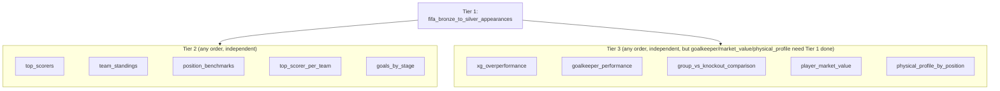

# Part 9 — Orchestration (Dagster) & BI Dashboards (Superset)

**[← Guide index](00-README.md)** · Part 9 of 14 · Previous: [Part 8 — Advanced Pipeline Engine: Execution Rules & Real Bugs](08-advanced-pipeline-execution-rules-and-bugs.md) · Next: [Part 10 — Machine Learning (MLflow) & Version Control (Gitea) →](10-ml-and-version-control.md)

---

## Chapter 13 — Orchestration with Dagster (Jobs page)

**Depends on:** [Part 3](03-pipeline-builder-fundamentals.md)–[Part 4](04-gold-pipelines.md) Chapters 7–8 (needs pipelines to orchestrate).

### 13.1 What Dagster is doing under the hood

Open **Jobs** (`/jobs`). This page is a thin, friendly UI over a **real**
Dagster deployment (its own webserver + daemon + Postgres DB) — no need to
hand-craft Dagster launchpad YAML or look up pipeline UUIDs yourself. Every
one of your 11 saved pipelines is listed under **Other Pipelines** (or
**Scheduled Pipelines**, once you've given one a schedule), each with a
**Run now** button.

### 13.2 Manually trigger all 11 pipelines in dependency order



Click **Trigger Run** for each pipeline in this order. Each click launches
a real, Dagster-tracked run — watch it appear in **Recent Runs** with the
pipeline's real name and live status (`QUEUED` → `SUCCESS`/`FAILURE`). Once
a run's Dagster op starts, click **View progress** to expand a step-by-step
breakdown of every node — status, row count, duration.

> 🧪 **Test it:** while any run shows `QUEUED`/`RUNNING`, open the **Dagster
> UI** directly (http://localhost:3001) → **Runs** and find the same run by
> its ID — proof that "Jobs" in the app is a real, thin UI over a real
> Dagster deployment, not a separate mocked tracker. Re-run one pipeline a
> second time to see a second, independent run entry appended (not
> overwritten), with its own timestamp and duration.

### 13.3 Scheduling

Go to **Pipelines**, open a pipeline's "Pipeline settings" panel, and use
the **Schedule** dropdown: **Daily**/**Weekly**/**Hourly** (with a
time/day picker) or **Custom cron…**. A live summary line (e.g. "Runs
daily at 03:00 UTC.") confirms exactly what you've set — no cron syntax
required for the common cases.

Internally, a Dagster **sensor** (`scheduled_pipelines_sensor` in
`infra/dagster/repository.py`) checks every 30 seconds and automatically
launches a run for exactly the pipelines whose schedule has fired,
independently per pipeline. Stagger `fifa_bronze_to_silver_appearances` a
few minutes ahead of any gold pipeline that depends on it, since this
sensor model doesn't (yet) express true fine-grained "wait for this other
run to finish" dependencies — that's a further exercise if you want to go
beyond this guide.

> 🧪 **Test the scheduler for real:** pick any already-successful gold
> pipeline (its table already exists, so a re-run is cheap), set its
> schedule to **Custom cron…** a couple of minutes in the future, save, then
> just leave the Jobs page open. Within ~30 seconds of the scheduled time a
> new run should appear under **Scheduled Pipelines** with **no button
> click from you** — the sensor firing for real. Turn the schedule back off
> afterwards (**Schedule** → **None**).

---

## Chapter 14 — BI dashboards with Superset

**Depends on:** [Part 4](04-gold-pipelines.md) Chapter 8 (all 10 gold tables must exist).

This is the most detailed chapter after Chapters 8 and 12 — a real
production-style analytics dashboard, not a single quick chart: 10
datasets, **15 charts across 4 tabs**, native cross-filters, and
conditional formatting.

### 14.1 Reconnect Trino (only if you reset the stack)

Superset's dashboards/datasets/DB-connections live in its own metadata
Postgres DB — a full `docker compose down -v` wipes them like every other
stateful service. If **Settings → Database Connections** is empty, recreate
it once:

1. http://localhost:8088 (`admin` / `openlakehouse_dev_password`)
2. **Settings → Database Connections → + Database**
3. Pick **Trino**, SQLAlchemy URI: `trino://dbt@trino:8080/iceberg` (no
   password — Trino has no auth in this stack)
4. **Advanced → Security** → tick **"Allow this database to be explored"**
   (needed for §14.6's "Save as dataset")
5. **Connect → Finish**

### 14.2 Create datasets for all 10 gold tables

**Data → Datasets → + Dataset**, pick the Trino DB → schema `gold` → table
→ **Add** (or **Create Dataset and Create Chart**).

| # | Dataset name | Schema.Table | Feeds chart(s) in |
|---|---|---|---|
| 1 | Top Scorers | `gold.top_scorers` | Tab 1 |
| 2 | Team Standings | `gold.team_standings` | Tab 1, Tab 2 |
| 3 | Position Benchmarks | `gold.position_benchmarks` | Tab 1, Tab 3 |
| 4 | Top Scorer per Team | `gold.top_scorer_per_team` | Tab 1 |
| 5 | Goals by Stage | `gold.goals_by_stage` | Tab 2 |
| 6 | XG Overperformance | `gold.xg_overperformance` | Tab 3 |
| 7 | Goalkeeper Performance | `gold.goalkeeper_performance` | Tab 3 |
| 8 | Group vs Knockout Comparison | `gold.group_vs_knockout_comparison` | Tab 2 |
| 9 | Player Market Value | `gold.player_market_value` | Tab 4 |
| 10 | Physical Profile by Position | `gold.physical_profile_by_position` | Tab 4 |

### 14.3 Tab 1 — "Overview" (4 charts)

1. **Top 15 Goal Scorers** — Bar Chart on `Top Scorers`: X-axis
   `player_name`, Metric `SUM(goals_sum)`, Sort by the metric Descending,
   Row Limit 15. Save as *"Top 15 Goal Scorers"*.
2. **Team Wins/Draws/Losses** — Bar Chart (stacked) on `Team Standings`:
   X-axis `team`, Metrics `SUM(is_win_sum)`, `SUM(is_draw_sum)`,
   `SUM(is_loss_sum)`, Row Limit 48, Sort by `SUM(is_win_sum)` Descending.
   Save as *"Team Record (W/D/L)"*.
3. **Avg Rating by Position** — Bar Chart on `Position Benchmarks`: X-axis
   `position`, Metric `AVG(player_rating_avg)`, sorted by the metric
   Descending. Save as *"Average Rating by Position"*.
4. **Top 3 Scorers per Team** — Table on `Top Scorer per Team`: columns
   `team`, `player_name`, `goals_sum`, `team_rank`, sorted by `team` then
   `team_rank` ascending. **Customize → Conditional Formatting**: column
   `team_rank`, operator `=`, value `1`, gold/yellow background — visually
   highlights each team's top scorer. Save as *"Top 3 Scorers per Team"*.

### 14.4 Tab 2 — "Team & Stage Analysis" (4 charts)

5. **Goal Difference Leaderboard** — Table on `Team Standings` with a
   **custom SQL metric**: `+ Add metric → Custom SQL` →
   `SUM(goals_team_sum) - SUM(goals_opponent_sum)`, labeled
   `goal_difference`. Columns `team`, `goal_difference`, sorted descending.
   Conditional Formatting: `goal_difference > 0` → green;
   `goal_difference < 0` → red. Save as *"Goal Difference Leaderboard"*.
6. **Goals by Tournament Stage** — Table on `Goals by Stage` (already one
   row per team, no aggregation needed). Save as *"Goals by Tournament
   Stage"*.
7. **Group Stage vs Knockout — Avg Player Rating** — Bar Chart on
   `Group vs Knockout Comparison`: X-axis `stage_type`, Metric
   `AVG(player_rating_avg)`. Save as *"Group vs Knockout — Rating"*.
8. **Group Stage vs Knockout — Multi-Metric Table** — Table on the same
   dataset: all 5 metric columns plus `stage_type`, no row limit (only 2
   rows). Save as *"Group vs Knockout — All Metrics"*.

### 14.5 Tab 3 — "Advanced Player Analytics" (4 charts)

9. **xG Overperformance — Top 15** — Bar Chart on `XG Overperformance`:
   X-axis `player_name`, Metric `SUM(xg_overperformance)`, Sort
   Descending, Row Limit 15, diverging color scheme (e.g. `Fire`) since
   values can be negative. Save as *"Top Finishers (xG Overperformance)"*.
10. **Goals vs Expected Goals — Scatter Plot** — Scatter chart: X
    `AVG(expected_goals_xg_sum)`, Y `AVG(goals_sum)`, Entity `player_name`,
    Row Limit 200. Players above the diagonal outscored their xG. Save as
    *"Goals vs Expected Goals"*.
11. **Goalkeeper Save Rate Leaderboard** — Table on `Goalkeeper
    Performance`: `player_name`, `team`, `saves_sum`, `clean_sheet_sum`,
    `save_rate`, sorted by `save_rate` descending. Conditional Formatting:
    `save_rate > 0.7` → green. Save as *"Goalkeeper Save Rate"*.
12. **Clean Sheets by Goalkeeper** — Bar Chart on the same dataset: X-axis
    `player_name`, Metric `SUM(clean_sheet_sum)`, Sort Descending, Row Limit
    15. Save as *"Clean Sheets Leaderboard"*.

### 14.6 Tab 4 — "Market Value & Physical Profile" (3 charts)

13. **Market Value vs Efficiency — Scatter Plot** — X `AVG(market_value_eur)`,
    Y `AVG(goal_contribution_sum)`, Entity `player_name`, Row Limit 200.
    Save as *"Market Value vs Output"*.
14. **Most Expensive Squads by Team** — Bar Chart: X-axis `team`, Metric
    `SUM(market_value_eur)`, Sort Descending, Row Limit 48. Save as
    *"Squad Market Value by Team"*.
15. **Physical Profile by Position (Small Multiples)** — Bar Chart: X-axis
    `metric`, Metric `AVG(metric_value)`, **Group by** `position` — this is
    exactly why §8.10 unpivoted the data first, since a wide table can't be
    faceted by metric name like this. Save as *"Physical Profile by
    Position"*.

**Optional — a virtual (SQL-defined) dataset:** Open **SQL Lab**
(`/sqllab`), run:

```sql
SELECT team, tournament_stage, AVG(player_rating) AS avg_rating,
       AVG(pass_accuracy) AS avg_pass_accuracy
FROM iceberg.bronze.fifa_player_matches
WHERE minutes_played > 0
GROUP BY team, tournament_stage
```

then **Save → Save as new dataset**, `team_stage_rating_virtual` — a normal
dataset for any one-off chart without building a full No-Code pipeline.

### 14.7 Assemble the dashboard

1. **Dashboards → + Dashboard**, name it "FIFA World Cup 2026 Performance
   Analytics".
2. Drag a **Tabs** component onto the canvas, add 4 tabs: **Overview**,
   **Team & Stage Analysis**, **Advanced Player Analytics**, **Market
   Value & Physical Profile**.
3. Drag each chart from §14.3–§14.6 into its matching tab (4+4+4+3 = 15
   charts), 2 per row. **Save.**

It also appears on the app's **Dashboards** page (`/dashboards`).

### 14.8 Native (cross-)filters

1. Click **Filters** (funnel icon) → **+ Add/Edit Filters**.
2. **Value filter**, Column `team` (from `Team Standings`), Title "Team".
   **Scoping → Apply to specific panels**: charts 2, 4, 5, 13, 14.
3. **Value filter**, Column `position` (from `Position Benchmarks` or
   `XG Overperformance`), Title "Position". Scope: charts 3, 9, 10, 15.
4. **Value filter**, Column `tournament_stage`/`stage_type` — only datasets
   with a row-level stage column qualify (charts 7, 8, plus the optional
   virtual-dataset chart from §14.6).
5. **Save.** Selecting "Spain" in the Team filter instantly narrows the
   Team Record, Goal Difference, xG Overperformance, and Market Value
   charts together — real cross-filtering, not static charts side by side.

### 14.9 Finishing touches

- **Dashboard properties → Colors**: one consistent scheme so the same
  team/position renders the same color everywhere.
- **Alerts & Reports** (optional): schedule the dashboard to email a
  screenshot daily.
- **Edit dashboard → Set auto-refresh interval** (e.g. 1 minute) to reflect
  newly re-run pipelines (Chapter 13) without manual reload.

---

**[← Guide index](00-README.md)** · Part 9 of 14 · Previous: [Part 8 — Advanced Pipeline Engine: Execution Rules & Real Bugs](08-advanced-pipeline-execution-rules-and-bugs.md) · Next: [Part 10 — Machine Learning (MLflow) & Version Control (Gitea) →](10-ml-and-version-control.md)
