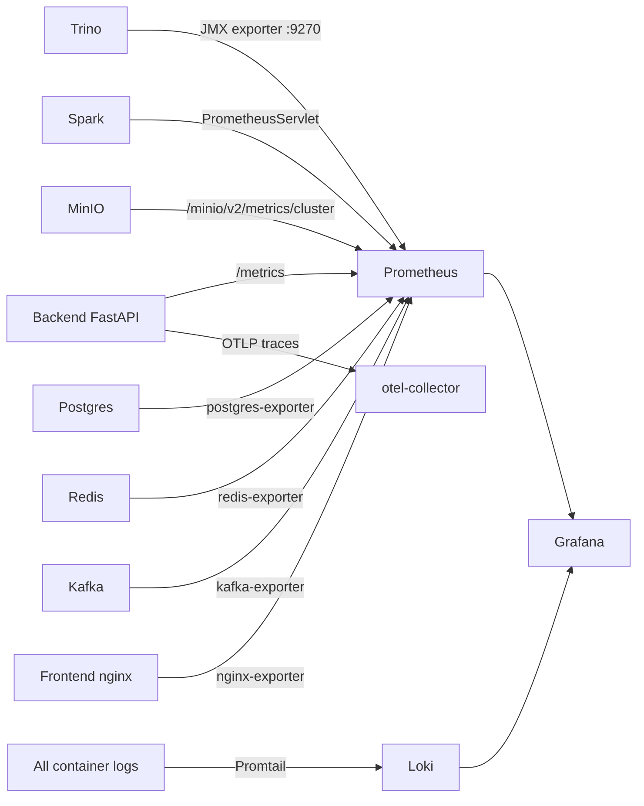
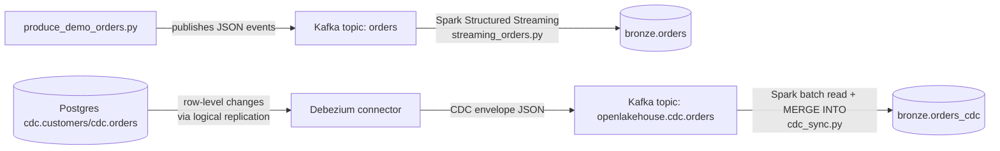

# Part 11 — Observability & Streaming/CDC

**[← Guide index](00-README.md)** · Part 11 of 14 · Previous: [Part 10 — Machine Learning (MLflow) & Version Control (Gitea)](10-ml-and-version-control.md) · Next: [Part 12 — Platform Management, AI Assistant & RBAC →](12-platform-management-and-rbac.md)

---

## Chapter 17 — Observability: Prometheus, Grafana, Loki

**Depends on:** any earlier chapter (the more you've done, the richer the
metrics/logs).

### 17.1 What's being collected



### 17.2 Step-by-step

Open **Monitoring** (`/monitoring`) in the app — an overall health summary
(health %, up/down target counts) plus a per-service grouped status view
above the raw Prometheus targets table.

Open Grafana directly (http://localhost:3300, `admin` /
`openlakehouse_dev_password`) → **OpenLakehouse** folder:

- A platform-overview dashboard (request rate/latency/error rate per API
  route, container CPU/memory) — the Spark write from [Part 2](02-loading-and-exploring-data.md) Chapter 3 and all 11
  Trino CTAS queries from [Part 3](03-pipeline-builder-fundamentals.md)–[Part 4](04-gold-pipelines.md) Chapters 7–8 show up here, alongside backend API
  request counts from every click along the way (including the 15 Superset
  chart queries and both MLflow training runs).
- A logs panel (Loki), filterable by service name (e.g.
  `service="backend"`) — watch the exact log lines produced by the
  pipeline runs you triggered in [Part 9](09-orchestration-and-bi-dashboards.md) Chapter 13.
- Prometheus's own UI (http://localhost:9090) for raw PromQL, e.g.
  `rate(http_requests_total[5m])`.

> 🧪 **Test it:** run `rate(http_requests_total[5m])` in Prometheus right
> after clicking around the app for a minute — a real, non-zero rate,
> proving every click really does increment a real counter.

---

## Chapter 18 — Streaming (Kafka) and CDC (Debezium)

**Depends on:** nothing from earlier chapters (uses a separate small
`orders` demo dataset, not the FIFA data — batch data can't exercise
streaming/CDC on its own).

### 18.1 Concepts



### 18.2 Step-by-step

1. **Streaming ingestion** — publish a burst of demo events from inside the
   backend container (it already has `kafka-python`):

   ```powershell
   docker compose cp infra/kafka/produce_demo_orders.py backend:/tmp/produce_demo_orders.py
   docker compose exec backend python /tmp/produce_demo_orders.py --count 20 --bootstrap-servers kafka:9092
   ```

   Open **Streaming** (`/streaming`) to watch the `orders` topic's
   partition/message/lag counters update live (polls every 5s, backed by
   real Kafka introspection via `GET /api/v1/streaming/status`).

2. Run the Structured Streaming job:

   ```powershell
   docker compose exec spark-master spark-submit \
     --packages org.apache.spark:spark-sql-kafka-0-10_2.12:3.5.1 \
     /opt/spark-apps/streaming_orders.py
   ```

   Prints `STREAMING_ORDERS_OK bronze_orders_count=<n>` — verify:
   `SELECT COUNT(*) FROM iceberg.bronze.orders;`.

3. **CDC from Postgres** — the `debezium-connect` service already has a
   connector (`openlakehouse-postgres-cdc`) capturing row-level
   `INSERT`/`UPDATE`/`DELETE` from `cdc.customers`/`cdc.orders`. Check it's
   running:

   ```powershell
   curl http://localhost:8083/connectors/openlakehouse-postgres-cdc/status
   ```

   Make a change:

   ```powershell
   docker compose exec postgres psql -U openlakehouse -c "UPDATE cdc.orders SET status='SHIPPED' WHERE order_id=1;"
   ```

   It lands on the `openlakehouse.cdc.orders` Kafka topic within seconds —
   no polling.

4. Merge CDC events into Iceberg:

   ```powershell
   docker compose exec spark-master spark-submit /opt/spark-apps/cdc_sync.py
   ```

   Confirm: `SELECT * FROM iceberg.bronze.orders_cdc;` — updated status and
   any deletes reflected correctly. The job dedupes multiple events per key
   before its `MERGE INTO`, so re-running it is always safe (a known
   gotcha: a naive `MERGE INTO` evaluating multiple same-key events against
   one pre-batch snapshot can otherwise resurrect deleted rows).

---

**[← Guide index](00-README.md)** · Part 11 of 14 · Previous: [Part 10 — Machine Learning (MLflow) & Version Control (Gitea)](10-ml-and-version-control.md) · Next: [Part 12 — Platform Management, AI Assistant & RBAC →](12-platform-management-and-rbac.md)
