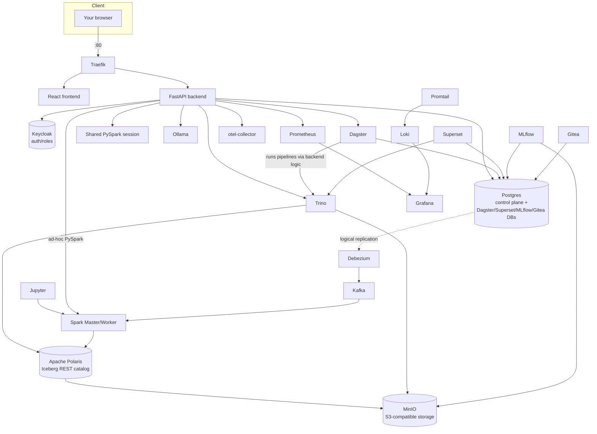

# Part 14 — Appendices

**[← Guide index](00-README.md)** · Part 14 of 14 · Previous: [Part 13 — Testing Matrix & Troubleshooting](13-testing-matrix-and-troubleshooting.md)

---

## Appendix A — Complete architecture diagram



## Appendix B — What you built

```
fifa_world_cup_2026_player_performance.csv (54,600 rows)
              │  (Jupyter/Spark, Part 2 Chapter 3)
              ▼
    bronze.fifa_player_matches ─────────────────────────────────────────────┐
              │  not_null/unique/range gate (Part 3 Ch. 7)                  │
              │  + filter(minutes_played>0) + derive                        │  dedup/select/cast/filter/union/join
              ▼                                                              ▼
    silver.player_match_appearances (31,558)             gold.team_standings (48)
        │    │    │    │    │                            gold.goals_by_stage (48)
        │    │    │    │    └─ aggregate ───────────────▶ gold.position_benchmarks (4)
        │    │    │    └─ aggregate + sort ──────────────▶ gold.top_scorers (1,248)
        │    │    └─ aggregate + window + filter ────────▶ gold.top_scorer_per_team (173)
        │    └─ regex gate + filter + fill_null ──────────▶ gold.goalkeeper_performance
        └─ aggregate + unpivot ───────────────────────────▶ gold.physical_profile_by_position (16)

    bronze (2nd branch) ─ row_count gate + select + cast ─▶ gold.xg_overperformance
    bronze (2 branches) ─ filter + derive + union ─────────▶ gold.group_vs_knockout_comparison (2)
    silver + bronze (joined) ─ aggregate + dedup + rename ─▶ gold.player_market_value
                                                        │
                        ├──▶ 9-node advanced pipeline (Part 6-8): variable/code/
                        │    control(if,for_each)/api_ingestion/sub_pipeline — SUCCESS
                        ├──▶ 15-chart, 4-tab Superset dashboard w/ native filters (Part 9)
                        ├──▶ 2 MLflow-tracked models, 3 runs (Part 10)
                        ├──▶ Lineage graph + ER Diagram (Part 5)
                        ├──▶ Dagster-orchestrated reruns, 3-tier dependency order (Part 9)
                        └──▶ Streaming/CDC, Connections/Compute, AI Assistant,
                             RBAC/Admin, full Grafana/Prometheus/Loki observability
                             (Part 11-12) exercised against the shared `orders` demo
```

Every step in this guide ran (or will run, when you follow it) against a
real Spark/Trino/Superset/MLflow/Dagster/Keycloak service — including the
advanced pipeline execution engine, which was fully built and run through
the real browser UI while verifying this guide, catching and fixing two
real backend bugs along the way ([Part 8](08-advanced-pipeline-execution-rules-and-bugs.md) §12.10). Nothing here is aspirational or
mocked. If you're recording this as a demo video, Appendix B is the natural
closing shot: from one raw CSV to a fully orchestrated, dashboarded,
monitored, role-secured lakehouse.

---

**[← Guide index](00-README.md)** · Part 14 of 14 · Previous: [Part 13 — Testing Matrix & Troubleshooting](13-testing-matrix-and-troubleshooting.md)
