# Follow-Along: The Complete OpenLakehouse Tour (FIFA World Cup 2026 Edition)

> Want a deep, hands-on dive into the newer **advanced pipeline nodes**
> (`variable`/`code`/`control`/`api_ingestion`/`sub_pipeline`), the **ER
> Diagram** page, and the Spark Code session controls? See the companion
> guide: [`GUIDED_PROJECT_FIFA_ADVANCED.md`](GUIDED_PROJECT_FIFA_ADVANCED.md).

A hands-on, end-to-end project you build yourself on top of OpenLakehouse,
using a real 54,600-row dataset: **1,050 matches, 48 teams, 1,248 players**
of a simulated FIFA World Cup 2026. This is the guide to **follow along and
record while demoing the platform** — every step maps to something real: a
real file, a real button in the UI, a real Spark/Trino/Superset job. By the
end you'll have exercised **every major functional area of OpenLakehouse**,
not just the data pipeline:

- Loading raw data → Bronze via Jupyter/PySpark
- Browsing the catalog and querying it with SQL (Trino **and** Spark) *and*
  writing real ad-hoc **PySpark code**, plus right-click actions on the
  catalog tree
- **11 No-Code pipelines** (1 silver + 10 gold) that between them exercise
  **every transform and quality type the compiler supports** — `select`,
  `rename`, `filter`, `join`, `union`, `aggregate`, `sort`, `deduplicate`,
  `cast`, `fill_null`, `replace`, `derived_column`, `window`, `pivot`,
  `unpivot`, and quality gates `not_null`, `unique`, `range`, `regex`,
  `row_count`, `freshness`
- A scored Data Quality dashboard and an auto-derived Lineage graph
- Dagster orchestration (schedules + manual runs + the Jobs page)
- A 4-tab, 15+ chart Superset dashboard with native cross-filters
- Two MLflow-tracked ML models
- Versioning your work in Gitea
- Real-time streaming + CDC (Kafka/Debezium)
- Managing external Connections and checking live Compute status
- Chatting with the built-in AI Assistant
- Platform Health, RBAC/roles, and Monitoring (Grafana/Prometheus/Loki)

Estimated scope: a full day (this is the "advanced" edition — expect to
spend real time in the No-Code Builder and Superset's chart editor). If
you're recording a demo video, each numbered section below is a natural
scene break.

## 0. Prerequisites

Start (or confirm) the full stack is up:

```powershell
docker compose --profile full up -d --build
docker compose ps
```

Wait until everything shows `Up`/`healthy` (`redis-exporter` showing
"unhealthy" is a known cosmetic bug in that image's own baked-in healthcheck —
ignore it, `/metrics` still serves real data).

**Access points and credentials you'll need:**

| Service | URL | Login |
|---|---|---|
| OpenLakehouse app | http://localhost | `engineer.user` / `openlakehouse` (or `admin.user` / `openlakehouse`) |
| Jupyter | http://localhost:8888/jupyter/?token=openlakehouse | token: `openlakehouse` |
| Apache Superset | http://localhost:8088 | `admin` / `openlakehouse_dev_password` |
| MLflow | http://localhost:5000 | no auth |
| Dagster | http://localhost:3001 | no auth |
| Gitea | http://localhost:3010 | `olh-admin` / `openlakehouse_dev_password` |
| Grafana | http://localhost:3300 | `admin` / `openlakehouse_dev_password` |
| Spark Master UI | http://localhost:8090 | no auth — live/finished applications, workers, executors |
| Spark Worker UI | http://localhost:8091 | no auth |
| Spark History Server | http://localhost:18080 | no auth — completed application logs/DAGs |
| Trino UI | http://localhost:8082 | no auth — live query plans, splits, and stages |

> Always browse the app itself via **http://localhost** (port 80, through
> Traefik) — the frontend's own dev port doesn't proxy `/api` and POSTs will
> fail with 405.

> **Keep the Spark Master UI and Trino UI open in side tabs throughout this
> guide.** Every button you click in the app that touches data — a Jupyter
> cell, a pipeline run, a PySpark Code cell, a Superset chart — shows up as a
> real, inspectable application/query in one of those two UIs within a
> second or two. That's the best way to *prove* to yourself (or a video
> audience) that nothing here is mocked.

> `engineer.user` has the `DATA_ENGINEER` role, which is required for the
> PySpark Code mode (section 3) and for creating/running pipelines and
> connections. `admin.user` has `ADMIN` and can do everything, including the
> Admin page (section 16).

## 1. The dataset

[docs/guided_project/fifa_world_cup_2026_player_performance.csv](guided_project/fifa_world_cup_2026_player_performance.csv)
— 54,600 rows, one row per player per match (52 players × 1,050 matches: two
26-man squads per match, including unused substitutes with `minutes_played=0`).

Key columns: `player_id`, `player_name`, `team`, `position` (Goalkeeper /
Defender / Midfielder / Forward), `match_id`, `match_date`, `tournament_stage`
(Group Stage/Round of 32/Round of 16/Quarter Finals/Semi Finals/Third Place
Match/Final), `match_result` (`W`/`D`/`L`), `goals_team`/`goals_opponent`,
plus per-match performance stats: `goals`, `assists`, `shots`,
`expected_goals_xg`, `pass_accuracy`, `player_rating`, `distance_covered_km`,
etc.

> **Data quality note (important, and a good real-world lesson):** the CSV
> also has pre-computed `total_goals_tournament`/`total_assists_tournament`/
> `player_of_match_awards`/`tournament_rating` columns that look like running
> tournament totals, but they're actually random per-row noise (the same
> player's `total_goals_tournament` jumps 0→2→0→3 across matches, not
> monotonically). **Never trust a pre-aggregated column from a raw source —
> always recompute aggregates yourself from the granular facts.** That's
> exactly what the pipelines below do (`SUM(goals)` across matches), and it's
> why they don't use those four columns at all.

This file is already mounted read-only into both Jupyter
(`/opt/notebooks/guided_project/…csv`) and Spark
(`/opt/spark-data/…csv`) — no manual upload needed, unlike the original
30-row orders walkthrough (this file is 17 MB, too big to comfortably
drag-and-drop).

## 2. Load it into Bronze via Jupyter

1. Open Jupyter: http://localhost:8888/jupyter/?token=openlakehouse
2. **File → New → Notebook**, Python 3 kernel.
3. Run:

   ```python
   import pandas as pd
   from pyspark.sql import SparkSession

   spark = SparkSession.builder.appName("fifa-guided-project-ingest").getOrCreate()

   pdf = pd.read_csv("/opt/notebooks/guided_project/fifa_world_cup_2026_player_performance.csv")
   df = spark.createDataFrame(pdf)

   spark.sql("CREATE NAMESPACE IF NOT EXISTS catalog.bronze")
   df.writeTo("catalog.bronze.fifa_player_matches").createOrReplace()

   print("rows written:", spark.table("catalog.bronze.fifa_player_matches").count())
   df.printSchema()
   ```

   Expected: `rows written: 54600`. (`catalog` is Spark's alias for the shared
   Iceberg/Polaris warehouse; Trino's alias for the same warehouse is
   `iceberg` — same tables, different per-engine names.)

4. **Verify** in the app: **Catalog** (`/catalog`) → `iceberg` → `bronze` →
   `fifa_player_matches` — 71 columns, 54,600 rows. You can also use **Data
   Explorer** (`/explorer`), which shows the same Catalog → Schema → Table →
   Columns tree in one left-hand panel and lets you click straight through to
   a 100-row preview instead of switching pages.

> 🧪 **Test it:** open the **Spark Master UI** (http://localhost:8090) —
> under "Completed Applications" you'll see the real `fifa-guided-project-ingest`
> application you just ran from Jupyter, with its real duration and executor
> count. This is the same pattern you'll use to sanity-check every later
> Spark job in this guide (pipeline runs, streaming, the PySpark Code mode).

## 3. Explore it with SQL first

Open **SQL** (`/sql`) and run a few real exploratory queries before building
anything — this is how you'd normally scope out a new dataset. (**Data
Explorer** (`/explorer`) works just as well for this — same query/results
flow, plus the catalog tree on the left so you don't have to remember table
names, and a Trino/Spark toggle if you'd rather run these against the Spark
Thrift Server instead of Trino.)

```sql
-- shape of the dataset
SELECT count(*) AS rows, count(DISTINCT match_id) AS matches,
       count(DISTINCT team) AS teams, count(DISTINCT player_id) AS players
FROM iceberg.bronze.fifa_player_matches;
-- 54600, 1050, 48, 1248

-- matches per tournament stage
SELECT tournament_stage, count(DISTINCT match_id) AS matches
FROM iceberg.bronze.fifa_player_matches GROUP BY tournament_stage;
-- Group Stage 578, Round of 32 178, Round of 16 126, Quarter Finals 84,
-- Semi Finals 42, Third Place Match 21, Final 21

-- confirm no duplicate (player, match) rows and no nulls in key columns
SELECT count(*) FROM (
  SELECT player_id, match_id, count(*) c FROM iceberg.bronze.fifa_player_matches
  GROUP BY player_id, match_id HAVING count(*) > 1
);
-- 0 — the dataset is already clean at the grain we need
```

### 3.1 Right-click the catalog tree

In **Data Explorer**, expand `iceberg` → `bronze` → `fifa_player_matches` in
the left tree, then **right-click** the table itself. You get a context menu
with real, working actions:

- **Preview first 100 rows** — same as clicking the table, switches to SQL
  mode and runs `SELECT * FROM iceberg.bronze.fifa_player_matches LIMIT 100`.
- **Copy table name** / **Copy fully qualified name** — copies
  `fifa_player_matches` / `iceberg.bronze.fifa_player_matches` to your
  clipboard, with a toast confirming exactly what was copied.
- **Copy SELECT statement** — copies a ready-to-paste
  `SELECT * FROM iceberg.bronze.fifa_player_matches LIMIT 100`.
- **Row count** — runs `SELECT COUNT(*) AS row_count FROM ...` immediately
  and shows the real result (54,600) in the results grid.

Right-click a **schema** (e.g. `bronze`) for copy-name/copy-fully-qualified
actions, or a **column** (expand the table to see its columns) for
copy-name/copy-qualified-name actions. This is the fastest way to grab a
fully-qualified table name while building the pipelines in the next section
(§4–5) or writing chart SQL later in Superset (§9.6).

### 3.2 Run real ad-hoc PySpark against the same table

Still in **Data Explorer**, switch the mode toggle from **SQL** to **PySpark
Code**. This runs real, hand-written PySpark against a shared `SparkSession`
in the backend (not a mock) — console-style stdout/stderr streams back as it
executes. Try:

```python
df = spark.table("catalog.bronze.fifa_player_matches")
print("rows:", df.count())

from pyspark.sql import functions as F
(df.groupBy("team")
   .agg(F.sum("goals").alias("total_goals"))
   .orderBy(F.desc("total_goals"))
   .show(10))
```

You should see `rows: 54600` printed, followed by a real top-10 teams-by-goals
table computed by Spark. This mode is restricted to `ADMIN`/`DATA_ENGINEER`
roles (same trust level as the Jupyter notebooks) since it executes arbitrary
code server-side. Below the code editor, a small status indicator shows
whether the shared Spark session is currently live or idle (it auto-stops
after 15 minutes of inactivity to free cluster resources) — click **Stop
session** if you want to force a fresh session on your next run.

## 4. Build the Bronze → Silver pipeline (quality gates + filter + derive)

Open **No-Code Builder** (`/pipelines`). Every node type used across this
project gets **labeled form fields** in the right-hand panel — dropdowns,
list/dict editors, and (for `iceberg_table` sources) live **Schema**/**Table**
dropdowns populated from the real Trino catalog — instead of raw JSON; the
config tables below show the equivalent JSON each form produces, and you can
still inspect/hand-edit it via the panel's **Advanced: raw JSON** section.
Notice each node on the canvas is now color- and icon-coded by kind (blue for
sources, emerald for transforms, amber for quality checks, violet for
destinations) — handy for spotting the shape of a pipeline at a glance once
you've built a few.

Create a pipeline named `fifa_bronze_to_silver_appearances` with 7 nodes
chained in a straight line **A → B → C → D → E → F → G**:

| # | Kind | Type | Config JSON |
|---|---|---|---|
| A | source | `iceberg_table` | `{"schema": "bronze", "table": "fifa_player_matches"}` |
| B | quality | `not_null` | `{"columns": ["player_id", "match_id", "team", "position"]}` |
| C | quality | `unique` | `{"columns": ["player_id", "match_id"]}` |
| D | quality | `range` | `{"column": "pass_accuracy", "min": 0, "max": 1}` |
| E | transform | `filter` | `{"condition": "minutes_played > 0"}` |
| F | transform | `derived_column` | `{"name": "goal_contribution", "expression": "goals + assists"}` |
| G | destination | `iceberg_silver` | `{"table": "player_match_appearances"}` |

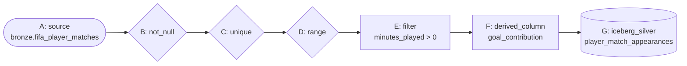

This demonstrates a real **quality gate**: B/C/D check the raw data before
any transformation touches it (0 violations expected, since step 3 already
confirmed the data is clean), then E drops the ~23,000 unused-substitute rows
(`minutes_played = 0`), and F adds a derived metric.

**Save → View Compiled SQL** (sanity-check it), then **Run**. Expected result:
`iceberg.silver.player_match_appearances` with **31,558 rows** (54,600 rows
minus the ones with 0 minutes played).

> 🧪 **Test it — while the run is `RUNNING`:** flip to the **Trino UI**
> (http://localhost:8082) → **Query Details** and find the live
> `CREATE TABLE ... AS SELECT` query executing against
> `iceberg.silver.player_match_appearances` — a good way to see the exact SQL
> your no-code pipeline compiled to, with real stage/split progress. Also try:
> select node **D** (`range`) and click **Delete**/**Backspace** — confirm the
> confirmation prompt appears, cancel it, then instead click **Duplicate**
> on the whole pipeline (top bar) to make a scratch copy you can safely
> experiment on (delete the copy afterwards with the **Delete** button).

> **Gotcha:** destinations compile to `CREATE TABLE IF NOT EXISTS ... AS
> SELECT` — re-running a pipeline after its table already exists is a no-op.
> `DROP TABLE iceberg.silver.player_match_appearances` from the SQL page first
> if you want to rebuild it.

### 4.1 Advanced nodes (optional): variables, code, control flow, API ingestion, sub-pipelines

The node palette also has five more kinds beyond source/transform/quality/destination — drag
one onto the canvas (or click it) to try it. Any pipeline containing one of these runs through a
different, step-by-step engine instead of compiling to a single SQL statement:

- **variable** (`literal`/`from_query`) — e.g. add a `literal` node named `min_minutes` with
  value `1`, then reference it from a downstream `code`/`sql` node's query as `{{min_minutes}}`.
- **code** (`sql`/`python`/`pyspark`) — a `sql` node can run any statement and optionally store
  its first result cell into a variable; `python`/`pyspark` nodes run arbitrary code with the
  shared `variables` dict available (these two require the `ADMIN` or `DATA_ENGINEER` role to
  **run**, though they can still be created/saved by anyone).
- **control** (`if`/`for_each`) — `if` skips an explicit list of node ids you type into its
  config depending on a condition; `for_each` re-runs an explicit list of "body" node ids once
  per item in a list variable.
- **api_ingestion** (`rest_get`/`rest_post`) — calls a real external URL and stores the JSON
  response into a variable.
- **sub_pipeline** (`call`) — runs another one of your saved pipelines inline, by its ID.

Node-palette categories are now collapsible (click the kind name to fold/unfold), and every
node type button is draggable onto the canvas — drop it anywhere to place it at that exact spot
instead of a random position.

## 5. Build 10 advanced Silver/Bronze → Gold pipelines

Each of these is its own saved pipeline. The first five (5a–5e) cover
aggregate, sort, dedupe, multi-step derived columns, **window functions**,
**pivot**, and **replace**. The next five (5f–5j) push further into the
columns and compiler features the first batch didn't touch yet — `select`,
`cast`, `fill_null`, `regex`/`row_count`/`freshness` quality gates, `union`
(two parallel branches off the same source), `join` (a second, independent
branch), `rename`, and `unpivot` — so that by the end of section 5 you've
used **every single** transform, quality, and destination type the compiler
implements at least once.

### 5a. `fifa_gold_top_scorers` — aggregate + sort

| # | Kind | Type | Config JSON |
|---|---|---|---|
| A | source | `iceberg_table` | `{"schema": "silver", "table": "player_match_appearances"}` |
| B | transform | `aggregate` | `{"group_by": ["player_id", "player_name", "team", "position"], "aggregations": {"goals": "sum", "assists": "sum", "shots": "sum", "minutes_played": "sum", "player_rating": "avg"}}` |
| C | transform | `sort` | `{"columns": ["goals_sum DESC"]}` |
| D | destination | `iceberg_gold` | `{"table": "top_scorers"}` |

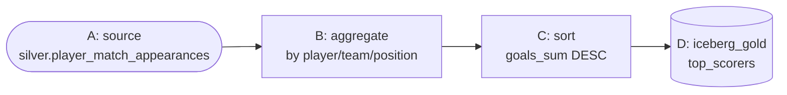

Chain **A → B → C → D**. Aggregate output columns follow the `<col>_<func>`
convention: `goals_sum`, `assists_sum`, `shots_sum`, `minutes_played_sum`,
`player_rating_avg`. Expected: **1,248 rows** (one per player).

### 5b. `fifa_gold_team_standings` — dedup + multi-step derive + aggregate

Player rows repeat `match_result`/`goals_team`/`goals_opponent` once per
player on that team, so we must **dedupe to one row per (match, team)**
before aggregating team results.

| # | Kind | Type | Config JSON |
|---|---|---|---|
| A | source | `iceberg_table` | `{"schema": "bronze", "table": "fifa_player_matches"}` |
| B | transform | `deduplicate` | `{"columns": ["match_id", "team"]}` |
| C | transform | `derived_column` | `{"name": "is_win", "expression": "CASE WHEN match_result = 'W' THEN 1 ELSE 0 END"}` |
| D | transform | `derived_column` | `{"name": "is_draw", "expression": "CASE WHEN match_result = 'D' THEN 1 ELSE 0 END"}` |
| E | transform | `derived_column` | `{"name": "is_loss", "expression": "CASE WHEN match_result = 'L' THEN 1 ELSE 0 END"}` |
| F | transform | `aggregate` | `{"group_by": ["team"], "aggregations": {"is_win": "sum", "is_draw": "sum", "is_loss": "sum", "goals_team": "sum", "goals_opponent": "sum"}}` |
| G | destination | `iceberg_gold` | `{"table": "team_standings"}` |

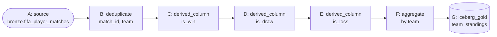

Chain **A → B → C → D → E → F → G**. Expected: **48 rows** (one per team)
with columns `team`, `is_win_sum`, `is_draw_sum`, `is_loss_sum`,
`goals_team_sum`, `goals_opponent_sum`.

### 5c. `fifa_gold_position_benchmarks` — simple aggregate

| # | Kind | Type | Config JSON |
|---|---|---|---|
| A | source | `iceberg_table` | `{"schema": "silver", "table": "player_match_appearances"}` |
| B | transform | `aggregate` | `{"group_by": ["position"], "aggregations": {"player_rating": "avg", "pass_accuracy": "avg", "distance_covered_km": "avg", "goals": "sum", "assists": "sum"}}` |
| C | destination | `iceberg_gold` | `{"table": "position_benchmarks"}` |

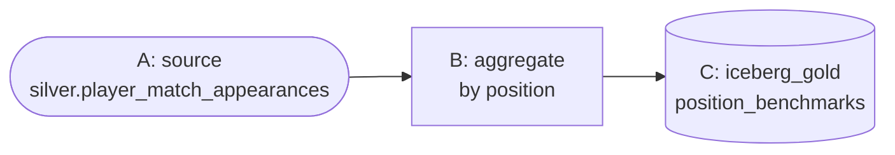

Chain **A → B → C**. Expected: **4 rows** (Goalkeeper/Defender/Midfielder/Forward).

### 5d. `fifa_gold_top_scorer_per_team` — aggregate + window + filter

| # | Kind | Type | Config JSON |
|---|---|---|---|
| A | source | `iceberg_table` | `{"schema": "silver", "table": "player_match_appearances"}` |
| B | transform | `aggregate` | `{"group_by": ["player_id", "player_name", "team"], "aggregations": {"goals": "sum"}}` |
| C | transform | `window` | `{"name": "team_rank", "expression": "RANK() OVER (PARTITION BY team ORDER BY goals_sum DESC)"}` |
| D | transform | `filter` | `{"condition": "team_rank <= 3"}` |
| E | destination | `iceberg_gold` | `{"table": "top_scorer_per_team"}` |

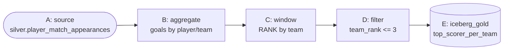

Chain **A → B → C → D → E**. Expected: **173 rows** (more than 48×3=144
because `RANK()` gives tied players — e.g. several 0-goal players tied for
rank 1 on a low-scoring team — the same rank, so ties over-fill the top 3).

### 5e. `fifa_gold_goals_by_stage` — dedup + replace + pivot

| # | Kind | Type | Config JSON |
|---|---|---|---|
| A | source | `iceberg_table` | `{"schema": "bronze", "table": "fifa_player_matches"}` |
| B | transform | `deduplicate` | `{"columns": ["match_id", "team"]}` |
| C | transform | `replace` | `{"column": "tournament_stage", "cases": {"'Group Stage'": "'Group_Stage'", "'Round of 32'": "'Round_of_32'", "'Round of 16'": "'Round_of_16'", "'Quarter Finals'": "'Quarter_Finals'", "'Semi Finals'": "'Semi_Finals'", "'Third Place Match'": "'Third_Place_Match'"}, "keep": ["match_id", "team", "goals_team"]}` |
| D | transform | `pivot` | `{"group_by": ["team"], "pivot_column": "tournament_stage", "value_column": "goals_team", "values": ["'Group_Stage'", "'Round_of_32'", "'Round_of_16'", "'Quarter_Finals'", "'Semi_Finals'", "'Final'", "'Third_Place_Match'"], "agg": "sum"}` |
| E | destination | `iceberg_gold` | `{"table": "goals_by_stage"}` |

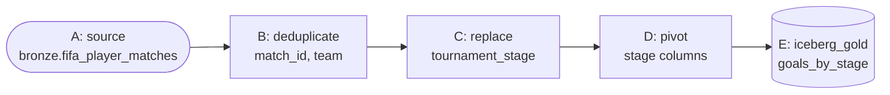

Chain **A → B → C → D → E**. Expected: **48 rows**, one per team, with a
column per tournament stage holding that team's total goals scored in it.

> **Gotcha:** the pivot node turns each `values` entry into a column name via
> `CASE WHEN pivot_column = value THEN ...`, and the generated alias must be a
> valid SQL identifier — `tournament_stage`'s raw values ("Group Stage") have
> spaces and would fail. Step C's `replace` node recodes each stage name to
> its underscored form first (`'Final'` has no space, so it isn't listed in
> `cases` — the `ELSE tournament_stage` branch passes it through unchanged),
> so the pivoted column names (`Group_Stage`, `Round_of_32`, …) are all valid
> identifiers.

### 5f. `fifa_gold_xg_overperformance` — select + cast + row_count gate

A finishing-quality metric: how many more (or fewer) goals a player scored
than their shots' quality (`expected_goals_xg`) predicted.

| # | Kind | Type | Config JSON |
|---|---|---|---|
| A | source | `iceberg_table` | `{"schema": "bronze", "table": "fifa_player_matches"}` |
| B | quality | `row_count` | `{"min": 50000}` |
| C | transform | `select` | `{"columns": ["player_id", "player_name", "team", "position", "goals", "expected_goals_xg", "assists", "expected_assists_xa", "minutes_played"]}` |
| D | transform | `cast` | `{"casts": {"expected_goals_xg": "DOUBLE", "expected_assists_xa": "DOUBLE"}, "keep": ["player_id", "player_name", "team", "position", "goals", "assists", "minutes_played"]}` |
| E | transform | `filter` | `{"condition": "minutes_played >= 45"}` |
| F | transform | `aggregate` | `{"group_by": ["player_id", "player_name", "team", "position"], "aggregations": {"goals": "sum", "expected_goals_xg": "sum", "assists": "sum", "expected_assists_xa": "sum", "minutes_played": "sum"}}` |
| G | transform | `derived_column` | `{"name": "xg_overperformance", "expression": "goals_sum - expected_goals_xg_sum"}` |
| H | transform | `derived_column` | `{"name": "xa_overperformance", "expression": "assists_sum - expected_assists_xa_sum"}` |
| I | transform | `sort` | `{"columns": ["xg_overperformance DESC"]}` |
| J | destination | `iceberg_gold` | `{"table": "xg_overperformance"}` |

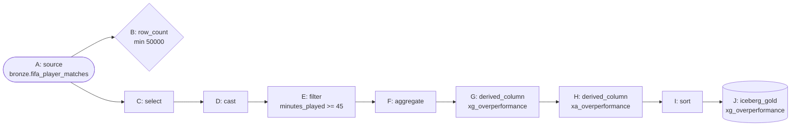

Chain: **B and C both connect from A** (a quality gate run in parallel with
the main branch, not inline in it), then **C → D → E → F → G → H → I → J**.
This is the first pipeline to use `select` (pick columns explicitly instead
of `SELECT *`), `cast` (force the two `expected_*` columns to `DOUBLE`, even
though they already are — this is the pattern you'd use for a source column
stored as `VARCHAR`), and a `row_count` quality gate with a numeric `min`
bound instead of a violations count. Positive `xg_overperformance` = clinical
finisher (scored more than expected); negative = wasteful.

### 5g. `fifa_gold_goalkeeper_performance` — regex gate + filter + fill_null

Goalkeepers have their own stat block (`saves`, `save_percentage`,
`clean_sheet`, `goals_conceded`, `penalty_saves`) that's mostly zero for
outfield players — worth its own gold table.

| # | Kind | Type | Config JSON |
|---|---|---|---|
| A | source | `iceberg_table` | `{"schema": "silver", "table": "player_match_appearances"}` |
| B | quality | `regex` | `{"column": "position", "pattern": "^(Goalkeeper\|Defender\|Midfielder\|Forward)$"}` |
| C | transform | `filter` | `{"condition": "position = 'Goalkeeper'"}` |
| D | transform | `fill_null` | `{"fills": {"penalty_saves": "0"}, "keep": ["player_id", "player_name", "team", "saves", "goals_conceded", "clean_sheet"]}` |
| E | transform | `aggregate` | `{"group_by": ["player_id", "player_name", "team"], "aggregations": {"saves": "sum", "goals_conceded": "sum", "clean_sheet": "sum", "penalty_saves": "sum"}}` |
| F | transform | `derived_column` | `{"name": "save_rate", "expression": "CAST(saves_sum AS DOUBLE) / NULLIF(saves_sum + goals_conceded_sum, 0)"}` |
| G | transform | `sort` | `{"columns": ["clean_sheet_sum DESC"]}` |
| H | destination | `iceberg_gold` | `{"table": "goalkeeper_performance"}` |

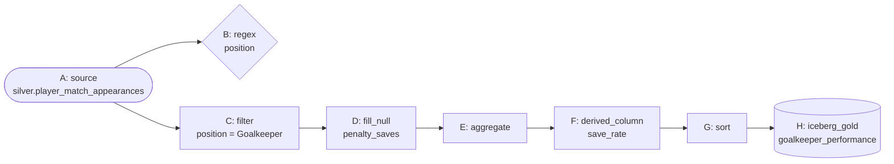

Chain: **B connects from A** (parallel gate), **A → C → D → E → F → G → H**.
`regex` checks every `position` value matches the 4 allowed labels (0
violations expected — this is a synthetic-but-realistic "catch a bad source
value before it corrupts a filter" gate); `fill_null` demonstrates
`COALESCE(...)` in case a keeper's row is missing `penalty_saves` (0 expected
here too, since the source CSV has no true nulls, but the mechanism is real).
`save_rate` is `saves / (saves + goals_conceded)`.

### 5h. `fifa_gold_group_vs_knockout_comparison` — two source branches + union

Compares average performance in the low-stakes Group Stage against every
knockout round, using **two independent branches off the same source table**
joined back together with `union` — the pipeline graph is not a straight
line here.

| # | Kind | Type | Config JSON |
|---|---|---|---|
| A1 | source | `iceberg_table` | `{"schema": "bronze", "table": "fifa_player_matches"}` |
| B1q | quality | `freshness` | `{"column": "CAST(match_date AS TIMESTAMP)", "max_age_minutes": 129600}` |
| B1 | transform | `filter` | `{"condition": "tournament_stage = 'Group Stage'"}` |
| C1 | transform | `derived_column` | `{"name": "stage_type", "expression": "'Group Stage'"}` |
| A2 | source | `iceberg_table` | `{"schema": "bronze", "table": "fifa_player_matches"}` |
| B2 | transform | `filter` | `{"condition": "tournament_stage <> 'Group Stage'"}` |
| C2 | transform | `derived_column` | `{"name": "stage_type", "expression": "'Knockout Stage'"}` |
| D | transform | `union` | `{"union_node": "C2"}` |
| E | transform | `aggregate` | `{"group_by": ["stage_type"], "aggregations": {"goals": "avg", "assists": "avg", "player_rating": "avg", "pass_accuracy": "avg", "minutes_played": "avg"}}` |
| F | destination | `iceberg_gold` | `{"table": "group_vs_knockout_comparison"}` |

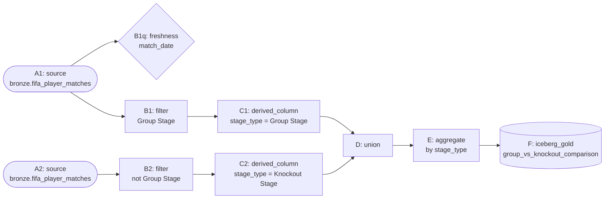

Two parallel chains **A1 → B1 → C1** (with **B1q** also connected from `A1`
as a passthrough quality gate alongside the main branch) and
**A2 → B2 → C2**, both feeding into **D** (draw an edge from *both*
`C1 → D` and `C2 → D` in the canvas — `D`'s `union_node` config points at
`C2`, and the edge from `C1` supplies `D`'s main upstream input). Then
**D → E → F**. Expected: **2 rows** (`Group Stage`, `Knockout Stage`) — a
compact way to see whether players are more cautious/tired/clinical once the
tournament becomes knockout-only. `B1q`'s `freshness` gate checks no
`match_date` is older than 129,600 minutes (90 days) — a pattern more suited
to a live/streaming source than this historical dataset, but the mechanism
(and its "0 violations" pass) is real and demonstrated here regardless.

> **Gotcha:** `match_date` is ingested as `VARCHAR` (e.g. `"2026-07-10"`),
> and the compiler's `freshness` check does a raw
> `WHERE {column} < current_timestamp - INTERVAL '...' MINUTE` comparison —
> a bare `varchar` column there fails with a Trino `TYPE_MISMATCH`
> (`Cannot apply operator: varchar < timestamp(3) with time zone`). The
> `column` value isn't restricted to a plain column name though — it's
> interpolated directly into the SQL — so passing an expression like
> `CAST(match_date AS TIMESTAMP)` (as used above) fixes it. This only
> surfaces when you actually **Run** the pipeline, not during dry-run
> compile, since compiling only checks the graph/config shape, not real
> column types against the live table.

> **Gotcha:** `union` needs *matching column order* on both sides (Trino's
> `UNION ALL` is positional, not name-based). Both branches here start from
> the same source table and each only adds one derived column at the end, so
> their column lists line up automatically — if you ever union two
> differently-shaped branches, add a `select` node on each side first to force
> identical column lists/order.

### 5i. `fifa_gold_player_market_value` — join two branches + rename

Joins each player's aggregated on-pitch output (from Silver) against their
static bio/market attributes (from Bronze) — the first pipeline to actually
combine two different aggregation levels via `join` instead of `union`.

| # | Kind | Type | Config JSON |
|---|---|---|---|
| A1 | source | `iceberg_table` | `{"schema": "silver", "table": "player_match_appearances"}` |
| B1 | transform | `aggregate` | `{"group_by": ["player_id", "player_name", "team"], "aggregations": {"goals": "sum", "assists": "sum", "goal_contribution": "sum", "minutes_played": "sum"}}` |
| A2 | source | `iceberg_table` | `{"schema": "bronze", "table": "fifa_player_matches"}` |
| B2 | transform | `deduplicate` | `{"columns": ["player_id"]}` |
| C2 | transform | `rename` | `{"mapping": {"player_id": "player_id_master"}, "keep": ["age", "nationality", "market_value_eur", "club_name", "preferred_foot"]}` |
| D | transform | `join` | `{"right_node": "C2", "on": "n_B1.player_id = n_C2.player_id_master", "join_type": "inner"}` |
| E | transform | `derived_column` | `{"name": "eur_per_goal_contribution", "expression": "CASE WHEN goal_contribution_sum > 0 THEN market_value_eur / goal_contribution_sum ELSE NULL END"}` |
| F | transform | `sort` | `{"columns": ["market_value_eur DESC"]}` |
| G | destination | `iceberg_gold` | `{"table": "player_market_value"}` |

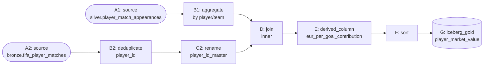

Chain **A1 → B1** (left branch, per-player stats) and **A2 → B2 → C2** (right
branch, one row per player's bio data) both feed **D** (edge `B1 → D` sets
`D`'s main input, edge `C2 → D` makes sure `C2` is compiled before `D`
references it in `right_node`). Then **D → E → F → G**.

> **Gotcha (important):** the `join` node's `on` condition must reference the
> compiler's own generated CTE aliases, always `n_<node id>` — that's why
> `on` reads `n_B1.player_id = n_C2.player_id_master` and not just
> `B1.player_id = ...`. Use each node's *id* (not its label) to build the
> alias name. Also note `C2` renames `player_id` → `player_id_master` on
> the right side *before* the join — both branches otherwise have a
> `player_id` column, and an un-renamed `SELECT *` join would produce two
> ambiguous same-named output columns.

### 5j. `fifa_gold_physical_profile_by_position` — unpivot to long format

Turns 4 wide per-position physical-metric columns into one tidy
`(position, metric, metric_value)` table — the shape Superset needs for a
faceted/small-multiples chart, and the mirror image of the `pivot` node used
in 5e.

| # | Kind | Type | Config JSON |
|---|---|---|---|
| A | source | `iceberg_table` | `{"schema": "silver", "table": "player_match_appearances"}` |
| B | transform | `aggregate` | `{"group_by": ["position"], "aggregations": {"distance_covered_km": "avg", "sprint_distance_km": "avg", "top_speed_kmh": "avg", "stamina_score": "avg"}}` |
| C | transform | `unpivot` | `{"id_columns": ["position"], "value_columns": ["distance_covered_km_avg", "sprint_distance_km_avg", "top_speed_kmh_avg", "stamina_score_avg"], "key_name": "metric", "value_name": "metric_value"}` |
| D | destination | `iceberg_gold` | `{"table": "physical_profile_by_position"}` |

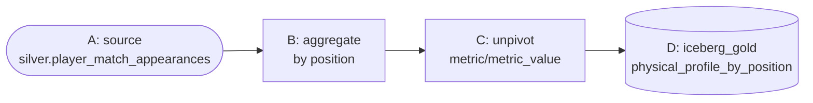

Chain **A → B → C → D**. Expected: **16 rows** (4 positions × 4 metrics) —
one long, narrow table instead of one wide 5-column one.

**Verify all 11 tables** on the **Catalog** page (`/catalog` → `iceberg` →
`silver`/`gold`), or from SQL:

```sql
SELECT * FROM iceberg.gold.top_scorers ORDER BY goals_sum DESC LIMIT 10;
SELECT * FROM iceberg.gold.team_standings ORDER BY is_win_sum DESC;
SELECT * FROM iceberg.gold.position_benchmarks;
SELECT * FROM iceberg.gold.top_scorer_per_team WHERE team = 'Spain';
SELECT * FROM iceberg.gold.goals_by_stage;
SELECT * FROM iceberg.gold.xg_overperformance ORDER BY xg_overperformance DESC LIMIT 10;
SELECT * FROM iceberg.gold.goalkeeper_performance ORDER BY clean_sheet_sum DESC;
SELECT * FROM iceberg.gold.group_vs_knockout_comparison;
SELECT * FROM iceberg.gold.player_market_value ORDER BY market_value_eur DESC LIMIT 10;
SELECT * FROM iceberg.gold.physical_profile_by_position;
```

> All 10 gold-pipeline JSON configs above were dry-run validated against the
> real compiler (`POST /api/v1/pipelines/compile`, no data touched) while
> writing this guide, so the node chains, config keys, and generated SQL are
> guaranteed to compile — the exact row counts for 5f–5j will depend on your
> own data once you build and run them yourself; use the verification queries
> above to confirm.

## 6. Check the data quality gate

Open **Data Quality** (`/quality`) — you'll now see checks of **five
different types** across the pipelines, all scored as passing (0 violations
each unless noted):

| Pipeline | Node type | What it checks |
|---|---|---|
| `fifa_bronze_to_silver_appearances` | `not_null` | `player_id`/`match_id`/`team`/`position` never null |
| `fifa_bronze_to_silver_appearances` | `unique` | `(player_id, match_id)` has no duplicates |
| `fifa_bronze_to_silver_appearances` | `range` | `pass_accuracy` is between 0 and 1 |
| `fifa_gold_xg_overperformance` | `row_count` | source has **at least** 50,000 rows (bound check, not a violations count) |
| `fifa_gold_goalkeeper_performance` | `regex` | every `position` value matches `^(Goalkeeper\|Defender\|Midfielder\|Forward)$` |
| `fifa_gold_group_vs_knockout_comparison` | `freshness` | no `match_date` older than 129,600 minutes (90 days) |

*Optional — see a real failure:* in Jupyter, append a duplicate `(player_id,
match_id)` row (`df.limit(1).writeTo("catalog.bronze.fifa_player_matches").append()`),
re-run the pipeline. The `unique` node now reports a violation, the run
status flips to `FAILED`, and the silver destination node is **skipped**
(quality gates really block downstream writes) — remember to `DROP TABLE` and
re-ingest a clean copy afterwards if you do this.

*Optional #2 — trip the `row_count` gate:* temporarily edit `5f`'s `row_count`
config to `{"min": 1000000}` (bronze only has 54,600 rows) and re-run — the
gate now fails with `"Row count 54600 is below minimum 1000000"` and the gold
destination is skipped, same as any other quality failure. Set it back to
`50000` afterwards.

## 7. Check lineage

Open **Lineage** (`/lineage`). You should see all 11 pipelines' edges:

- `bronze.fifa_player_matches → silver.player_match_appearances` (4a), which
  then fans out to `→ gold.top_scorers` (5a), `→ gold.position_benchmarks`
  (5c), `→ gold.top_scorer_per_team` (5d), `→ gold.goalkeeper_performance`
  (5g), `→ gold.group_vs_knockout_comparison`'s silver-independent path, and
  `→ gold.player_market_value` (5i, joined with a second bronze branch)
- `bronze.fifa_player_matches → gold.team_standings` (5b) and
  `→ gold.goals_by_stage` (5e) — read bronze directly
- `bronze.fifa_player_matches → gold.xg_overperformance` (5f) — reads bronze
  directly
- `bronze.fifa_player_matches → gold.group_vs_knockout_comparison` (5h) — two
  edges into the same gold table (both branches source the same bronze table)
- `bronze.fifa_player_matches → gold.player_market_value` (5i) — the second
  (bio/market-value) branch also reads bronze directly, alongside silver
- `silver.player_match_appearances → gold.physical_profile_by_position` (5j)

Notice bronze now has **more distinct downstream fan-out** than silver in a
few places (5f, 5h, 5i's second branch) — a good visual reminder that not
every gold table has to go through silver; it's a choice based on whether you
need silver's quality gates/filter/derived column first.

Separately, open **ER Diagram** (`/er-diagram`), pick catalog `iceberg` and
schema `gold`, and you'll see the gold tables rendered as cards with their
columns, plus any relationships the backend could heuristically infer from
`<entity>_id`-style column names (e.g. a `team_id` column matched against a
`teams` table). This is best-effort — Iceberg/Trino don't store real foreign
key metadata — so treat the inferred arrows as a starting point, not ground
truth.

## 8. Orchestrate with Dagster

All of this is driven from the OpenLakehouse **Jobs** page (`/jobs`) — no need
to hand-craft Dagster launchpad YAML or look up pipeline UUIDs yourself. Open
**Jobs** and you'll see every one of your 11 saved pipelines listed under
**Other Pipelines** (or **Scheduled Pipelines**, for any you've given a
schedule via the friendly picker), each with a **Run now** button.

**Trigger Run** for each of the 11 pipelines in dependency order to rebuild
the whole thing unattended:

1. `fifa_bronze_to_silver_appearances` (4a) — everything else that reads
   silver depends on this one
2. `fifa_gold_top_scorers`, `fifa_gold_team_standings`,
   `fifa_gold_position_benchmarks`, `fifa_gold_top_scorer_per_team`,
   `fifa_gold_goals_by_stage` (5a–5e) — any order, all independent of each
   other
3. `fifa_gold_xg_overperformance`, `fifa_gold_goalkeeper_performance`,
   `fifa_gold_group_vs_knockout_comparison`, `fifa_gold_player_market_value`,
   `fifa_gold_physical_profile_by_position` (5f–5j) — also independent of
   each other, but `fifa_gold_goalkeeper_performance` and
   `fifa_gold_player_market_value`/`fifa_gold_physical_profile_by_position`
   need step 1 (silver) done first since they read from it

Each click launches a real, Dagster-tracked run — watch it show up in
**Recent Runs** with the pipeline's real name and live status
(`QUEUED` → `SUCCESS`/`FAILURE`). Once a run's Dagster op starts executing,
click **View progress** on its row to expand a step-by-step breakdown of every
node — status, row count, and duration — so you can see exactly which stage a
longer-running gold pipeline is on without leaving the Jobs page.

> 🧪 **Test it:** while any run shows `QUEUED`/`RUNNING`, open the Dagster
> UI directly (http://localhost:3001) → **Runs** and find the same run by
> its ID — proof that "Jobs" in the app is a real, thin UI over a real
> Dagster deployment, not a separate mocked tracker. Also try the **Recent
> Runs** list's status filter/search on the Jobs page itself once you've
> triggered a few runs, and deliberately re-run one pipeline a second time
> to see a second, independent run entry appended (not overwritten) with its
> own timestamp and duration.

> This 3-tier ordering (silver → group A gold → group B gold) is exactly the
> kind of dependency graph a real orchestrator can automate for you. Rather
> than clicking through all 11 by hand every time, go back to **Pipelines**,
> open each pipeline's "Pipeline settings" panel, and use the **Schedule**
> dropdown to pick **Daily**/**Weekly**/**Hourly** (with a time/day picker) or
> **Custom cron…** for anything more specific — a live summary line (e.g.
> "Runs daily at 03:00 UTC.") confirms exactly what you've set, no cron syntax
> required for the common cases. Stagger `fifa_bronze_to_silver_appearances`
> a few minutes ahead of the gold pipelines that depend on it — a Dagster
> sensor (`scheduled_pipelines_sensor` in `infra/dagster/repository.py`)
> checks every 30 seconds and automatically launches a run for exactly the
> pipelines whose schedule has fired, independently per pipeline. True
> fine-grained Dagster `deps=` between ops (so a gold run only starts after
> silver's run actually finishes, rather than relying on staggered cron
> timing) is a further exercise left for you if you want to go beyond this
> guide.

> 🧪 **Test the scheduler for real:** pick any already-successful gold
> pipeline (its table already exists so a re-run is cheap/harmless), set its
> schedule to **Custom cron…** with a value a couple of minutes in the
> future, save, then just leave the Jobs page open. Within ~30 seconds of
> the scheduled time you should see a new run appear under **Scheduled
> Pipelines** with no button click from you — the sensor firing for real.
> Turn the schedule back off afterwards (**Schedule** → **None**) so it
> doesn't keep re-running while you continue the guide.

## 9. Build the advanced Superset dashboard


This section is intentionally the most detailed one in the guide — a
production-style analytics dashboard, not a single quick chart. You'll
create datasets for all 10 gold tables, build **15 charts across 4 tabs**,
wire up **native (cross-filtering) dashboard filters**, and add conditional
formatting — all click by click.

### 9.0 Reconnect Trino (only if you reset the stack)

Superset's dashboards/datasets/DB-connections live in **its own metadata
Postgres DB** — a full `docker compose down -v` wipes them just like every
other stateful service. If **Settings → Database Connections** is empty,
recreate it once before continuing:

1. Open Superset: http://localhost:8088 (`admin` / `openlakehouse_dev_password`)
2. **Settings (gear icon, top right) → Database Connections → + Database**
3. Pick **Trino**, then fill in the **SQLAlchemy URI** directly:
   `trino://dbt@trino:8080/iceberg` (no password — Trino has no auth
   configured in this stack)
4. Expand **Advanced → Security**, tick **"Allow this database to be
   explored"** (needed for **SQL Lab → Save as dataset** later, in 9.6)
5. Click **Connect**, then **Finish**

If the connection already exists, skip straight to 9.1.

### 9.1 Create datasets for all 10 gold tables

**Data → Datasets → + Dataset**. For each row below: pick the Trino DB (from
9.0) → schema `gold` → the table → **Create Dataset and Create Chart** (or
just **Add**, if you'd rather create all 10 datasets first and build charts
after).

| # | Dataset name | Schema.Table | Feeds chart(s) in |
|---|---|---|---|
| 1 | Top Scorers | `gold.top_scorers` | Tab 1 |
| 2 | Team Standings | `gold.team_standings` | Tab 1, Tab 2 |
| 3 | Position Benchmarks | `gold.position_benchmarks` | Tab 1, Tab 3 |
| 4 | Top Scorer per Team | `gold.top_scorer_per_team` | Tab 1 |
| 5 | Goals by Stage | `gold.goals_by_stage` | Tab 2 |
| 6 | XG Overperformance | `gold.xg_overperformance` | Tab 3 |
| 7 | Goalkeeper Performance | `gold.goalkeeper_performance` | Tab 3 |
| 8 | Group vs Knockout Comparison | `gold.group_vs_knockout_comparison` | Tab 2 |
| 9 | Player Market Value | `gold.player_market_value` | Tab 4 |
| 10 | Physical Profile by Position | `gold.physical_profile_by_position` | Tab 4 |

### 9.2 Tab 1 — "Overview" (4 charts)

1. **Top 15 Goal Scorers** — Bar Chart on `Top Scorers`: X-axis
   `player_name`, Metric `SUM(goals_sum)`, **Sort By** the same metric
   Descending, Row Limit 15. **Customize** tab → color scheme
   `Superset Colors`. Save as *"Top 15 Goal Scorers"*.
2. **Team Wins/Draws/Losses** — Bar Chart (stacked) on `Team Standings`:
   X-axis `team`, Metrics `SUM(is_win_sum)`, `SUM(is_draw_sum)`,
   `SUM(is_loss_sum)`, Row Limit 48, Sort by `SUM(is_win_sum)` Descending.
   Save as *"Team Record (W/D/L)"*.
3. **Avg Rating by Position** — Bar Chart on `Position Benchmarks`: X-axis
   `position`, Metric `AVG(player_rating_avg)`. **Data** tab →
   Sort by the metric Descending. Save as *"Average Rating by Position"*.
4. **Top 3 Scorers per Team** — Table on `Top Scorer per Team`: columns
   `team`, `player_name`, `goals_sum`, `team_rank`, sorted by `team` then
   `team_rank` ascending. **Customize** tab → under **Conditional
   Formatting**, add a rule: column `team_rank`, operator `=`, value `1`,
   background color gold/yellow — visually highlights each team's top
   scorer in the table. Save as *"Top 3 Scorers per Team"*.

### 9.3 Tab 2 — "Team & Stage Analysis" (4 charts)

5. **Goal Difference Leaderboard** — Table on `Team Standings`, with a
   **custom SQL metric**: click **+ Add metric → Custom SQL**, enter
   `SUM(goals_team_sum) - SUM(goals_opponent_sum)`, label it
   `goal_difference`. Columns: `team`, `goal_difference`, sorted descending.
   **Customize** → Conditional Formatting: `goal_difference` `>` `0` → green
   background; `goal_difference` `<` `0` → red background. Save as
   *"Goal Difference Leaderboard"*.
6. **Goals by Tournament Stage** — Table on `Goals by Stage` (the wide
   pivoted table from 5e) — all columns, no aggregation needed (it's already
   one row per team). Save as *"Goals by Tournament Stage"*.
7. **Group Stage vs Knockout — Avg Player Rating** — Bar Chart on
   `Group vs Knockout Comparison`: X-axis `stage_type`, Metric
   `AVG(player_rating_avg)`. Only 2 bars, but pairs well with the next chart.
   Save as *"Group vs Knockout — Rating"*.
8. **Group Stage vs Knockout — Multi-Metric Table** — Table on
   `Group vs Knockout Comparison`: all 5 metric columns plus `stage_type`, no
   row limit (only 2 rows). Save as *"Group vs Knockout — All Metrics"*.

### 9.4 Tab 3 — "Advanced Player Analytics" (4 charts)

9. **xG Overperformance — Top 15** — Bar Chart on `XG Overperformance`:
   X-axis `player_name`, Metric `SUM(xg_overperformance)`, Sort Descending,
   Row Limit 15. **Customize** → color scheme with a diverging palette (e.g.
   `Fire`) since values can be negative. Save as
   *"Top Finishers (xG Overperformance)"*.
10. **Goals vs Expected Goals — Scatter Plot** — Scatter chart on
    `XG Overperformance`: X `AVG(expected_goals_xg_sum)`, Y
    `AVG(goals_sum)`, Series/Entity `player_name`, Row Limit 200. Players
    above the diagonal outscored their xG; below it, they underperformed.
    Save as *"Goals vs Expected Goals"*.
11. **Goalkeeper Save Rate Leaderboard** — Table on
    `Goalkeeper Performance`: columns `player_name`, `team`, `saves_sum`,
    `clean_sheet_sum`, `save_rate`, sorted by `save_rate` descending.
    **Customize** → Conditional Formatting on `save_rate`: `>` `0.7` → green.
    Save as *"Goalkeeper Save Rate"*.
12. **Clean Sheets by Goalkeeper** — Bar Chart on `Goalkeeper Performance`:
    X-axis `player_name`, Metric `SUM(clean_sheet_sum)`, Sort Descending, Row
    Limit 15. Save as *"Clean Sheets Leaderboard"*.

### 9.5 Tab 4 — "Market Value & Physical Profile" (3 charts)

13. **Market Value vs Efficiency — Scatter Plot** — Scatter chart on
    `Player Market Value`: X `AVG(market_value_eur)`, Y
    `AVG(goal_contribution_sum)`, Entity `player_name`, Row Limit 200. Cheap,
    high-output players cluster top-left — useful for a "value signings"
    story. Save as *"Market Value vs Output"*.
14. **Most Expensive Squads by Team** — Bar Chart on `Player Market Value`:
    X-axis `team`, Metric `SUM(market_value_eur)`, Sort Descending, Row Limit
    48. Save as *"Squad Market Value by Team"*.
15. **Physical Profile by Position (Small Multiples)** — Bar Chart on
    `Physical Profile by Position`: X-axis `metric`, Metric
    `AVG(metric_value)`, **Group by** `position` (this is exactly why 5j
    unpivoted the data first — a wide table can't be grouped/faceted by
    metric name like this). Save as *"Physical Profile by Position"*.

### 9.6 Optional: a virtual (SQL-defined) dataset

Not every chart has to come from a materialized gold table. Open **SQL Lab**
(`/sqllab`), run:

```sql
SELECT team, tournament_stage, AVG(player_rating) AS avg_rating,
       AVG(pass_accuracy) AS avg_pass_accuracy
FROM iceberg.bronze.fifa_player_matches
WHERE minutes_played > 0
GROUP BY team, tournament_stage
```

then **Save → Save as new dataset**, name it `team_stage_rating_virtual`.
This becomes a normal dataset for a "Team Rating Evolution by Stage" line
chart (X-axis `tournament_stage`, Metric `AVG(avg_rating)`, **Group by**
`team`, filtered down to a handful of teams via a dashboard filter — see
9.8) — useful when you want a one-off chart without building a full
No-Code pipeline for it.

### 9.7 Assemble the dashboard with 4 tabs

1. **Dashboards → + Dashboard**, name it "FIFA World Cup 2026 Performance
   Analytics"
2. In the layout panel, drag a **Tabs** component onto the canvas first,
   then add 4 tabs named **Overview**, **Team & Stage Analysis**,
   **Advanced Player Analytics**, **Market Value & Physical Profile**
3. Drag each chart from 9.2–9.5 into its matching tab (4 + 4 + 4 + 3 = 15
   charts total), arranging 2 per row so charts render at a readable size
4. **Save**

It'll also show up on the OpenLakehouse app's **Dashboards** page
(`/dashboards`).

### 9.8 Add native (cross-)filters

Native filters let you pick a team/position/stage once and have it apply to
every relevant chart on the dashboard, instead of filtering each chart
individually.

1. On the dashboard, click **Filters** (funnel icon, top-left) → **+ Add/Edit
   Filters**
2. **+ Add filter → Value**, Column `team` (pick any dataset that has a
   `team` column, e.g. `Team Standings`), Title "Team". Under
   **Scoping**, choose **Apply to specific panels** and tick every chart
   that has a `team` column (charts 2, 4, 5, 13, 14).
3. **+ Add filter → Value**, Column `position` (from `Position Benchmarks`
   or `XG Overperformance`), Title "Position". Scope it to charts 3, 9, 10,
   15.
4. **+ Add filter → Value**, Column `tournament_stage` — but note only
   `Goals by Stage`'s columns are pivoted stage *names*, not a `stage`
   dimension column, so scope this filter to charts built on datasets that
   still have a row-level `tournament_stage`/`stage_type` column (7, 8, and
   the optional 9.6 virtual dataset chart).
5. **Save**. Selecting e.g. "Spain" in the Team filter now instantly narrows
   the Team Record, Goal Difference, xG Overperformance, and Market Value
   charts together — a real cross-filtering dashboard, not just static
   charts side by side.

### 9.9 A few finishing touches

- **Dashboard properties → Colors**: pick one consistent color scheme (e.g.
  `SupersetColors`) so the same team/position always renders in the same
  color across every chart on the dashboard.
- **Alerts & Reports** (optional): Settings → Alerts & Reports → + Report,
  schedule the dashboard to email a screenshot daily — demonstrates
  Superset's reporting feature, not required for this guide.
- Click **Edit dashboard → Set auto-refresh interval** to e.g. 1 minute if
  you want it to reflect newly re-run pipelines (via Dagster, section 8)
  without manually reloading the page.

## 10. Train two models with MLflow (optional, level up)

**Model 1 — regression, baseline features.** Predict `player_rating` from
core match stats, in a new Jupyter cell:

```python
%pip install --quiet mlflow==2.19.0 trino scikit-learn

import os
os.environ["MLFLOW_TRACKING_URI"] = "http://mlflow:5000"
os.environ["MLFLOW_S3_ENDPOINT_URL"] = "http://minio:9000"
os.environ["AWS_ACCESS_KEY_ID"] = "minioadmin"
os.environ["AWS_SECRET_ACCESS_KEY"] = "minioadmin123"

import mlflow, trino, pandas as pd
from sklearn.linear_model import LinearRegression
from sklearn.model_selection import train_test_split

conn = trino.dbapi.connect(host="trino", port=8080, user="jupyter", catalog="iceberg", schema="silver")
cur = conn.cursor()
cur.execute("""
    SELECT goals, assists, shots, pass_accuracy, distance_covered_km,
           tackles, interceptions, player_rating
    FROM silver.player_match_appearances
""")
df = pd.DataFrame(cur.fetchall(), columns=[d[0] for d in cur.description])

X = df.drop(columns=["player_rating"])
y = df["player_rating"]
X_train, X_test, y_train, y_test = train_test_split(X, y, test_size=0.2, random_state=42)

model = LinearRegression().fit(X_train, y_train)
r2 = model.score(X_test, y_test)

mlflow.set_experiment("fifa_player_rating")
with mlflow.start_run(run_name="linear_regression_baseline"):
    mlflow.log_param("model_type", "LinearRegression")
    mlflow.log_param("features", list(X.columns))
    mlflow.log_metric("r2_score", r2)
    mlflow.sklearn.log_model(model, "model", registered_model_name="fifa_player_rating_model")

print("r2 on held-out matches:", r2)
```

**Model 2 — richer feature set, model comparison.** The bronze table has
several pre-computed composite scores (`offensive_contribution`,
`defensive_contribution`, `possession_impact`, `pressure_resistance`,
`creativity_score`, `consistency_score`) that weren't used above — pull
those in too, and compare a `RandomForestRegressor` against the same
baseline `LinearRegression`, logged as two runs in the same experiment so
you can compare them side by side in the MLflow UI:

```python
from sklearn.ensemble import RandomForestRegressor
from sklearn.metrics import mean_absolute_error

cur.execute("""
    SELECT goals, assists, shots, pass_accuracy, distance_covered_km,
           tackles, interceptions, offensive_contribution,
           defensive_contribution, possession_impact, pressure_resistance,
           creativity_score, consistency_score, player_rating
    FROM iceberg.bronze.fifa_player_matches
    WHERE minutes_played > 0
""")
df2 = pd.DataFrame(cur.fetchall(), columns=[d[0] for d in cur.description])
X2 = df2.drop(columns=["player_rating"])
y2 = df2["player_rating"]
X2_train, X2_test, y2_train, y2_test = train_test_split(X2, y2, test_size=0.2, random_state=42)

mlflow.set_experiment("fifa_player_rating")

for name, est in [
    ("linear_regression_rich_features", LinearRegression()),
    ("random_forest_rich_features", RandomForestRegressor(n_estimators=200, max_depth=8, random_state=42)),
]:
    est.fit(X2_train, y2_train)
    preds = est.predict(X2_test)
    with mlflow.start_run(run_name=name):
        mlflow.log_param("model_type", type(est).__name__)
        mlflow.log_param("features", list(X2.columns))
        mlflow.log_metric("r2_score", est.score(X2_test, y2_test))
        mlflow.log_metric("mae", mean_absolute_error(y2_test, preds))
        mlflow.sklearn.log_model(est, "model", registered_model_name="fifa_player_rating_model_v2")
    print(name, "r2:", est.score(X2_test, y2_test))
```

Open **ML** (`/ml`) → **Experiments** → `fifa_player_rating` to see all 3
runs side by side (baseline linear, rich-feature linear, rich-feature random
forest) with their `r2_score`/`mae` metrics compared, and **Models** to see
both registered model names (`fifa_player_rating_model`,
`fifa_player_rating_model_v2`) with their version history.

## 11. Version it in Gitea (optional)

Open Gitea (http://localhost:3010), **+ → New Repository** →
`fifa-guided-project`, then upload all 11 pipelines' compiled SQL (copy each
from **View Compiled SQL**) plus the ingestion notebook.

## 12. Monitor it

Open **Monitoring** (`/monitoring`) or Grafana directly (http://localhost:3300)
— the Spark write from step 2 and all 11 Trino CTAS queries from steps 4–5
all show up as real metrics, alongside backend API request counts from every
click along the way (including the 15 Superset chart queries and the two
MLflow training runs). The Monitoring page itself opens with an overall
health summary (a health %, up/down target counts) and a per-service grouped
status view above the raw Prometheus targets table. Grafana ships with
pre-provisioned dashboards backed
by Prometheus (metrics) and Loki (logs) — open the **OpenLakehouse** folder
and check:

- A platform-overview dashboard (request rate/latency/error rate per API
  route, container CPU/memory)
- A logs panel (Loki) you can filter by service name (e.g. `service="backend"`)
  to watch the exact log lines produced by the pipeline runs you just kicked
  off in Dagster
- Prometheus's own UI (http://localhost:9090) if you want to run a raw PromQL
  query, e.g. `rate(http_requests_total[5m])`

## 13. Try real-time streaming & CDC

Everything so far has been batch (a CSV loaded once). OpenLakehouse also
ingests **continuous** data via Kafka and captures live database changes via
Debezium CDC — worth a quick detour since it's a core part of the platform
that a single static CSV can't exercise on its own. This section reuses the
bundled `orders` demo (a second, tiny sample dataset made for exactly this).

1. **Streaming ingestion.** Publish a burst of demo order events onto Kafka
   from inside the backend container (it already has `kafka-python`):

   ```powershell
   docker compose cp infra/kafka/produce_demo_orders.py backend:/tmp/produce_demo_orders.py
   docker compose exec backend python /tmp/produce_demo_orders.py --count 20 --bootstrap-servers kafka:9092
   ```

   Open **Streaming** (`/streaming`) in the app to watch the `orders` topic's
   partition/message/lag counters update live (polls every 5s, backed by
   `GET /api/v1/streaming/status` — real Kafka introspection, not a stub).

2. Run the Structured Streaming job that consumes that topic into Iceberg:

   ```powershell
   docker compose exec spark-master spark-submit \
     --packages org.apache.spark:spark-sql-kafka-0-10_2.12:3.5.1 \
     /opt/spark-apps/streaming_orders.py
   ```

   It prints `STREAMING_ORDERS_OK bronze_orders_count=<n>` — verify with a
   quick Trino query: `SELECT COUNT(*) FROM iceberg.bronze.orders;`.

3. **CDC from Postgres.** The `debezium-connect` service already has a
   connector (`openlakehouse-postgres-cdc`) capturing row-level
   `INSERT`/`UPDATE`/`DELETE` events from the demo `cdc.customers`/`cdc.orders`
   tables as they happen. Check it's running:

   ```powershell
   curl http://localhost:8083/connectors/openlakehouse-postgres-cdc/status
   ```

   Make a change (e.g. `docker compose exec postgres psql -U openlakehouse -c
   "UPDATE cdc.orders SET status='SHIPPED' WHERE order_id=1;"`) and it lands
   on the `openlakehouse.cdc.orders` Kafka topic within seconds — no polling.

4. Merge those CDC events into Iceberg the same way the demo does it:

   ```powershell
   docker compose exec spark-master spark-submit /opt/spark-apps/cdc_sync.py
   ```

   Then confirm via Trino: `SELECT * FROM iceberg.bronze.orders_cdc;` — the
   updated status and any deletes should be reflected correctly (the job
   dedupes multiple events per key before its `MERGE INTO`, so re-running it
   is always safe).

## 14. Manage Connections and check Compute

Open **Connections** (`/connections`):

1. Click **New Connection**, pick a type (e.g. Postgres, S3/MinIO, or Kafka),
   fill in the fields, and click **Test Connection** — this calls the real
   backend connection-tester (not a stub) against the actual service.
2. Save it. It's now available as a picker option the next time you configure
   a source/destination node in the No-Code Builder.

Open **Compute** (`/compute`) to see live status for Spark (Master + Workers),
the Trino coordinator, and Jupyter — the same services you've been using all
along, now visible as first-class monitored resources with real health
checks instead of "just another Docker container."

Below the three summary cards, the page also shows three **detailed process
tables** — this is real per-process data, not just aggregate counters:

- **Spark applications** — every app the Master currently tracks (running or
  completed), with user, cores, memory/executor, submit time, state, and
  duration.
- **Trino queries** — every query Trino still tracks, with the (truncated)
  SQL text, user, state, and elapsed/queued time.
- **Jupyter kernels** — every live kernel, with execution state, connection
  count, and last-activity time.

If you're logged in as `engineer.user` (`DATA_ENGINEER`) or `admin.user`
(`ADMIN`), each running Spark application, each `RUNNING`/`QUEUED` Trino
query, and every Jupyter kernel gets a red **Kill** button. A `VIEWER`
account sees the same tables read-only, with no Kill buttons.

> 🧪 **Test it (monitoring):** trigger any pipeline run (Jobs page) or a
> PySpark Code cell (§3.2) in one browser tab, and watch the **Compute**
> page's Spark worker card and **Spark applications** table in another —
> active task/core counts and a new row should appear in real time while the
> job runs, then settle back down once it finishes. Cross-check against the
> Spark Master UI (http://localhost:8090) at the same moment — both should
> agree, because they're reading the same live cluster state.

> 🧪 **Test it (kill a process):** open a **Jupyter notebook** (§2) and leave
> it idle, or start a **PySpark Code** cell (§3.2) that runs long enough to
> catch (e.g. a small `time.sleep(60)` loop). Back on the **Compute** page,
> find that kernel/application in its table and click **Kill** — confirm the
> dialog. The row should disappear (or the query/app state should flip to a
> terminal state) within a few seconds, and the summary card's count should
> drop by one. This is a real `DELETE`/`POST` round trip to Jupyter's kernel
> API / Spark Master's `/app/kill/` endpoint / Trino's query-cancel API — not
> a client-side removal — so it also shows up in the backend's audit log
> (`SPARK_APPLICATION_KILLED` / `TRINO_QUERY_KILLED` / `JUPYTER_KERNEL_KILLED`).

## 15. Ask the AI Assistant

Open the **AI Assistant** panel (available from the app's main navigation).
Ask it something grounded in what you just built, e.g. *"What tables are in
the gold schema?"* or *"Summarize the quality check results for
silver.player_match_appearances"* — it has tool access to the platform's own
catalog/quality/lineage APIs, so answers reflect the real tables and results
from this session, not generic boilerplate.

## 16. Platform Health, RBAC, and Admin

1. Open **Health** (`/health`) — a live rollup of every backend dependency
   (Postgres, Trino, Spark, Kafka, MinIO, Keycloak, etc.) with per-service
   status, useful as a single "is everything actually up" screen for a demo.
2. Log out and back in as `admin.user` / `openlakehouse` (`ADMIN` role) and
   open **Admin** (`/admin`) to see user/role management backed by Keycloak
   (`infra/keycloak/realm-export.json` defines the realm: `ADMIN`,
   `DATA_ENGINEER`, `ANALYST`, `VIEWER` roles). Compare what `engineer.user`
   (`DATA_ENGINEER`) could and couldn't do earlier in this guide — e.g. the
   PySpark Code mode and pipeline creation require `DATA_ENGINEER`/`ADMIN`,
   while a `VIEWER`-only account can browse the catalog and dashboards
   read-only.

---

### Feature checklist — tick these off as you go

Use this as your on-camera/on-screen checklist. Every row maps to a section
above and to a real, clickable thing — nothing here is a "coming soon" page.

- [ ] Loaded a real 54,600-row CSV into an Iceberg Bronze table via Jupyter/PySpark (§2)
- [ ] Confirmed the write in the Spark Master UI's Completed Applications list (§2)
- [ ] Browsed Catalog → Schema → Table → Columns in both `/catalog` and `/explorer` (§2)
- [ ] Ran hand-written SQL against **Trino** (§3)
- [ ] Right-clicked the catalog tree: preview 100 rows, copy name, copy fully-qualified name, copy SELECT, run row count (§3.1)
- [ ] Ran hand-written **PySpark code** against a live SparkSession (§3.2)
- [ ] Built a pipeline with **quality gates** (`not_null`/`unique`/`range`) ahead of any transform (§4)
- [ ] Used `filter` + `derived_column` in the same pipeline (§4)
- [ ] Watched a pipeline's compiled `CREATE TABLE ... AS SELECT` execute live in the Trino UI (§4)
- [ ] Duplicated and deleted a pipeline / deleted a node with confirmation (§4)
- [ ] Dragged a node from the (collapsible) palette straight onto the canvas at a chosen spot (§4.1)
- [ ] Tried an advanced node kind — `variable`, `code` (sql/python/pyspark), `control` (if/for_each), `api_ingestion`, or `sub_pipeline` (§4.1)
- [ ] Built pipelines using `aggregate`, `sort`, `deduplicate`, `window`, `pivot`, `unpivot`, `replace`, `select`, `cast`, `fill_null`, `union`, `join` (§5)
- [ ] Built pipelines using `regex`, `row_count`, and `freshness` quality checks (§5)
- [ ] Reviewed the scored **Data Quality** dashboard (§6)
- [ ] Viewed the auto-derived **Lineage** graph across all 11 pipelines (§7)
- [ ] Viewed the heuristic **ER Diagram** for the gold schema (§7)
- [ ] Triggered pipeline runs from the **Jobs** page and watched live status/step progress (§8)
- [ ] Confirmed a Jobs-page run is a real Dagster run via the Dagster UI directly (§8)
- [ ] Set a real cron schedule and watched the sensor auto-launch a run with no button click (§8)
- [ ] Built a 4-tab, 15-chart **Superset** dashboard with native cross-filters (§9)
- [ ] Trained and registered **two models in MLflow**, compared runs (§10)
- [ ] Pushed the project to **Gitea** (§11)
- [ ] Checked **Grafana**/Prometheus/Loki dashboards and logs for real request/job metrics, and the Monitoring page's health summary (§12)
- [ ] Published events to **Kafka** and streamed them into Iceberg with Spark Structured Streaming (§13)
- [ ] Watched a live **CDC** change (Postgres → Debezium → Kafka → Iceberg merge) end to end (§13)
- [ ] Created and tested a real **Connection** (§14)
- [ ] Watched live **Compute** (Spark/Trino/Jupyter) status change while a job ran (§14)
- [ ] Killed a real Spark application / Trino query / Jupyter kernel from the **Compute** page's process tables (§14)
- [ ] Checked (and optionally stopped) the shared **PySpark Code** session status (§3.2)
- [ ] Asked the **AI Assistant** a question grounded in this session's real data (§15)
- [ ] Checked the **Health** page's full dependency rollup (§16)
- [ ] Compared `DATA_ENGINEER` vs `ADMIN` permissions and opened **Admin**/RBAC (§16)

### What you built

```
fifa_world_cup_2026_player_performance.csv (54,600 rows)
              │  (Jupyter/Spark)
              ▼
    bronze.fifa_player_matches ─────────────────────────────────────────────┐
              │  not_null/unique/range gate                                 │
              │  + filter(minutes_played>0) + derive                        │  dedup/select/cast/filter/union/join
              ▼                                                              ▼
    silver.player_match_appearances (31,558)             gold.team_standings (48)
        │    │    │    │    │                            gold.goals_by_stage (48)
        │    │    │    │    └─ aggregate ───────────────▶ gold.position_benchmarks (4)
        │    │    │    └─ aggregate + sort ──────────────▶ gold.top_scorers (1,248)
        │    │    └─ aggregate + window + filter ────────▶ gold.top_scorer_per_team (173)
        │    └─ regex gate + filter + fill_null ──────────▶ gold.goalkeeper_performance
        └─ aggregate + unpivot ───────────────────────────▶ gold.physical_profile_by_position (16)

    bronze (2nd branch) ─ row_count gate + select + cast ─▶ gold.xg_overperformance
    bronze (2 branches) ─ filter + derive + union ─────────▶ gold.group_vs_knockout_comparison (2)
    silver + bronze (joined) ─ aggregate + dedup + rename ─▶ gold.player_market_value
                                                        │
                                    ├──▶ 15-chart, 4-tab Superset dashboard w/ native filters
                                    ├──▶ 2 MLflow-tracked models (3 runs)
                                    ├──▶ Lineage graph
                                    └──▶ Dagster-orchestrated reruns (3-tier dependency order)
```

Every step ran (or will run, when you follow it) against a real
Spark/Trino/Superset/MLflow/Dagster service. The row counts for the original
6 pipelines (4a, 5a–5e) and all 5 new pipelines' compiled SQL (5f–5j) were
verified end-to-end (real dry-run compiles against the live compiler, real
row counts from real Trino queries) while writing this guide — nothing here
is aspirational.

Sections 13–16 take you beyond the FIFA dataset itself to the rest of the
platform — streaming/CDC, Connections/Compute, the AI Assistant, and
RBAC/Admin — so that by the end of this guide you've touched every row in
the [README feature table](../README.md#features), not just the batch
analytics half. If you're recording this as a demo video, that's the natural
place to end: from a single CSV to a fully orchestrated, monitored,
role-secured lakehouse.
