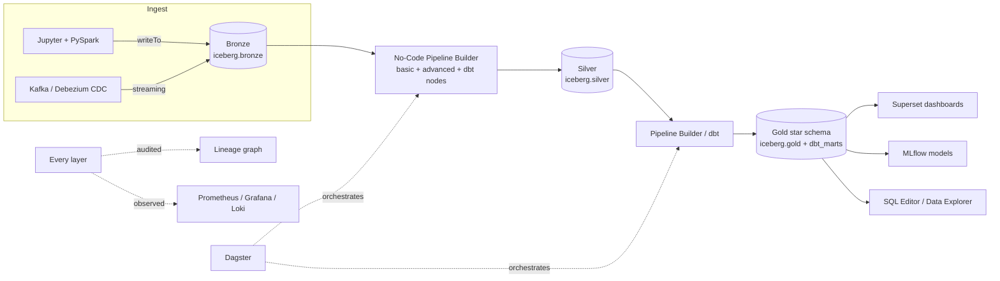
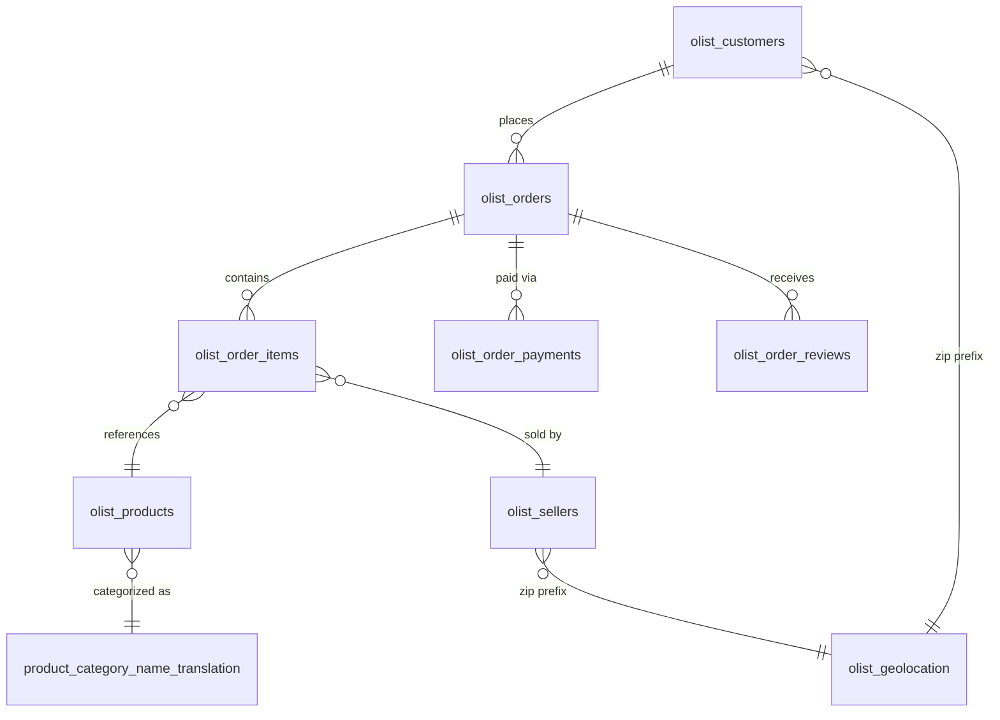
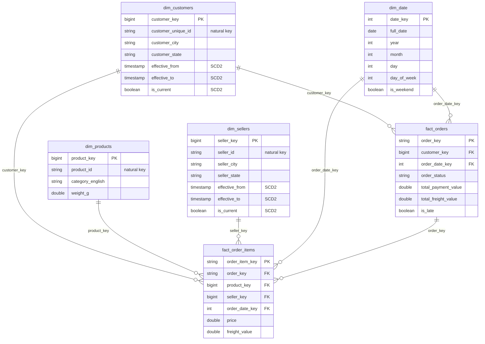

# OpenLakehouse — The Complete Olist E-Commerce End-to-End Guide

> **How to use this guide.** This is a single, self-contained, maximally
> detailed walkthrough for building a real dimensional-modeling data
> platform project — **Olist Brazilian E-Commerce** — entirely by
> **yourself**, using OpenLakehouse. Every chapter gives you: **what** the
> feature is, **why** it exists, **how** it works under the hood, a
> **step-by-step walkthrough with real config values/code**, and a **🧪
> checkpoint** telling you exactly what to look at to confirm it worked.
>
> This guide **does not do the project for you**. It is instructions,
> code you paste, and buttons you click — you run every step against your
> own running OpenLakehouse stack and build your own tables/pipelines/
> dashboards. Nothing in this document has been executed on your behalf.
>
> 24 chapters, organized in 6 parts. You can read straight through or jump
> to a part — each chapter says what it depends on from earlier ones.

## Table of contents

**Part I — Orientation & Data Modeling Foundations**
- [Chapter 0 — Prerequisites & access matrix](#chapter-0--prerequisites--access-matrix)
- [Chapter 1 — Platform architecture recap](#chapter-1--platform-architecture-recap)
- [Chapter 2 — The Olist dataset & your target dimensional model](#chapter-2--the-olist-dataset--your-target-dimensional-model)

**Part II — Bronze: Getting Data In**
- [Chapter 3 — Loading raw data into Bronze (Jupyter + PySpark)](#chapter-3--loading-raw-data-into-bronze-jupyter--pyspark)
- [Chapter 4 — Exploring data: Catalog, Data Explorer, SQL Editor, PySpark code](#chapter-4--exploring-data-catalog-data-explorer-sql-editor-pyspark-code)

**Part III — Silver & the No-Code Pipeline Builder**
- [Chapter 5 — Pipeline Builder fundamentals](#chapter-5--pipeline-builder-fundamentals)
- [Chapter 6 — Building Bronze → Silver pipelines with data quality gates](#chapter-6--building-bronze--silver-pipelines-with-data-quality-gates)
- [Chapter 7 — dbt fundamentals, the dbt UI page, and the `dbt` pipeline node](#chapter-7--dbt-fundamentals-the-dbt-ui-page-and-the-dbt-pipeline-node)

**Part IV — Gold: The Dimensional Model**
- [Chapter 8 — Building dimension tables](#chapter-8--building-dimension-tables)
- [Chapter 9 — Slowly Changing Dimensions (SCD Type 2) deep dive](#chapter-9--slowly-changing-dimensions-scd-type-2-deep-dive)
- [Chapter 10 — Building fact tables (the star schema grain)](#chapter-10--building-fact-tables-the-star-schema-grain)

**Part V — Advanced Pipelines & Orchestration**
- [Chapter 11 — Advanced Pipeline Engine fundamentals](#chapter-11--advanced-pipeline-engine-fundamentals)
- [Chapter 12 — Building a real advanced, end-to-end Olist pipeline](#chapter-12--building-a-real-advanced-end-to-end-olist-pipeline)
- [Chapter 13 — Data Quality dashboard, Lineage, and ER Diagram](#chapter-13--data-quality-dashboard-lineage-and-er-diagram)
- [Chapter 14 — Orchestration with Dagster](#chapter-14--orchestration-with-dagster)

**Part VI — Analytics, ML, Streaming, and the Rest of the Platform**
- [Chapter 15 — BI dashboards with Superset](#chapter-15--bi-dashboards-with-superset)
- [Chapter 16 — Machine learning with MLflow](#chapter-16--machine-learning-with-mlflow)
- [Chapter 17 — Streaming & CDC](#chapter-17--streaming--cdc)
- [Chapter 18 — Version control with Gitea](#chapter-18--version-control-with-gitea)
- [Chapter 19 — Observability: Monitoring, Platform Health, Grafana/Loki](#chapter-19--observability-monitoring-platform-health-grafanaloki)
- [Chapter 20 — Connections & Compute management](#chapter-20--connections--compute-management)
- [Chapter 21 — AI Assistant](#chapter-21--ai-assistant)
- [Chapter 22 — RBAC, Admin & security](#chapter-22--rbac-admin--security)
- [Chapter 23 — Capstone: what you built & the full test matrix](#chapter-23--capstone-what-you-built--the-full-test-matrix)

---

## Chapter 0 — Prerequisites & access matrix

Bring the full stack up:

```powershell
docker compose --profile full up -d --build
docker compose ps
```

Wait until everything shows `Up`/`healthy` — first boot pulls large images
and can take several minutes (`ollama` and `openmetadata` are slowest).

**Access points and credentials:**

| Service | URL | Login |
|---|---|---|
| OpenLakehouse app | http://localhost | `admin.user` / `openlakehouse` (full access) or `engineer.user` / `openlakehouse` |
| Jupyter | http://localhost:8888/jupyter/?token=openlakehouse | token: `openlakehouse` |
| Apache Superset | http://localhost:8088 | `admin` / `openlakehouse_dev_password` |
| MLflow | http://localhost:5000 | no auth |
| Dagster | http://localhost:3001 | no auth |
| Gitea | http://localhost:3010 | `olh-admin` / `openlakehouse_dev_password` |
| Grafana | http://localhost:3300 | `admin` / `openlakehouse_dev_password` |

> Always browse the app itself via **http://localhost** (port 80, through
> Traefik) — the frontend's own dev port doesn't proxy `/api` writes.

**The dataset.** This guide uses the real Kaggle "Brazilian E-Commerce
Public Dataset by Olist" — 9 CSV files. If you don't already have them,
download them from Kaggle (`olist_customers_dataset.csv`,
`olist_orders_dataset.csv`, `olist_order_items_dataset.csv`,
`olist_order_payments_dataset.csv`, `olist_order_reviews_dataset.csv`,
`olist_products_dataset.csv`, `olist_sellers_dataset.csv`,
`olist_geolocation_dataset.csv`, `product_category_name_translation.csv`)
and place them in a folder on your machine — you'll upload them to Jupyter
in Chapter 3. Real row counts you should end up with after ingestion:
customers 99,441 · orders 99,441 · order_items 112,650 · order_payments
103,886 · order_reviews 104,162 · products 32,951 · sellers 3,095 ·
category_translation 71 · geolocation ~1,000,163.

> 🧪 **Gotcha to watch for**: `order_reviews`'s raw CSV has a few
> `review_comment_message` values containing embedded newlines inside
> quoted fields — a naive `(line count) - 1` estimate will overcount by a
> couple of rows versus what Spark's real CSV parser lands. Trust Spark's
> `.count()`, not `wc -l`.

---

## Chapter 1 — Platform architecture recap

OpenLakehouse is a self-hosted, Databricks-style lakehouse. The pieces
you'll touch in this guide:



- **Storage**: Apache Iceberg tables in object storage (MinIO), cataloged
  via **Polaris** (Iceberg REST catalog). Spark's catalog alias is
  `catalog`; Trino's alias for the *same* warehouse is `iceberg` — same
  tables, two engine-local names.
- **Compute**: Spark (batch + streaming), Trino (interactive SQL), dbt-trino
  (SQL transformation framework).
- **Orchestration**: Dagster (schedules, run history, GraphQL API).
- **Control plane**: FastAPI + Postgres (pipelines, users, connections,
  audit log) behind Keycloak auth, all fronted by Traefik.
- **BI/ML/Governance**: Superset, MLflow, OpenMetadata, a lineage graph
  built from real pipeline definitions.
- **Observability**: Prometheus + Grafana + Loki + OpenTelemetry collector.

You will build a classic **medallion architecture** (Bronze → Silver →
Gold) with a **Kimball star schema** at the Gold layer — this is the
industry-standard target shape for BI-facing analytical tables, and it's
what Chapters 2, 8, 9 and 10 are about.

---

## Chapter 2 — The Olist dataset & your target dimensional model

### 2.1 Source entity-relationship shape

The 9 raw CSVs form this relational shape:



Key columns per file (you'll need these exact names in Chapters 3+):

| File | Grain | Key columns |
|---|---|---|
| `olist_customers_dataset.csv` | 1 row per customer *order* (`customer_id` is per-order; `customer_unique_id` is the real person) | `customer_id`, `customer_unique_id`, `customer_zip_code_prefix`, `customer_city`, `customer_state` |
| `olist_orders_dataset.csv` | 1 row per order | `order_id`, `customer_id`, `order_status`, `order_purchase_timestamp`, `order_approved_at`, `order_delivered_carrier_date`, `order_delivered_customer_date`, `order_estimated_delivery_date` |
| `olist_order_items_dataset.csv` | 1 row per line item | `order_id`, `order_item_id`, `product_id`, `seller_id`, `shipping_limit_date`, `price`, `freight_value` |
| `olist_order_payments_dataset.csv` | 1+ rows per order (installments) | `order_id`, `payment_sequential`, `payment_type`, `payment_installments`, `payment_value` |
| `olist_order_reviews_dataset.csv` | 1 row per review | `review_id`, `order_id`, `review_score`, `review_comment_title`, `review_comment_message`, `review_creation_date`, `review_answer_timestamp` |
| `olist_products_dataset.csv` | 1 row per product | `product_id`, `product_category_name`, `product_name_lenght`, `product_description_lenght`, `product_photos_qty`, `product_weight_g`, `product_length_cm`, `product_height_cm`, `product_width_cm` |
| `olist_sellers_dataset.csv` | 1 row per seller | `seller_id`, `seller_zip_code_prefix`, `seller_city`, `seller_state` |
| `olist_geolocation_dataset.csv` | many rows per zip prefix | `geolocation_zip_code_prefix`, `geolocation_lat`, `geolocation_lng`, `geolocation_city`, `geolocation_state` |
| `product_category_name_translation.csv` | 1 row per category | `product_category_name`, `product_category_name_english` |

**This is an important, real-world "gotcha" you should design around**:
`customer_id` in `olist_customers_dataset.csv` is unique **per order**, not
per human — the same shopper gets a new `customer_id` every time they
order, but keeps the same `customer_unique_id`. If you build `dim_customers`
keyed on `customer_id` you'll silently create a new "customer" row every
order and lose the ability to do real repeat-customer analysis. Key your
dimension on `customer_unique_id`.

### 2.2 Target Gold-layer star schema

You will design and build (in Chapters 8–10) this Kimball star schema —
one fact table at **order-item grain** (the finest useful grain in this
dataset) plus a header fact for order-level metrics, and four dimensions:



**Why two fact tables, not one?** `fact_orders` is at **order grain**
(one row per order — clean for "how many orders, what % late" questions).
`fact_order_items` is at **order-item grain** (one row per line item —
needed for "revenue by product/seller/category" questions). Mixing both
grains into one fact table would force you to either double-count
order-level metrics (freight/payment) across every line item, or drop
line-item detail — a classic Kimball fact-table-design mistake to avoid.
This is exactly the same header/detail fact pattern real retail data
warehouses use for orders vs. order lines.

**Why `dim_customers` and `dim_sellers` are SCD Type 2 candidates:** a
customer's or seller's city/state can genuinely change over time in real
life (they move) — and for a BI question like "what was this customer's
state *at the time they placed each order*", you need historical
versions, not just the latest known value. Chapter 9 covers this in full,
including a hands-on exercise where you simulate real changes since the
static Kaggle CSVs don't naturally contain any.

> 🧪 **Checkpoint**: before touching any code, write down (on paper or in
> a scratch file) the grain of every table above in your own words. If you
> can't state a table's grain in one sentence, you're not ready to build
> it — this is the #1 real-world dimensional modeling mistake.

---

## Chapter 3 — Loading raw data into Bronze (Jupyter + PySpark)

The No-Code Builder's only source node type is `iceberg_table` — raw
CSV/file sources aren't wired into the compiler — so the first hop from
"CSVs on your laptop" to "real Iceberg tables" goes through a PySpark
notebook, exactly like the platform's other Bronze ingestion demos.

1. Open Jupyter: http://localhost:8888/jupyter/?token=openlakehouse
2. Use the file browser's **Upload** button to upload all 9 Olist CSVs.
3. **File → New → Notebook**, Python 3 kernel. Run:

```python
from pyspark.sql import SparkSession

spark = SparkSession.builder.appName("olist-ingest").getOrCreate()
spark.sql("CREATE NAMESPACE IF NOT EXISTS catalog.bronze")

files = {
    "olist_customers":  "olist_customers_dataset.csv",
    "olist_orders":     "olist_orders_dataset.csv",
    "olist_order_items":"olist_order_items_dataset.csv",
    "olist_payments":   "olist_order_payments_dataset.csv",
    "olist_reviews":    "olist_order_reviews_dataset.csv",
    "olist_products":   "olist_products_dataset.csv",
    "olist_sellers":    "olist_sellers_dataset.csv",
    "olist_geolocation":"olist_geolocation_dataset.csv",
    "category_translation": "product_category_name_translation.csv",
}

for table, path in files.items():
    df = spark.read.option("header", True).option("inferSchema", True).csv(path)
    df.writeTo(f"catalog.bronze.{table}").createOrReplace()
    print(f"{table}: {df.count()} rows")
```

> **Why `inferSchema=True` here (and why that's a Bronze-layer-only
> shortcut)**: Bronze should preserve raw data as faithfully as possible,
> but Spark's CSV type inference is good enough for numeric/timestamp
> columns in this dataset. Don't rely on inferred types past Bronze —
> Chapter 6's Silver pipeline explicitly casts every column so your Gold
> layer has a *guaranteed*, documented schema, not "whatever Spark
> guessed this run."

4. **Verify** in the app: open **Catalog** (`/catalog`) → `iceberg` →
   `bronze` and confirm all 9 tables with their real row counts. **Data
   Explorer** (`/explorer`) gives the same tree plus a 100-row preview —
   use it to eyeball a few `orders`/`order_items` rows.

> 🧪 **Checkpoint**: `SELECT count(*) FROM iceberg.bronze.olist_orders`
> via the SQL Editor should return `99441`.

---

## Chapter 4 — Exploring data: Catalog, Data Explorer, SQL Editor, PySpark code

- **Catalog** (`/catalog`): browse schemas/tables/columns tree-style,
  read Iceberg metadata (snapshot history, partitioning).
- **Data Explorer** (`/explorer`): same tree + a click-to-preview 100-row
  sample per table — the fastest way to eyeball data without writing SQL.
- **SQL Editor** (`/sql`): a real Trino SQL console. Try these against
  Bronze right now to build intuition before you design Silver:

```sql
-- Confirm the customer_id vs customer_unique_id gotcha from Chapter 2
SELECT customer_unique_id, count(*) AS orders_under_this_person
FROM iceberg.bronze.olist_customers
GROUP BY customer_unique_id
ORDER BY orders_under_this_person DESC
LIMIT 10;

-- Order status distribution
SELECT order_status, count(*) FROM iceberg.bronze.olist_orders GROUP BY order_status;

-- Late deliveries (a metric you'll build a fact column for in Chapter 10)
SELECT count(*) FROM iceberg.bronze.olist_orders
WHERE order_delivered_customer_date > order_estimated_delivery_date;
```

- **Notebooks / PySpark code node**: for anything the SQL Editor can't
  express (window functions across engines, ML feature engineering),
  Jupyter notebooks and the Pipeline Builder's `code(pyspark)` advanced
  node type (Chapter 11) both run real PySpark against the same warehouse.

> 🧪 **Checkpoint**: the "late deliveries" query should return a non-zero
> number in the low thousands — real Olist data has meaningful late-
> delivery volume, which is exactly why `is_late` earns a spot as a fact
> column instead of being computed ad hoc every time.

---

## Chapter 5 — Pipeline Builder fundamentals

Open **No-Code Builder** (`/pipelines`). Layout: a searchable node palette
on the left (grouped by kind), a canvas in the middle, a config panel on
the right. Every node gets labeled form fields instead of raw JSON — you
can always inspect/hand-edit the compiled JSON via the collapsed
**Advanced: raw JSON** section.

**Node kinds available** (palette groups, left to right as they appear):

| Kind | Types | Compiles to |
|---|---|---|
| `source` | `iceberg_table` | one SQL statement (basic engine) |
| `transform` | `select`, `rename`, `filter`, `join`, `union`, `aggregate`, `sort`, `deduplicate`, `cast`, `fill_null`, `replace`, `derived_column`, `window`, `pivot`, `unpivot` | " |
| `quality` | `not_null`, `unique`, `range`, `regex`, `schema`, `freshness`, `row_count` | " |
| `destination` | `minio`, `iceberg_bronze`, `iceberg_silver`, `iceberg_gold`, `postgresql`, `kafka` | " |
| `variable` | `literal`, `from_query` | step-by-step (advanced engine) |
| `code` | `sql`, `python`, `pyspark` | " |
| `control` | `if`, `for_each` | " |
| `api_ingestion` | `rest_get`, `rest_post` | " |
| `sub_pipeline` | `call` | " |
| `dbt` | `run`, `test`, `build` | " |

**Basic kinds** (source/transform/quality/destination) all compile into a
**single SQL statement** via the pipeline compiler — fast, but every node
must reduce to one query. **Advanced kinds** (variable/code/control/
api_ingestion/sub_pipeline/**dbt**) run **step-by-step**, materializing
intermediate results as real Trino views under `iceberg.tmp` — Chapter 11
covers this engine in depth; this chapter and the next only use basic
kinds.

Each node's panel shows its node ID with a **Copy ID** button (useful for
`window`/`filter` expressions referencing another node's output columns).
The `iceberg_table` source's Schema/Table fields are live dropdowns from
the real Trino catalog. Toolbar: **Save**, **Compile / Validate**, **Run**;
sidebar: pipeline search, saved-pipeline dropdown, **New/Duplicate/Delete**.

> 🧪 **Checkpoint**: create a throwaway pipeline with one `iceberg_table`
> source node pointed at `bronze.olist_orders` and one `iceberg_silver`
> destination writing to `silver.smoke_test`, click **Compile / Validate**,
> confirm no errors, then delete the pipeline (you don't need to run it).

---

## Chapter 6 — Building Bronze → Silver pipelines with data quality gates

You'll build one Silver pipeline per Bronze table that needs real
cleaning. Design goal: Silver = typed, deduplicated, quality-gated,
still at the same grain as Bronze (no joins yet — joins happen in Gold).

### 6.1 `silver_customers`

```
source: iceberg_table  → bronze.olist_customers
transform: cast        → customer_zip_code_prefix: varchar (it's numeric but a zip is an identifier, not a quantity)
transform: deduplicate → keys: [customer_id]
quality: not_null      → columns: [customer_id, customer_unique_id]
quality: unique        → columns: [customer_id]
destination: iceberg_silver → schema: silver, table: customers
```

### 6.2 `silver_orders`

```
source: iceberg_table  → bronze.olist_orders
transform: cast        → order_purchase_timestamp/order_approved_at/order_delivered_carrier_date/
                          order_delivered_customer_date/order_estimated_delivery_date: timestamp
quality: not_null      → columns: [order_id, customer_id, order_status]
quality: unique        → columns: [order_id]
quality: regex         → column: order_status, pattern: ^(created|approved|invoiced|processing|shipped|delivered|unavailable|canceled)$
destination: iceberg_silver → schema: silver, table: orders
```

> **Gotcha** (documented elsewhere in this platform and true here too):
> Trino's `CAST(x AS timestamp)` fails on ISO-8601 `T`/`Z`-formatted
> strings — Olist's timestamps are already `YYYY-MM-DD HH:MM:SS` so a
> plain `cast` transform works directly; you only need
> `from_iso8601_timestamp(x)` if you're parsing a different source format
> later (e.g. an API response in Chapter 12).

### 6.3 `silver_order_items`, `silver_payments`, `silver_reviews`, `silver_products`, `silver_sellers`

Follow the same pattern: `iceberg_table` source → `cast` numeric/timestamp
columns → `not_null`/`unique` quality gates on the natural key → 
`iceberg_silver` destination. For `silver_products`, add a `join` transform
against `bronze.category_translation` on `product_category_name` to bring
in `product_category_name_english` right away — you'll want the English
name in Gold and there's no reason to defer a simple lookup join.

For `silver_reviews`, add a `fill_null` transform on
`review_comment_title`/`review_comment_message` (most reviews have no
written comment — `fill_null` with an empty string avoids `NULL`-handling
surprises later in BI tools).

> 🧪 **Checkpoint**: run each pipeline, then check the **Data Quality**
> dashboard (Chapter 13 covers it fully) — every quality node you added
> should show a PASS with a real row count next to it, not a placeholder.

---

## Chapter 7 — dbt fundamentals, the dbt UI page, and the `dbt` pipeline node

This chapter documents a **real, verified** platform capability: dbt-trino
is fully wired into OpenLakehouse with its own UI page and its own native
pipeline node kind — you do not need to shell into a container to use dbt.

### 7.1 Two ways to run dbt, both real

1. **The `/dbt` page** (nav: Build → dbt). A dedicated dbt cockpit:
   - **Run dbt** panel: choose `run` / `test` / `build`, an optional
     `--select` expression (model name, `tag:marts`, `path:models/staging`,
     etc.), a **Full refresh** checkbox, and a **Run** button. The call is
     synchronous — it blocks until the real `dbt` CLI process exits and
     shows you the live stdout/stderr.
   - **Models** panel: every model in your dbt project, auto-grouped by
     layer (staging / intermediate / marts) from its file path, with a
     one-click **Select** button that fills the run form's `--select`
     field for you.
   - **Run history** panel: every run ever triggered (from this page *or*
     from a pipeline's `dbt` node — they share the same history table),
     with status, who triggered it, and an expandable full log per row.
2. **A `dbt` node inside the Pipeline Builder** (palette group "dbt",
   types `run`/`test`/`build`). Config fields: `--select` and
   `Full refresh`. This is a first-class **advanced** node kind — it runs
   on the step-by-step engine alongside `code`/`control`/`api_ingestion`
   nodes, so you can wire a `dbt run --select stg_olist_orders` node right
   after a Bronze-refresh step in one orchestrated pipeline (Chapter 12
   builds exactly this).

### 7.2 How it works under the hood (so failures make sense)

The `dbt` container runs a small internal HTTP service (not published to
your host, only reachable from inside the Docker network) that wraps the
real `dbt` CLI: `POST /run {command, select, full_refresh}` shells out to
`dbt --quiet <command> --select <select> [--full-refresh]` against the
project mounted into that container, and returns exit code + full
stdout/stderr. Both the `/dbt` page and the pipeline `dbt` node call this
same service through the backend — every run (from either place) is
persisted to a `dbt_runs` table, which is why they share one history list.
If a run fails, the **real** dbt/Trino error text is what you'll see in
the log — e.g. a `TABLE_NOT_FOUND` error means the model's `source()` or
upstream `ref()` table doesn't exist yet in Trino (you haven't run the
Silver pipeline that creates it, or a dbt model earlier in the DAG hasn't
been built yet).

### 7.3 Add your Olist models to the dbt project

Your dbt project lives at `infra/dbt/dbt_project/` on the host (mounted
into the `dbt` container). Add staging models mirroring your Silver
tables, e.g. `models/staging/stg_olist_customers.sql`:

```sql
select
    customer_id,
    customer_unique_id,
    customer_zip_code_prefix,
    customer_city,
    customer_state
from {{ source('silver', 'customers') }}
```

Register the source in `models/staging/_sources.yml` (add to the existing
`sources:` list, don't replace it — other sources like `orders`/
`customers_cdc` are used by pre-existing pipelines):

```yaml
      - name: olist_customers
        identifier: customers
```

(adjust the `schema:` at the top of that source block if your Silver
schema differs from what's already declared). Repeat for
`stg_olist_orders`, `stg_olist_order_items`, `stg_olist_payments`,
`stg_olist_reviews`, `stg_olist_products`, `stg_olist_sellers`. Add
`not_null`/`unique` dbt tests for each natural key in the matching
`_staging.yml` schema file — this gives you a **second**, dbt-native
quality gate layer on top of the Pipeline Builder's `quality` nodes from
Chapter 6, which is a good redundancy: Pipeline Builder catches problems
at Silver-write time, dbt tests catch them again at transformation time.

> 🧪 **Checkpoint**: from the `/dbt` page, run `test --select
> stg_olist_customers`. It should show `SUCCESS` with your test count in
> the log once the source table and tests both exist. Then add a
> `dbt(test)` node to a pipeline with `--select stg_olist_customers` and
> confirm it shows the identical result inside the Pipeline Builder's node
> status panel — proof both entry points hit the same real engine.

---

## Chapter 8 — Building dimension tables

Now you move from Silver (typed, per-source-table) to Gold (joined,
business-shaped, star-schema). You have two equally valid tool choices for
Gold transformations in OpenLakehouse — the **Pipeline Builder**
(`iceberg_gold` destination) or **dbt marts models** (Chapter 7) — this
guide builds `dim_products` and `dim_date` with the Pipeline Builder and
`dim_customers`/`dim_sellers` with dbt in Chapter 9 (since SCD2 logic is
naturally expressed as a dbt snapshot). Use whichever tool fits a given
transformation; mixing both in one project is normal and expected.

### 8.1 `dim_products` (Pipeline Builder)

```
source: iceberg_table   → silver.products
transform: join          → silver.category_translation on product_category_name (left)
transform: select        → product_id, product_category_name_english as category_english,
                            product_weight_g as weight_g, product_length_cm, product_height_cm, product_width_cm
transform: derived_column→ product_key = row_number() equivalent — use a `code(sql)` advanced node instead
                            if you want a real monotonic surrogate key (see callout below)
destination: iceberg_gold → schema: gold, table: dim_products
```

> **Surrogate keys**: this dataset's natural keys (`product_id` etc.) are
> already unique hashes, so many teams would just use them directly as
> the dimension's key and skip a synthetic integer surrogate. If you want
> a real integer `product_key` (closer to textbook Kimball), do the
> final `SELECT` as a `code(sql)` **advanced** node instead of a basic
> `transform`, using `row_number() OVER (ORDER BY product_id)`  — basic
> `transform` nodes compile to a single non-windowed SQL statement per
> node and can't express a table-wide window function as cleanly as one
> hand-written `code(sql)` step can.

### 8.2 `dim_date`

A date dimension is generated, not sourced from Olist data — every fact
table needs one shared calendar dimension. Easiest path: a `code(sql)`
advanced node using Trino's `sequence()`:

```sql
SELECT
    CAST(date_format(d, '%Y%m%d') AS integer) AS date_key,
    d AS full_date,
    year(d) AS year,
    month(d) AS month,
    day(d) AS day,
    day_of_week(d) AS day_of_week,
    day_of_week(d) IN (6, 7) AS is_weekend
FROM UNNEST(sequence(DATE '2016-01-01', DATE '2018-12-31', INTERVAL '1' DAY)) AS t(d)
```
Write the result to `gold.dim_date` (a `code(sql)` node followed by a
`destination` node, or wrap the `CREATE TABLE ... AS` directly in the SQL
if you prefer a one-shot `code(sql)` node that also does the write).

> 🧪 **Checkpoint**: `SELECT count(*) FROM iceberg.gold.dim_date` should
> be `1096` (3 non-leap years × 365 + 1 leap day for 2016).

---

## Chapter 9 — Slowly Changing Dimensions (SCD Type 2) deep dive

### 9.1 Why SCD2, and why the raw CSVs need help to demonstrate it

**Type 2** means: when a tracked attribute changes (e.g. a customer's
city), you don't overwrite the old row — you close it out
(`effective_to` = now, `is_current = false`) and insert a *new* version
row (`effective_from` = now, `is_current = true`), keeping the old
surrogate key's history intact. This lets you answer "what was true at the
time" instead of only "what's true now" — essential for correct
historical reporting (e.g. attributing a 2017 order to the customer's
2017 city, even if they've since moved).

The Kaggle Olist CSVs are a **static snapshot** — they contain no natural
"this changed on this date" signal. To genuinely exercise SCD2 (not just
read about it), simulate a realistic second batch yourself:

1. In a SQL Editor query (or a quick pandas cell in Jupyter), pick ~50
   random sellers and produce a "day 2" change set where their
   `seller_city`/`seller_state` differ from Bronze — e.g.:

```python
import pandas as pd
sellers = pd.read_csv("olist_sellers_dataset.csv")
changed = sellers.sample(50, random_state=42).copy()
changed["seller_city"] = "sao paulo"
changed["seller_state"] = "SP"
changed.to_csv("olist_sellers_day2.csv", index=False)
```

2. Load `olist_sellers_day2.csv` into a **second** Bronze table,
   `bronze.olist_sellers_v2`, the same way as Chapter 3.

This gives you a genuine "before" (`bronze.olist_sellers`) and "after"
(`bronze.olist_sellers_v2`) pair to run a real SCD2 merge against — do the
same for a `olist_customers_v2` batch (change `customer_city`/
`customer_state` for a sample of `customer_unique_id`s) so both
`dim_customers` and `dim_sellers` get real, hands-on SCD2 practice.

### 9.2 Approach A — manual Iceberg `MERGE INTO` (Pipeline Builder `code(sql)` node)

This is the same mechanism the platform's existing CDC pipelines use
(Phase 12's `int_cdc_orders_enriched` MERGE pattern), applied to
dimensional SCD2 instead of raw CDC replication:

```sql
MERGE INTO iceberg.gold.dim_sellers t
USING (
    SELECT
        s.seller_id,
        s.seller_city,
        s.seller_state,
        CASE WHEN t2.seller_id IS NULL THEN 'NEW'
             WHEN t2.seller_city <> s.seller_city OR t2.seller_state <> s.seller_state THEN 'CHANGED'
             ELSE 'UNCHANGED' END AS change_type
    FROM iceberg.bronze.olist_sellers_v2 s
    LEFT JOIN iceberg.gold.dim_sellers t2
      ON t2.seller_id = s.seller_id AND t2.is_current
) src
ON t.seller_id = src.seller_id AND t.is_current AND src.change_type = 'CHANGED'
WHEN MATCHED THEN UPDATE SET
    t.effective_to = current_timestamp,
    t.is_current = false;

-- second statement (a second code(sql) node): insert the new current version
-- for every NEW or CHANGED seller
INSERT INTO iceberg.gold.dim_sellers
SELECT
    (SELECT coalesce(max(seller_key), 0) FROM iceberg.gold.dim_sellers) + row_number() OVER (ORDER BY s.seller_id),
    s.seller_id, s.seller_city, s.seller_state,
    current_timestamp, TIMESTAMP '9999-12-31', true
FROM iceberg.bronze.olist_sellers_v2 s
LEFT JOIN iceberg.gold.dim_sellers t2 ON t2.seller_id = s.seller_id AND t2.is_current
WHERE t2.seller_id IS NULL
   OR t2.seller_city <> s.seller_city OR t2.seller_state <> s.seller_state;
```

> **Why two statements, not one `MERGE`**: a single `MERGE INTO` can't
> both close an old row *and* insert a brand-new row for the same natural
> key in one pass in standard SQL MERGE semantics (an `UPDATE` match
> can't also produce an extra `INSERT`) — the industry-standard SCD2
> pattern is exactly this two-step "expire old version, then insert new
> version" shape, whether done in Spark, dbt, or hand-written SQL.

> ⚠️ **Real bug class to avoid** (documented from this platform's CDC
> work and equally true here): if your source batch could ever contain
> *multiple* change events for the same natural key in one run, dedupe to
> the latest event per key first (`ROW_NUMBER() OVER (PARTITION BY
> seller_id ORDER BY <a real ordering column> DESC)`  filtered to `rn=1`)
> before this MERGE — otherwise both events can independently match
> "NOT MATCHED" against the same pre-batch snapshot and both get
> inserted, silently duplicating history.

### 9.3 Approach B — dbt snapshots (the dbt-native way)

dbt has a **first-class SCD2 feature** called snapshots — prefer this over
hand-rolled MERGE when your source is a queryable table (as opposed to a
one-off event stream), since dbt manages the `effective_from`/
`effective_to`/`is_current`-equivalent columns for you. Add
`snapshots/dim_sellers_snapshot.sql`:

```sql

{{
    config(
      target_schema='dbt_snapshots',
      unique_key='seller_id',
      strategy='check',
      check_cols=['seller_city', 'seller_state'],
    )
}}
select seller_id, seller_city, seller_state
from {{ source('silver', 'sellers') }}

```

Run it from the `/dbt` page (command `run`... actually snapshots use the
`dbt snapshot` sub-command; if your dbt runner's `command` enum doesn't
yet include `snapshot`, run it once via
`docker compose exec dbt dbt snapshot` directly, or extend the `dbt` node
kind's allowed `command` values — see the callout at the end of this
chapter). dbt automatically adds `dbt_valid_from`/`dbt_valid_to` columns
that mean exactly what this guide's `effective_from`/`effective_to` mean.
Build `dim_sellers` as a downstream mart model selecting from
`{{ ref('dim_sellers_snapshot') }}`, aliasing `dbt_valid_from`/
`dbt_valid_to` to your chosen names and deriving `is_current` as
`dbt_valid_to IS NULL`.

> **Extending the `dbt` node kind if you want `snapshot` support in the
> Pipeline Builder**: the platform's `dbt` node's allowed `command` values
> are currently `run`/`test`/`build` (matching what most day-to-day pipeline
> orchestration needs). Adding `snapshot` is a small, well-contained change
> if you want it: extend the allowed command set in the backend pipeline
> schema/executor and the corresponding frontend dropdown — a good first
> "extend the platform yourself" exercise once you're comfortable with the
> rest of this guide.

> 🧪 **Checkpoint**: after running either approach, query
> `SELECT seller_id, count(*) FROM iceberg.gold.dim_sellers GROUP BY
> seller_id HAVING count(*) > 1 LIMIT 5` — you should see exactly the ~50
> sellers you changed, each with 2 rows (one `is_current=false` with a
> real `effective_to`, one `is_current=true`), and everyone else with
> exactly 1 row.

---

## Chapter 10 — Building fact tables (the star schema grain)

### 10.1 `fact_orders` (order grain)

```
source: iceberg_table  → silver.orders
transform: join          → silver.payments, aggregated to one row per order_id first
                            (aggregate transform: group by order_id, sum(payment_value) as total_payment_value)
transform: join          → silver.order_items, aggregated to one row per order_id
                            (aggregate transform: group by order_id, sum(freight_value) as total_freight_value)
transform: join           → gold.dim_customers on customer_unique_id (resolve to the CURRENT customer_key
                            as of order_purchase_timestamp — see SCD2-aware join note below)
transform: join           → gold.dim_date on cast(order_purchase_timestamp as date) = full_date
transform: derived_column → is_late = order_delivered_customer_date > order_estimated_delivery_date
destination: iceberg_gold → schema: gold, table: fact_orders
```

**SCD2-aware dimension join** (the payoff for Chapter 9's work): joining a
fact row to a Type-2 dimension must pick the dimension version that was
*current at the time of the fact event*, not just today's current row:

```sql
JOIN iceberg.gold.dim_customers dc
  ON dc.customer_unique_id = c.customer_unique_id
 AND o.order_purchase_timestamp >= dc.effective_from
 AND o.order_purchase_timestamp <  dc.effective_to
```

This is the single most important dimensional-modeling detail in this
entire project — a plain `dc.is_current = true` join instead would
silently attribute every historical order to the customer's *current*
city, defeating the entire purpose of building SCD2 in the first place.

### 10.2 `fact_order_items` (order-item grain)

```
source: iceberg_table  → silver.order_items
transform: join    → silver.orders (bring in order_purchase_timestamp for the date key + customer link)
transform: join    → gold.dim_products on product_id
transform: join    → gold.dim_sellers using the same time-windowed effective_from/effective_to join as above
transform: join    → gold.dim_customers via orders → customers, same time-windowed join
transform: join    → gold.dim_date on order date
destination: iceberg_gold → schema: gold, table: fact_order_items
```

> 🧪 **Checkpoint** (referential integrity — a real data-quality gate you
> should add as `quality` nodes on both fact pipelines): every
> `customer_key`/`product_key`/`seller_key`/`date_key` in a fact table
> must exist in its dimension. Verify with:
> ```sql
> SELECT count(*) FROM iceberg.gold.fact_order_items f
> LEFT JOIN iceberg.gold.dim_products d ON f.product_key = d.product_key
> WHERE d.product_key IS NULL;
> ```
> should return `0`. A non-zero count means a join above used the wrong
> key or dropped rows (e.g. an inner join where a `left` was needed) —
> fix the pipeline, don't just filter the fact table.

---

## Chapter 11 — Advanced Pipeline Engine fundamentals

Recall from Chapter 5: `variable`, `code`, `control`, `api_ingestion`,
`sub_pipeline`, and **`dbt`** are **advanced** node kinds — they execute
step-by-step (not compiled to one SQL statement), materializing
intermediate results as real Trino views under `iceberg.tmp`.

**Node kind reference:**

| Kind:Type | Purpose | Key config |
|---|---|---|
| `variable:literal` | Set a named variable to a fixed value | `name`, `value` |
| `variable:from_query` | Set a variable from a SQL query's result | `name`, `query` |
| `code:sql` | Run arbitrary SQL | `sql` (supports `{{var}}` templating) |
| `code:python` | Run arbitrary Python | `code` |
| `code:pyspark` | Run PySpark against the shared warehouse | `code` |
| `control:if` | Branch on a condition | `condition`, `true_skip_nodes`, `false_skip_nodes` |
| `control:for_each` | Loop over a list variable | `list_var`, `item_var`, `body_node_ids` |
| `api_ingestion:rest_get`/`rest_post` | Call an external HTTP API | `url`, `headers`, templated |
| `sub_pipeline:call` | Invoke another saved pipeline by ID | `pipeline_id` |
| `dbt:run`/`test`/`build` | Trigger a real dbt CLI run (Chapter 7) | `select`, `full_refresh` |

**Templating**: only `variable`/`code`/`api_ingestion` (and `dbt`'s
`select` field) configs get `{{var}}` templating applied — `source`/
`transform`/`quality`/`destination` configs are compiled literally and are
never templated.

**Execution order gotcha** (a real, documented platform behavior — plan
your edges around it): the engine's `topo_sort` runs nodes with no
dependency edges between them in a FIFO ready-queue order, **not**
canvas/left-to-right order. If node B needs a variable that node A sets,
you must wire an edge A → B — but avoid wiring edges directly *between*
two advanced nodes when you don't need output-column passthrough; prefer
having both depend on a shared upstream node, or accept that unconnected
advanced nodes may run in an order you don't expect. If in doubt, check
each node's **Message** field after a run — it tells you exactly what ran
and in what order.

> 🧪 **Checkpoint**: build a tiny 2-node test pipeline —
> `variable:literal` (`name=greeting`, `value=hello`) → edge → `code:sql`
> (`sql = SELECT '{{greeting}}' AS msg`). Run it; the `code:sql` node's
> result should show `row_count=1` and the templated value resolved
> correctly.

---

## Chapter 12 — Building a real advanced, end-to-end Olist pipeline

Put it all together: a single orchestrated pipeline that (1) refreshes a
Silver table, (2) runs the matching dbt staging model, (3) recomputes a
Gold mart, and (4) conditionally alerts if a data quality threshold is
breached — mixing basic and advanced node kinds in one pipeline, the same
"mixed" pattern the platform's own FIFA project pipelines use.

```
1. source: iceberg_table  → bronze.olist_orders                 (basic)
2. destination: iceberg_silver → silver.orders                   (basic, ends the basic chain)
   ── edge into the advanced tail ──
3. dbt: run    → --select stg_olist_orders                       (advanced)
4. variable: from_query → name=late_pct,
   query=SELECT round(100.0 * sum(case when is_late then 1 else 0 end) / count(*), 1)
         FROM iceberg.gold.fact_orders
5. control: if → condition={{late_pct}} > 10,
   true_skip_nodes=[], false_skip_nodes=[<id of node 6>]
6. code:python → send/log an alert (e.g. write a row to a
   postgresql "alerts" destination, or just print for this exercise)
```

Wire edges: 1→2 (basic chain, auto-handled by the compiler), 2→3, 3→4,
4→5, 5→6. Save, **Compile / Validate**, then **Run**. Open each node after
running to read its **Message** — node 3 should show the real dbt stdout
tail, node 4 should show the computed `late_pct` value, node 5 should
show which branch it took and why.

> 🧪 **Checkpoint**: intentionally set the `if` condition backwards once
> (`< 10` instead of `> 10`) and re-run, confirming the *opposite* branch
> fires — this proves you understand the true/false-branch wiring rather
> than having accidentally built something that "happens to pass."

---

## Chapter 13 — Data Quality dashboard, Lineage, and ER Diagram

- **Data Quality** (`/quality`): every `quality` node you've added across
  all your pipelines (Chapters 6, 10) rolls up here — pass/fail status,
  row counts, and history over time. Use this as your single source of
  truth for "is my Olist warehouse healthy right now."
- **Lineage** (`/lineage`): a real graph built from your saved pipeline
  definitions — every source/destination edge you wired in Chapters 6–12
  should appear here automatically, tracing `bronze.olist_orders →
  silver.orders → stg_olist_orders (dbt) → gold.fact_orders`. If a table
  is missing from the graph, it means no *saved* pipeline currently
  produces it from a tracked source — a good sanity check that you didn't
  build something by hand-typing SQL outside the platform's tracked tools.
- **ER Diagram** (`/er-diagram`): auto-derives an entity-relationship
  diagram from your actual Gold tables' foreign-key-shaped join columns —
  compare it against the target star schema you drew in Chapter 2.2 as a
  final design-vs-built sanity check.

> 🧪 **Checkpoint**: open Lineage and confirm you can trace an unbroken
> path from `bronze.olist_orders` all the way to `gold.fact_orders` and
> `gold.fact_order_items` with no gaps.

---

## Chapter 14 — Orchestration with Dagster

Open **Jobs** (`/jobs`) — real Dagster job/schedule/run data via GraphQL,
with an **Open Dagster** link to the full Dagster UI (http://localhost:3001).
Dagster's `all_pipelines_schedule` (cron `*/15 * * * *`) picks the
most-recently-updated saved pipeline and runs it — save your Chapter 12
end-to-end pipeline last so it's the one that gets picked up, then wait
for (or manually trigger, from the Dagster UI) a scheduled run and confirm
a new run shows up in both the Jobs page and the pipeline's own run
history.

> 🧪 **Checkpoint**: after a scheduled run fires, check
> `iceberg.gold.fact_orders`' row count hasn't dropped (a full pipeline
> re-run should be idempotent for a `createOrReplace`/full-refresh
> destination, or additive for an incremental one — know which one your
> pipeline is and confirm the *expected* behavior, not just "it ran").

---

## Chapter 15 — BI dashboards with Superset

Log into Superset (http://localhost:8088, `admin` /
`openlakehouse_dev_password`). Add a new database connection (or reuse the
existing Trino connection if one's pre-configured) pointing at
`iceberg.gold`. Build at least these 3 charts, then combine them into one
dashboard:

1. **Revenue by category** (bar chart): `fact_order_items` joined to
   `dim_products`, `sum(price)` grouped by `category_english`.
2. **Late-delivery rate by state** (bar/map chart): `fact_orders` joined
   to `dim_customers`, `avg(is_late::int)` grouped by `customer_state`.
3. **Monthly revenue trend** (line chart): `fact_orders` joined to
   `dim_date`, `sum(total_payment_value)` grouped by `year`, `month`.

> 🧪 **Checkpoint**: the monthly revenue line chart should show Olist's
> real, well-known growth curve — steadily rising through 2017, peaking
> around Black Friday (November 2017), then leveling off through 2018.

---

## Chapter 16 — Machine learning with MLflow

Build a real, useful model on this dataset: **predict whether a
just-placed order will be delivered late**, using only information known
at order-placement time (no leakage from `order_delivered_customer_date`
itself). Feature ideas from your star schema: customer state, seller
state, product category, product weight, freight value, day-of-week of
purchase, payment installments. Train in a Jupyter notebook or a
`code:pyspark` pipeline node, logging to MLflow (http://localhost:5000, no
auth):

```python
import mlflow
mlflow.set_experiment("olist-late-delivery")
with mlflow.start_run():
    # ... train a classifier (e.g. logistic regression or gradient boosted trees) ...
    mlflow.log_metric("auc", auc_score)
    mlflow.sklearn.log_model(model, "model")
```

> 🧪 **Checkpoint**: open the MLflow UI, confirm your run appears under
> the `olist-late-delivery` experiment with a logged metric and a
> registered model artifact.

---

## Chapter 17 — Streaming & CDC

Simulate Olist as a **live** system instead of a static dump: adapt the
platform's existing Kafka demo-order producer pattern
(`infra/kafka/produce_demo_orders.py`) to emit synthetic new Olist-shaped
orders on a topic, and a Spark Structured Streaming job
(`infra/spark/streaming_orders.py` is the existing reference
implementation) to land them into a `bronze.olist_orders_stream` Iceberg
table incrementally. Separately, if you want CDC-style change capture
(rather than freshly-generated events), Debezium is already wired for
Postgres-sourced tables via `infra/debezium/postgres-connector.json` — a
good exercise is loading your Chapter 9 "day 2" seller changes into a real
Postgres table and letting Debezium capture them as CDC events instead of
hand-crafting the `_v2` CSV batch.

> 🧪 **Checkpoint**: with the streaming job running, insert one new
> synthetic order via the producer script and confirm it appears in
> `bronze.olist_orders_stream` within a few seconds — then re-run your
> Chapter 6 Silver pipeline incrementally (or on the Dagster schedule) and
> confirm it flows all the way to `gold.fact_orders`.

---

## Chapter 18 — Version control with Gitea

Open Gitea (http://localhost:3010, `olh-admin` /
`openlakehouse_dev_password`). Create a repo for this project's artifacts
(your dbt model `.sql`/`.yml` files, any notebook exports, your pipeline
JSON definitions exported via each pipeline's **Advanced: raw JSON**
panel) and commit them — treating your dbt project directory as real,
version-controlled code (which it is) rather than a scratch area.

> 🧪 **Checkpoint**: confirm a commit shows up in Gitea's web UI with a
> readable diff.

---

## Chapter 19 — Observability: Monitoring, Platform Health, Grafana/Loki

- **Monitoring** (`/compute` and related pages) and **Platform Health**
  (`/health`): real-time service status for every component in Chapter 1's
  architecture diagram — use this to confirm nothing silently died mid-guide.
- **Grafana** (http://localhost:3300): pre-provisioned dashboards for
  Trino query performance, Spark job metrics, and container resource
  usage — watch these while your Chapter 12 pipeline or Chapter 17
  streaming job runs to see real load.
- **Loki** (via Grafana's Explore view): centralized logs from every
  container — search for `dbt` or your pipeline's node IDs to find the
  exact log lines behind a failure, faster than `docker compose logs`.

> 🧪 **Checkpoint**: trigger a deliberate failure (e.g. a `dbt:test` node
> selecting a model with a test you know will fail) and find its error in
> Grafana/Loki, cross-referencing it against the same error shown in the
> node's Message panel.

---

## Chapter 20 — Connections & Compute management

**Connections** (`/connections`): review/manage the platform's registered
data source connections (Trino catalogs, Postgres, Kafka brokers) — this
is where you'd register a *new* external system if you extended this
project (e.g. a real external payments API instead of the static
`olist_order_payments_dataset.csv`). **Compute** (`/compute`): Spark/Trino
cluster resource usage — check this after Chapter 17's streaming job has
been running a while to make sure it isn't starving other workloads.

---

## Chapter 21 — AI Assistant

Open **AI Assistant** (`/assistant`, Ollama-backed). Ask it questions
about your own warehouse once it's built — e.g. "what tables exist in the
gold schema" or "explain why fact_order_items has a seller_key but
fact_orders doesn't" — a good way to test both the assistant and your own
understanding of the model you just built.

---

## Chapter 22 — RBAC, Admin & security

Log in as `engineer.user` (non-admin) in a second browser session and
confirm you **cannot** reach `/admin`, and that pipeline-builder actions
requiring elevated roles behave differently than under `admin.user`.
Review **Admin** (`/admin`) as `admin.user`: user list, roles, and the
audit log — confirm your Chapter 6–12 pipeline saves/runs show up as real
audited events tied to your username, not an anonymous system action.

---

## Chapter 23 — Capstone: what you built & the full test matrix

By this point you have built, **yourself**, entirely on your own running
OpenLakehouse instance:

- [ ] 9 real Bronze Iceberg tables from the Kaggle Olist CSVs
- [ ] Typed, deduplicated, quality-gated Silver tables for every source
- [ ] A working dbt project with staging models, tests, and (if you did
      §9.3) a snapshot — runnable from both the `/dbt` page and a
      pipeline `dbt` node
- [ ] A complete Kimball star schema at Gold: `dim_customers` and
      `dim_sellers` as real, working **SCD Type 2** dimensions,
      `dim_products`, `dim_date`, and two correctly-time-joined fact
      tables (`fact_orders`, `fact_order_items`)
- [ ] Referential-integrity quality checks proving every fact row resolves
      to a real dimension row
- [ ] A mixed basic+advanced, dbt-integrated, conditionally-branching
      orchestrated pipeline (Chapter 12), scheduled via Dagster
- [ ] A verified, unbroken lineage graph from raw CSV to Gold table
- [ ] A 3-chart Superset dashboard telling a real story about the data
- [ ] A logged, registered MLflow model predicting late deliveries
- [ ] (Optional) a live streaming/CDC extension treating Olist as if it
      were a real-time system
- [ ] Your project artifacts committed to Gitea
- [ ] A working understanding of Monitoring/Grafana/Loki for debugging
      your own pipeline failures
- [ ] Confirmed RBAC actually restricts a non-admin user

If every box above is checked with a real, verified result (not "I read
the chapter") — you have independently built and can defend an entire
production-shaped lakehouse project end to end. That is the goal of this
guide.
