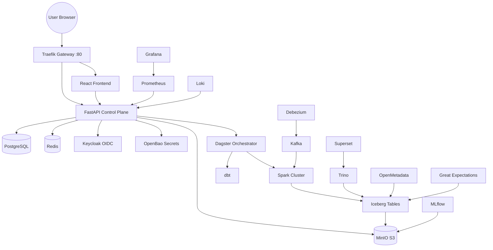
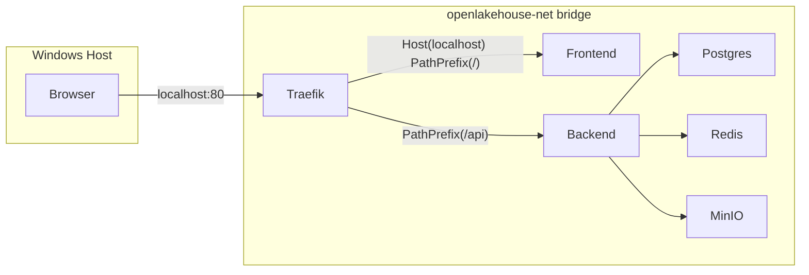
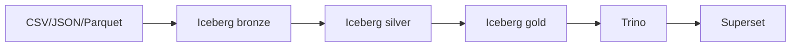

# OpenLakehouse — Architecture (Phase 0)

## 1. Overview

OpenLakehouse is a self-hosted, Dockerized data & AI platform. It is composed of
independently deployable services wired together with Docker Compose profiles,
fronted by a single reverse proxy (Traefik) so the whole platform is reachable
from `http://localhost`.

This document is the Phase 0 deliverable: architecture, dependency graph,
repository structure, API strategy, database model, Docker architecture and
network architecture. It is a living document — update it as phases land.

## 2. System Architecture



## 3. Network Architecture

All services join a single Docker user-defined bridge network `openlakehouse-net`
so they can resolve each other by service (container) name. Only Traefik
publishes ports 80/8080 to the host in normal operation; other services expose
host ports too during development for direct debugging (Adminer-less
PostgreSQL access, MinIO console, etc.) but production routing goes through
Traefik.



## 4. Data Flow (Batch)



## 5. Repository Structure

```text
openlakehouse/
├── README.md
├── LICENSE
├── .env.example
├── docker-compose.yml
├── Makefile
├── frontend/
├── backend/
├── services/
├── spark/
├── trino/
├── jupyter/
├── dagster/
├── kafka/
├── debezium/
├── dbt/
├── ml/
├── monitoring/
├── infra/
│   └── traefik/
├── migrations/
├── notebooks/
├── pipelines/
├── examples/
├── tests/
└── docs/
```

## 6. API Strategy

- FastAPI control plane exposes versioned REST API under `/api/v1/*`.
- OpenAPI docs at `/api/docs` (Swagger) and `/api/redoc`.
- All endpoints validated with Pydantic v2 schemas.
- Auth: OIDC/JWT bearer tokens validated against Keycloak (Phase 2). Until
  Phase 2 lands, a `dev` auth stub is clearly marked "not for production" and
  gated behind `BACKEND_ENV=development`.
- Persistence via SQLAlchemy 2.0 ORM + Alembic migrations (`backend/migrations`).
- Cross-cutting: request logging middleware, structured JSON logs, audit log
  table for mutating operations (Section 48 of the spec).

## 7. Database Model (Phase 1 baseline)

Initial control-plane tables (see `backend/app/models`):

- `users` — id, email, username, full_name, hashed_password (dev-mode only),
  keycloak_subject (nullable until Phase 2), role, is_active, timestamps
- `workspaces` — id, name, slug, description, owner_id, timestamps
- `audit_logs` — id, user_id, action, resource, resource_id, status, ip,
  timestamp, metadata(JSON)
- `service_health` — cached last-seen health of dependent services (populated
  by a polling task, read by the frontend Health page)

Later phases add: notebooks, pipelines, pipeline_versions, pipeline_runs,
jobs, job_runs, schedules, connections, datasets, quality_rules,
quality_runs, experiments, models, git_repositories, compute.

## 8. Docker Architecture & Profiles

Docker Compose profiles (Section 38 of the spec) group services so machines
with limited resources can start a subset:

| Profile | Services |
|---|---|
| `core` | traefik, frontend, backend, postgres, redis, minio |
| `security` | keycloak, openbao (+ core) |
| `lakehouse` | spark-master, spark-worker, polaris, trino (+ core) |
| `data-engineering` | dagster, dbt, openmetadata, great-expectations (+ lakehouse) |
| `streaming` | kafka, kafka-ui, debezium, flink (+ lakehouse) |
| `ml` | mlflow (+ lakehouse) |
| `governance` | openmetadata, great-expectations (+ lakehouse) |
| `monitoring` | prometheus, grafana, loki, otel-collector |
| `full` | everything |

Start core platform:

```bash
docker compose --profile core up -d
```

## 9. Status

See [docs/IMPLEMENTATION_STATUS.md](IMPLEMENTATION_STATUS.md) for live phase-by-phase
status, what has been tested, and what remains.
