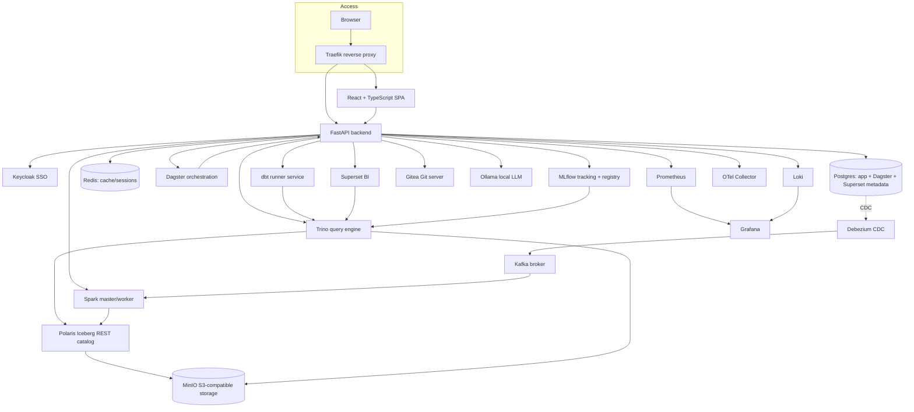

# 01 — System Topology

## High-level system diagram

## Real service inventory (verify each yourself)

| Service | Real purpose | Where reachable |
|---|---|---|
| Traefik | Reverse proxy, routes `http://localhost` to frontend/backend | port 80 |
| Backend (FastAPI) | REST API, orchestrates every subsystem | `http://localhost/api/v1` |
| Frontend (React) | SPA UI | `http://localhost` |
| Keycloak | SSO/JWT identity provider, real roles `ADMIN`/`DATA_ENGINEER`/`DATA_ANALYST`/`VIEWER` | direct port, not proxied |
| Postgres | App metadata (pipelines, connections, runs) + Dagster + Superset metadata + real CDC source | internal |
| Redis | Cache/session store | internal |
| Trino | Distributed SQL query engine over Iceberg | direct port + via app SQL Editor |
| Polaris | Iceberg REST catalog (table metadata, not data bytes) | internal |
| MinIO | S3-compatible object storage (actual Parquet/manifest files) | direct port |
| Spark | Batch ingestion + streaming compute + PySpark code nodes | direct port (master UI) |
| Dagster | Real cron-based pipeline scheduling via a polling sensor | direct port, not proxied |
| dbt runner | Proxies the real dbt CLI (`run`/`test`/`build`/`snapshot`) | via `/dbt` UI page |
| Superset | BI dashboards, own local auth (not SSO) | direct port |
| MLflow | Experiment tracking + model registry | direct port |
| Gitea | Self-hosted Git server, thin real REST proxy | direct port |
| Ollama | Local LLM backing the AI Assistant | internal |
| Kafka + Debezium | Streaming + CDC off Postgres | internal, some direct ports |
| Prometheus/Loki/Grafana/OTel | Metrics/logs/traces observability stack | direct ports |

## Why this matters before you touch anything

Every module in this guide maps to one or more boxes in this diagram.
When something breaks later (module 20's incident drills), you'll trace
the failure back through this exact graph — knowing the real topology
now makes every later diagnosis faster.

## Next document

[`02-medallion-architecture.md`](02-medallion-architecture.md).
