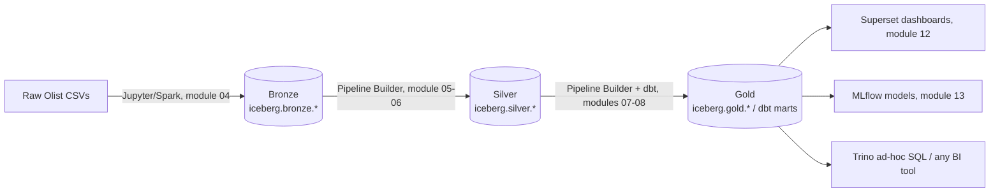

# 02 — The Medallion Architecture

## Bronze → Silver → Gold, and which module builds each tier

## Tier-by-tier real rules of this platform

| Tier | Built by | Mutation rule | Real gate before promotion |
|---|---|---|---|
| Bronze | Jupyter/Spark only (module 04) — Pipeline Builder's `csv`/`json`/`parquet` source types are UI-only and error at compile | Write-once/append; never hand-edited | None — raw landing zone |
| Silver | Pipeline Builder (module 05-06) | Rebuilt by re-running the owning pipeline | Quality nodes (`not_null`/`unique`/etc., module 06 doc 06) |
| Gold | Pipeline Builder + dbt (modules 07-08) | Rebuilt/incrementally updated | dbt tests + quality gates + referential integrity checks (module 10) |

## Why Bronze specifically requires Spark, not the No-Code builder

Pipeline Builder's real compiled **source** node types (verified in
module 06, doc 02) support only `iceberg_table` — meaning it can only
*read from* an existing Iceberg table, never *ingest* a raw CSV/JSON
file. This is why every module in this guide treats "load the raw Olist
files" as a Jupyter/Spark task (module 04), and everything from Silver
onward as a Pipeline Builder/dbt task.

## Hands-On Walkthrough — see all 3 tiers exist, right now

1. Open **Catalog** (or **Data Explorer**) in the app. **Expected
   result**: (once you've completed modules 04-08) you'll see `bronze`,
   `silver`, and `gold` schemas under the `iceberg` catalog, each with
   real tables and real row counts — this diagram is not aspirational,
   every arrow corresponds to a real, clickable table.

> 🧪 **Checkpoint**: you can explain, in one sentence, why Bronze
> ingestion in this platform genuinely cannot be done through the
> No-Code Pipeline Builder.

## Next document

[`03-hands-on-topology-check.md`](03-hands-on-topology-check.md).
