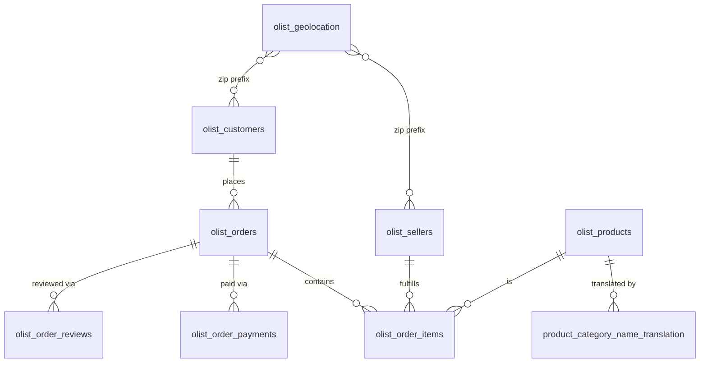

# 01 — Olist Schema ERD

## The real Olist dataset — 9 tables

## Real row counts and grain

| Table | Real row count | Grain |
|---|---|---|
| `olist_customers` | 99,441 | one per order-account instance |
| `olist_orders` | 99,441 | one per order |
| `olist_order_items` | 112,650 | one per line item |
| `olist_order_payments` | 103,886 | one per payment (some orders have multiple) |
| `olist_order_reviews` | 104,162 | one per review (real duplicate `review_id`s exist) |
| `olist_products` | 32,951 | one per product |
| `olist_sellers` | 3,095 | one per seller |
| `olist_geolocation` | 1,000,163 | one per zip-lat-lng observation (not unique per zip) |
| `product_category_name_translation` | 71 | category name lookup |

## The single most important real fact in this whole dataset

`customer_id` (99,441 distinct) is **not** the real customer identity —
`customer_unique_id` is (96,096 distinct). Olist issues a new
`customer_id` per order, even for a repeat customer. This one fact drives
the entire dimensional design in module 08 — get this wrong and your
"unique customers" metric will silently overcount by ~3.5%.

## Next document

[`02-profiling-the-raw-data.md`](02-profiling-the-raw-data.md).
