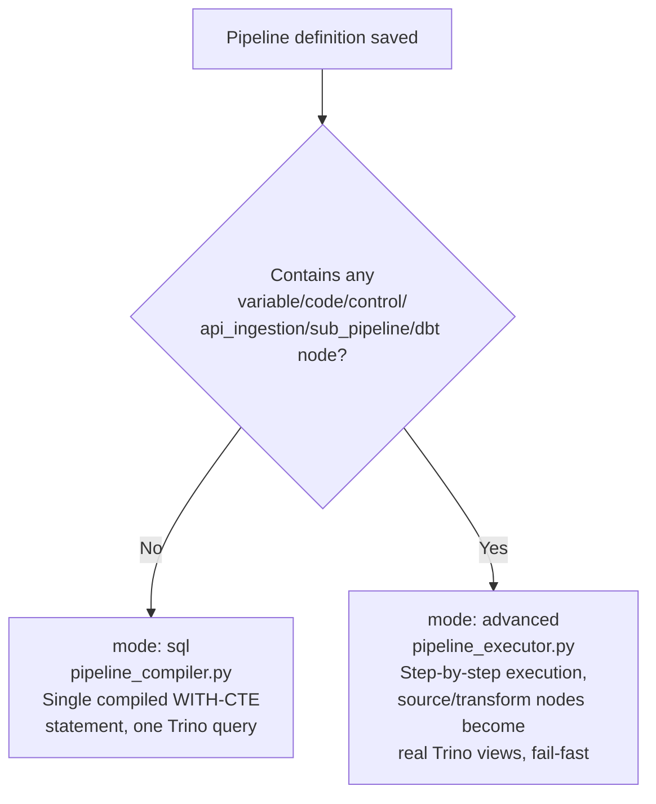

# Module 06 — Pipeline Builder Deep Dive

**Content type: CURRENT PLATFORM CAPABILITY (verified against
`backend/app/schemas/pipeline.py`, `pipeline_compiler.py`,
`pipeline_executor.py`) + PROJECT WORK.**

This module is the heart of this guide. It walks every real node kind the
Pipeline Builder supports, from the simplest possible pipeline to
advanced, multi-engine, role-gated, recursive pipelines — always against
real Olist data, always with the exact config keys the compiler/executor
actually read, and always with expected results you can verify yourself.

## Document map

| # | Document | What it covers |
|---|---|---|
| 01 | [`01-fundamentals-two-engines.md`](01-fundamentals-two-engines.md) | The `mode: sql` vs `mode: advanced` engines, when each is used, and why |
| 02 | [`02-source-and-destination-nodes.md`](02-source-and-destination-nodes.md) | The only real source (`iceberg_table`) and 3 real destinations |
| 03 | [`03-transformations-part1-select-rename-filter-join-union.md`](03-transformations-part1-select-rename-filter-join-union.md) | `select`, `rename`, `filter`, `join`, `union` |
| 04 | [`04-transformations-part2-aggregate-sort-dedup-cast-fillnull-replace.md`](04-transformations-part2-aggregate-sort-dedup-cast-fillnull-replace.md) | `aggregate`, `sort`, `deduplicate`, `cast`, `fill_null`, `replace` |
| 05 | [`05-transformations-part3-derived-window-pivot-unpivot.md`](05-transformations-part3-derived-window-pivot-unpivot.md) | `derived_column`, `window`, `pivot`, `unpivot` |
| 06 | [`06-quality-nodes.md`](06-quality-nodes.md) | `not_null`, `unique`, `range`, `regex`, `row_count`, `freshness` (+ the UI-only `schema` type) |
| 07 | [`07-variables.md`](07-variables.md) | `literal` and `from_query` variables, Jinja-style `{{ }}` templating |
| 08 | [`08-control-flow.md`](08-control-flow.md) | `if` branching, `for_each` looping |
| 09 | [`09-code-nodes-sql-python-pyspark.md`](09-code-nodes-sql-python-pyspark.md) | `code:sql`/`python`/`pyspark`, and the real role gate on the latter two |
| 10 | [`10-api-ingestion.md`](10-api-ingestion.md) | `rest_get`/`rest_post` live HTTP calls into variables |
| 11 | [`11-sub-pipelines.md`](11-sub-pipelines.md) | `call` nodes, variable passing, the real cyclic-call guard |
| 12 | [`12-dbt-nodes.md`](12-dbt-nodes.md) | `run`/`test`/`build` dbt nodes driven from inside a pipeline |
| 13 | [`13-error-handling-and-fail-fast.md`](13-error-handling-and-fail-fast.md) | The advanced engine's fail-fast/skip semantics, in detail |
| 14 | [`14-simple-vs-advanced-node-comparison.md`](14-simple-vs-advanced-node-comparison.md) | One master table: which node kinds trigger `mode: advanced`, and when you should deliberately choose simple over advanced |
| 15 | [`15-end-to-end-scenarios.md`](15-end-to-end-scenarios.md) | 10 full scenarios, simple → very complex, each combining several node kinds against real Olist tables |

## The two real engines, at a glance

## Real node-kind inventory (every kind, one line each)

| Kind | Real types | Engine that runs it |
|---|---|---|
| `source` | `iceberg_table` (8 others UI-only, error at compile) | both |
| `transform` | select, rename, filter, join, union, aggregate, sort, deduplicate, cast, fill_null, replace, derived_column, window, pivot, unpivot | both |
| `quality` | not_null, unique, range, regex, freshness, row_count (`schema` UI-only) | both |
| `destination` | iceberg_bronze, iceberg_silver, iceberg_gold (minio/kafka UI-only) | both |
| `variable` | literal, from_query | advanced only |
| `code` | sql, python, pyspark | advanced only |
| `control` | if, for_each | advanced only |
| `api_ingestion` | rest_get, rest_post | advanced only |
| `sub_pipeline` | call | advanced only |
| `dbt` | run, test, build | advanced only |

## Next document

Start with [`01-fundamentals-two-engines.md`](01-fundamentals-two-engines.md).
