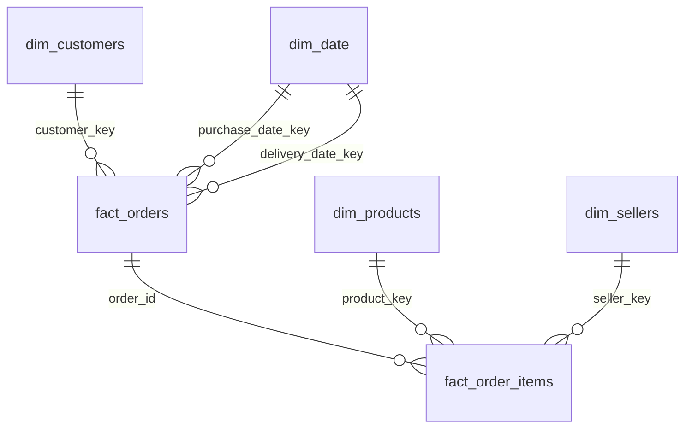

# 01 — Star Schema Design

## Target star schema

## Grain decisions (decide these before writing any SQL)

| Table | Grain | Real row count target |
|---|---|---|
| `dim_customers` | one row per `customer_unique_id` | 96,096 |
| `dim_sellers` | one row per `seller_id` | 3,095 |
| `dim_date` | one row per calendar day | 1,461 (2016-2019) |
| `fact_orders` | one row per order | 99,441 |
| `fact_order_items` | one row per order line item | 112,650 |

## Why `dim_date` is a role-playing dimension here

`fact_orders` needs **two** date relationships (purchase date, delivery
date) against the **same** `dim_date` table — this is the textbook
"role-playing dimension" pattern, and Olist's real
`order_estimated_delivery_date` vs. `order_delivered_customer_date`
(sometimes `NULL`) makes it a genuine, not contrived, example.

## Next document

[`02-building-dimensions.md`](02-building-dimensions.md).
