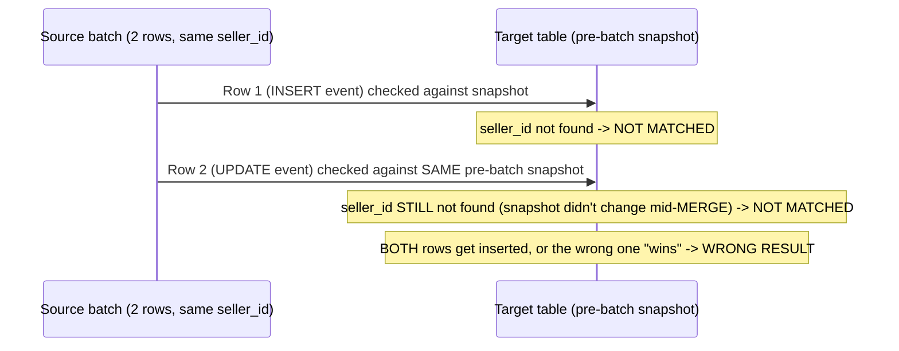

# 05 — The Real MERGE INTO Multi-Event Bug

**This is the single most important reproducible bug in this whole
guide.** It recurs in module 14 (streaming/CDC) in a live context.

## Scenario 5 (Complex, the key bug in this whole guide)

1. Simulate 2 events for the **same brand-new** seller landing in one
   batch (an insert immediately followed by an update, both unseen by
   the target table before this run). Run your SCD2 MERGE **without**
   deduplicating first.

## What actually happens (the bug), explained



**Expected (the bug's real symptom)**: both rows show as "NOT MATCHED"
against the pre-batch target snapshot — you may get either 2 duplicate
rows or a row with the **stale** value instead of the correct final one,
depending on which row Spark happens to process last.

## The fix

Before MERGE, dedupe to the latest event per key:
```sql
SELECT * FROM (
  SELECT *, ROW_NUMBER() OVER (PARTITION BY seller_id ORDER BY event_offset DESC) AS rn
  FROM staged_events
) WHERE rn = 1
```
Re-run. **Expected result**: exactly 1 correct row.

## Before/after table

| Step | Rows for the new seller | Correct? |
|---|---|---|
| MERGE without dedup | 2 (or 1 with stale value) | ❌ |
| MERGE after `ROW_NUMBER()` dedup | 1, latest values | ✅ |

## Why this matters beyond this one exercise

Any real CDC or multi-event batch pipeline (module 14) hits this exact
issue — Spark's `MERGE INTO` always evaluates every source row against
one single pre-batch target snapshot, never sequentially against its own
in-progress result. This is documented in this guide's persistent lessons
precisely because it produces **silently wrong data with no error
message** — the most dangerous kind of bug.

> 🧪 **Checkpoint**: you personally reproduced the MERGE-multi-event bug
> with your own data, and fixed it with `ROW_NUMBER` dedupe — not just
> read about it.

## Next document

[`06-temporal-joins.md`](06-temporal-joins.md).
