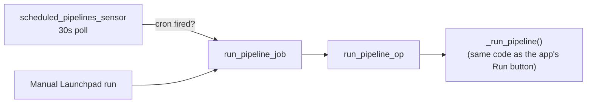

# 01 — Real Architecture and Manual Runs

## Real architecture

`run_pipeline_op` calls `app.api.v1.pipelines._run_pipeline` directly —
the exact same code path an API-triggered run uses. This means a
Dagster-launched run and a "click Run in the app" run share 100% of the
same execution logic; Dagster only adds scheduling on top.

## Hands-On Walkthrough — manually trigger a real run from Dagster

1. Open Dagster (`http://localhost:3001`) → **Jobs** → `run_pipeline_job`
   → **Launchpad**, supply a real `pipeline_id` from your `silver_orders`
   pipeline. **Launch**.
2. **Expected result**: real live log lines, and the same run appears in
   the app's own pipeline run history with `executed_by = "dagster"` —
   confirm this field directly in the run detail, proving Dagster and the
   app share one run-history table, not two separate systems.

> 🧪 **Checkpoint**: triggered a real pipeline run from Dagster's
> Launchpad, and confirmed `executed_by = "dagster"` in the app's own run
> history for that exact run.

## Next document

[`02-real-cron-scheduling.md`](02-real-cron-scheduling.md).
