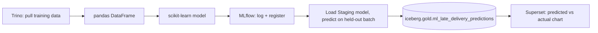

# 04 — Closing the Loop, and a Real Failed Run

## Scenario 4 (Complex) — write predictions back to the lakehouse

1. Score a full held-out batch, write results to
   `iceberg.gold.ml_late_delivery_predictions` via Spark, then build a
   Superset chart (module 12 skills) comparing predicted vs. actual
   `is_late` rate — a genuine ML → lakehouse → BI round trip.

## Scenario 5 (Complex) — a real failed run, diagnosed

2. Deliberately feed the model a DataFrame with a `NaN`-heavy column
   (e.g. don't impute a right-censored `order_delivered_customer_date`
   derived feature). **Expected result**: a real
   `ValueError: Input contains NaN` from scikit-learn, logged as a
   failed MLflow run (`status=FAILED`) if you wrap training in a
   `try/except` that still calls `mlflow.end_run(status="FAILED")` —
   confirm the failed run is visibly distinguishable in the UI.

| Run status | How it appears in MLflow's UI |
|---|---|
| `FINISHED` | green, normal run |
| `FAILED` | clearly marked, distinguishable at a glance |

> 🧪 **Checkpoint**: one full predict-and-write-back cycle visible in
> Superset, and one deliberately reproduced failed run visible in
> MLflow's UI.

## Back to module index / continue the guide

[`00-index.md`](00-index.md) — or continue to
[`../14-streaming-kafka-cdc/00-index.md`](../14-streaming-kafka-cdc/00-index.md).
