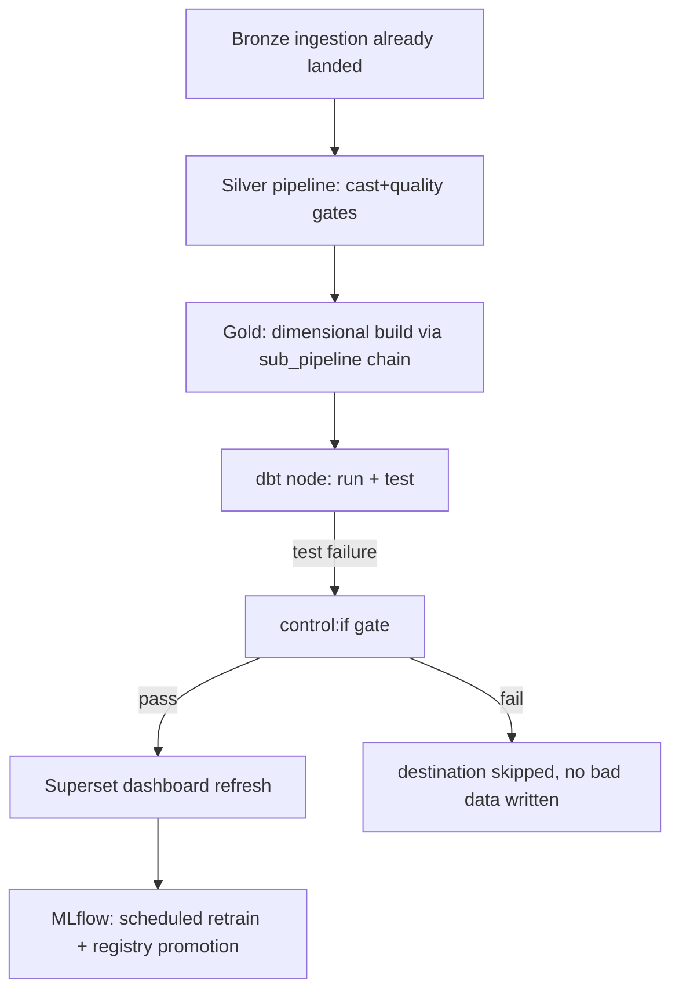

# 02 — The Capstone Run

## The capstone (Very Complex) — one full, unattended, scheduled, multi-tool pipeline

Build and schedule (via Dagster, module 09) a single production-style
flow, entirely unattended once triggered:

1. Wire this as a parent pipeline using `sub_pipeline` chaining (module
   06 doc 11 + module 09 doc 03's multi-stage workaround), schedule it
   via a real cron, and let it fire unattended.
2. **Expected result**: a fully real, unattended, multi-stage, multi-
   tool (Trino/Spark/dbt/MLflow) run completing with `executed_by =
   "dagster"`, verifiable end to end via the app's run history, Dagster's
   UI, and at least one downstream artifact (dashboard or model version).

> 🧪 **Checkpoint**: 1 real capstone run completed fully unattended,
> touching at least 4 distinct modules' worth of real components in a
> single execution.

## Next document

[`03-final-checklist.md`](03-final-checklist.md).
