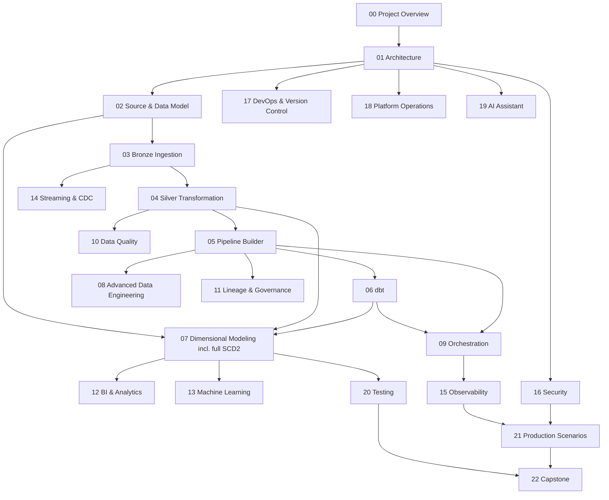

# 07 — Learning Roadmap

**Content type: PROJECT IMPLEMENTATION** (navigation aid over this
repository).

## Purpose

Give a single ordered reading list tying every module in this repository
together, cross-referenced by the reader goal it serves. See also
[`README.md`](../README.md) for the same paths in a more skimmable form.

## The dependency graph between modules

## Reading order by goal

1. **"I just want to understand the platform"** → `00` → `01` → skim `23-reference/glossary.md`.
2. **"I want to build the whole Olist project myself"** → follow modules
   `00` through `22` roughly in numeric order — each module's documents
   are self-contained but reference prior modules' terminology/diagrams.
3. **"I only care about dimensional modeling / SCD2"** → `02` → `07`
   (all 15 documents — this is the deepest single module in the repo).
4. **"I need to debug something right now"** →
   `23-reference/troubleshooting.md` first, then the relevant module's
   "failure scenarios" document (every module from `03` onward has one).
5. **"I'm prepping for an interview/architecture review"** →
   `01-architecture/09-architecture-decisions.md` →
   `23-reference/interview-questions.md`.

## What "done" looks like for a self-study reader

Work through the `22-capstone/01-24-phase-capstone-project.md` phase
checklist — it references every module in this repository and is the
single authoritative "have I actually built this" checklist, replacing the
original guide's Chapter 23 flat checklist with a phased implementation
project.
