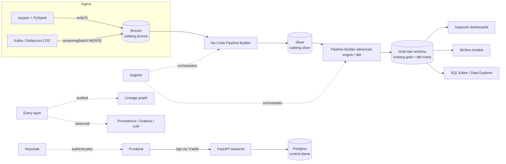

# 01 — Platform Architecture

**Content type: CURRENT PLATFORM CAPABILITY** throughout — every component
named here is a real, deployed, verified service in this repository's
`docker-compose.yml`.

## Purpose

Give the single reference architecture diagram every other document in
this repository links back to, plus a one-paragraph role for every
component.

## The full stack

## Component roles

| Component | Role | Reachable at |
|---|---|---|
| **Traefik** | Reverse proxy; only path that correctly serves both static frontend assets and `/api` writes | `http://localhost` |
| **Keycloak** | OIDC identity provider; issues bearer tokens for the backend API | `:8081` (token endpoint) |
| **Frontend (React/Vite/nginx)** | The OpenLakehouse app UI — Pipeline Builder, dbt page, SQL editor, dashboards, admin | via Traefik |
| **FastAPI backend** | Control plane: pipelines, users, connections, audit log, proxies to dbt-runner/Dagster/Ollama | via Traefik, `/api/v1/*` |
| **Postgres** | Backend's own control-plane DB, plus dedicated DBs for Dagster/Superset/MLflow/Gitea/OpenMetadata (one shared container, separate logical DBs) | internal |
| **MinIO** | S3-compatible object storage — the actual bytes behind every Iceberg table | `:9000` |
| **Polaris** | Iceberg REST catalog — metadata/table location authority, vends short-lived S3 credentials | internal, `:8181` |
| **Trino** | Interactive SQL engine, Iceberg catalog alias `iceberg` | internal, exposed via backend SQL API |
| **Spark (master+worker)** | Batch/streaming compute, Iceberg catalog alias `catalog` | Jupyter/spark-submit |
| **dbt (dbt-trino)** | SQL transformation framework over Trino; own tiny FastAPI wrapper (`infra/dbt/server.py`) for run/file APIs | internal `:8580`, proxied by backend |
| **Dagster** | Orchestration — schedules, GraphQL API | `:3001` |
| **Kafka** | Event streaming (KRaft single-node) | internal |
| **Debezium** | CDC connector off Postgres | `:8083` |
| **Superset** | BI dashboards over Trino | `:8088` |
| **MLflow** | Experiment tracking + model registry, MinIO-backed artifact store | `:5000` |
| **Gitea** | Git hosting for project artifacts | `:3010` |
| **Prometheus/Grafana/Loki/OTel collector** | Metrics/logs/traces | `:9090`/`:3300`/`:3100` |
| **OpenMetadata** | Data catalog (ingested via one-off CLI runs, not continuously synced) | `:8585` |
| **Ollama** | Local LLM backing the AI Assistant page | internal `:11434` |

## The two "same warehouse, two names" catalogs

Spark and Trino read/write the **exact same** Iceberg tables in the exact
same MinIO buckets via the exact same Polaris catalog — they just use
different local catalog aliases:

- Spark: `catalog.bronze.olist_orders`
- Trino: `iceberg.bronze.olist_orders`

Every code example in this repository uses the engine-correct alias. This
is the single most common copy-paste error when moving an example between
a Jupyter notebook and a SQL Editor/dbt query.

## Next document

[`02-logical-architecture.md`](02-logical-architecture.md).
