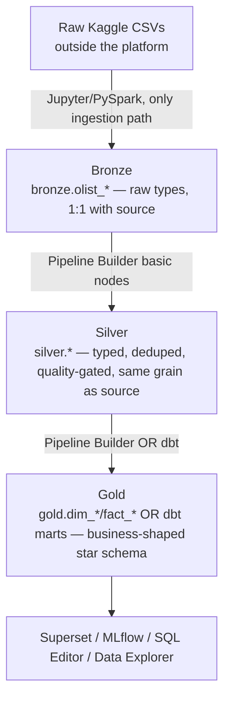

# 02 — Logical Architecture

**Content type: CURRENT PLATFORM CAPABILITY** (layer boundaries) +
**PROJECT IMPLEMENTATION** (how the Olist project specifically uses them).

## Purpose

Describe the platform's logical layering — independent of which container
runs where — so later documents can reason about "what layer does this
belong to" without re-deriving it each time.

## The medallion layers, precisely defined for this project

- **Bronze**: raw fidelity. The only allowed transformation is Spark's CSV
  type inference at ingest time — no business logic, no joins, no
  deduplication. Grain = 1 row per source CSV row.
- **Silver**: typed, deduplicated, individually quality-gated, but **still
  at the same grain as its Bronze source** — no cross-table joins yet
  (joins are a Gold-layer concern in this project's convention, to keep
  Silver tables independently testable).
- **Gold**: business-shaped. This is where the star schema lives —
  dimensions and facts, built by joining multiple Silver tables. This is
  the **only** layer BI tools and ML feature engineering should read from
  directly, by convention (not a platform-enforced rule).

## Why joins are deferred to Gold (a project convention, not a platform rule)

Nothing in the platform *forces* this — a Pipeline Builder `join` transform
node can run at any layer. This project defers joins to Gold specifically
so that:

1. Each Silver table can be tested/validated in isolation (its quality
   gates only depend on its own Bronze source).
2. A single business question's join logic lives in exactly one place
   (the Gold pipeline or dbt mart), not duplicated across multiple Silver
   pipelines that each independently decided to enrich themselves.

This is documented as ADR-002 in
[`09-architecture-decisions.md`](09-architecture-decisions.md).

## Control plane vs. data plane

A second, orthogonal logical split that matters for security and
operational reasoning:

- **Control plane**: FastAPI backend + its Postgres DB — stores pipeline
  *definitions*, user accounts, connection secrets, audit log, dbt run
  history. This is metadata about the platform's own operation.
- **Data plane**: Trino/Spark/Iceberg/MinIO/Kafka — actually stores and
  processes the Olist data itself.

A pipeline *run* is the control plane (backend) issuing real SQL/Spark work
against the data plane and recording the result back into its own
Postgres — this separation is why, e.g., deleting a `Pipeline` row
required careful FK cascade handling (documented in repo history) without
touching a single byte of actual Iceberg data.

## Next document

[`03-physical-architecture.md`](03-physical-architecture.md).
