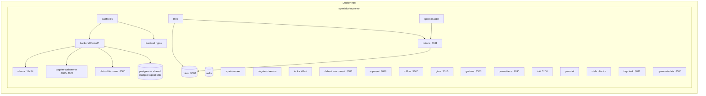

# 03 — Physical Architecture

**Content type: CURRENT PLATFORM CAPABILITY** — this document describes the
actual Docker Compose deployment topology.

## Purpose

Map every logical component to its actual container(s), ports, volumes, and
profile gating, so operational work (Chapters in `18-platform-operations/`,
`21-production-scenarios/`) has exact, correct facts to act on.

## Container topology

## Profile gating

Every non-core service is gated behind a docker-compose `profiles:` entry,
grouped roughly by phase/domain (`data-engineering`, `bi`, `ml-training`,
`streaming`, `governance`, `monitoring`, `ai`, ...). `--profile full`
includes everything. A real, recurring gotcha (documented in repo history):
a profile-gated service's `depends_on` targets are only auto-started if
those dependencies are **also** in the invoked profile set — shared infra
like `postgres`/`redis`/`trino`/`minio` is added to every profile that
needs it via a shared `x-core-profiles` YAML anchor, not repeated by hand.

## One-off / init containers

Several containers are **not** long-running services — they run once and
exit 0 by design: `gitea-init` (admin user creation), `superset-db-init`/
`mlflow-db-init`/`gitea-db-init` (createdb-if-not-exists), `minio-mlflow-
bucket-init`, `debezium-connector-register`, `ollama-init` (model pull),
`openmetadata-migrate` (schema bootstrap). Seeing these in `Exited(0)` state
in `docker compose ps` is correct, not a failure.

## Storage

- **Postgres** (one container, several logical databases: the app's own
  control-plane DB, plus `dagster`, `superset`, `mlflow`, `gitea`,
  `openmetadata` — each isolated to avoid Alembic/migration table
  collisions between unrelated tools).
- **MinIO** (one container, multiple buckets — the Iceberg warehouse
  bucket plus a dedicated `mlflow` artifact bucket).
- Volumes persist Postgres data, MinIO data, Gitea data, Grafana/Prometheus
  data, and Ollama's pulled model — a `docker compose down` (without
  `-v`) preserves all of this; only `down -v` or manual volume removal
  loses it.

## Networking specifics that matter operationally

- All inter-service communication uses Docker's internal DNS (service
  names as hostnames) on the single `openlakehouse-net` network — e.g. the
  backend reaches the dbt-runner at `http://dbt:8580`, never via a host
  port.
- Trino requires an `X-Trino-User` header on its own REST `/v1/node` and
  `/v1/query` endpoints (but not `/v1/info`) — a real, non-obvious API
  quirk documented in `compute_client.py`.

## Next document

[`04-data-flow.md`](04-data-flow.md).
