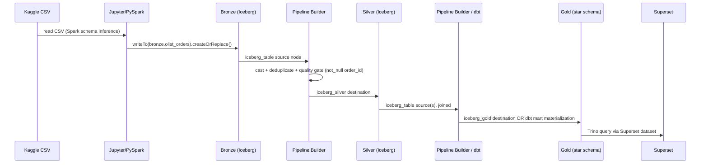

# 04 — Data Flow

**Content type: PROJECT IMPLEMENTATION** describing the Olist project's
concrete, end-to-end data path (built on **CURRENT PLATFORM CAPABILITY**).

## Purpose

Trace exactly how one Olist order's data moves from a Kaggle CSV row to a
Superset dashboard number, so every later module can say "this is step N
of the data flow" instead of re-explaining the whole path.

## The end-to-end flow

## Concrete example: `fact_orders` build

1. `olist_orders_dataset.csv` → Jupyter notebook → `bronze.olist_orders`
   (raw strings for date columns at this stage).
2. A Silver pipeline: source `bronze.olist_orders` → `cast` (string→
   timestamp for the 4 order timestamp columns) → `deduplicate` (on
   `order_id`) → quality `not_null(order_id)` + `unique(order_id)` →
   destination `silver.orders`.
3. A Gold pipeline/dbt model: source `silver.orders` joined to
   `dim_customers` (SCD2, "current at order time" join —
   see `07-dimensional-modeling/14-scd2-fact-lookup-and-temporal-joins.md`)
   and `dim_date` → destination `gold.fact_orders`.
4. Superset dataset `gold.fact_orders` (Trino) → dashboard chart.

## Batch vs. streaming paths (both real, used for different parts)

- **Batch** (the path above) is used for the initial historical load and
  all Silver/Gold transformation — this is the primary path for this
  project.
- **Streaming** (`infra/spark/streaming_orders.py`, Kafka topic
  `demo-orders` produced by `infra/kafka/produce_demo_orders.py`) is used
  only for the dedicated streaming exercise in
  `14-streaming-and-cdc/02-spark-structured-streaming.md` — it lands
  directly to a Bronze-equivalent Iceberg table via
  `writeStream.foreachBatch`, it does not replace the batch path for the
  main historical dataset.
- **CDC** (Debezium → Kafka → `infra/spark/cdc_sync.py` batch `MERGE
  INTO`) is a separate exercise simulating "day 2" Olist order updates —
  see `14-streaming-and-cdc/04-debezium-cdc.md`. Its dedup-before-merge
  requirement (`ROW_NUMBER() OVER (PARTITION BY key ORDER BY offset
  DESC)`) is a real, previously-hit bug class, not a hypothetical caveat.

## Next document

[`05-component-interactions.md`](05-component-interactions.md).
