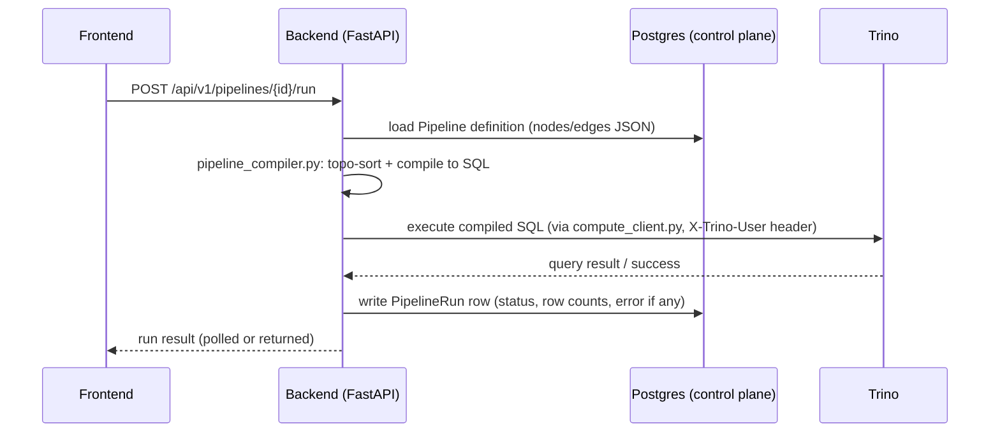
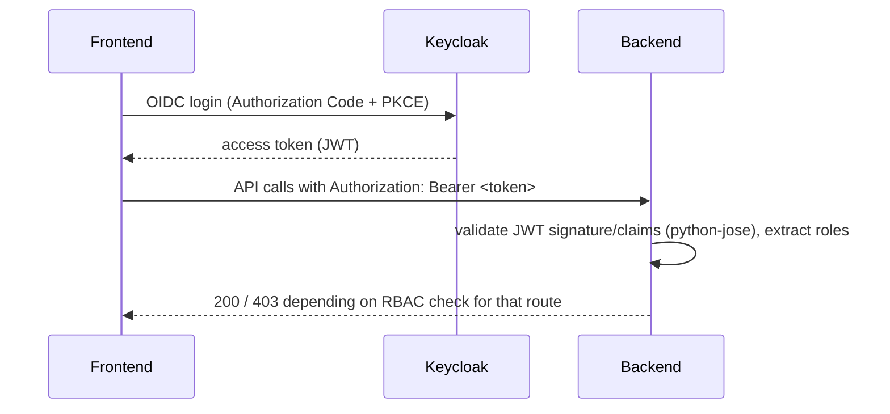

# 05 — Component Interactions

**Content type: CURRENT PLATFORM CAPABILITY.**

## Purpose

Document the real request/response paths between components for the
operations that matter most in this project — running a pipeline, running
dbt, and viewing lineage/quality — since these cross more service
boundaries than they might first appear to.

## Running a No-Code pipeline

## Running an advanced pipeline (with a `dbt` node)

Same shape, but `pipeline_executor.py` steps through nodes one at a time
(not a single compiled statement): `variable`/`code`/`control`/
`api_ingestion`/`sub_pipeline` execute directly against Trino/Spark or
Python; a `dbt` node instead calls the **dbt-runner's own FastAPI**
(`http://dbt:8580/run`) with the requested command (`run`/`test`/`build`
only), which shells out to real `dbt` CLI against the dbt-trino profile,
and returns stdout/exit code back through the backend to the frontend's
run-detail view.

## Viewing lineage

The Lineage page does **not** call a separate lineage engine — it's a
backend endpoint that reads every saved `Pipeline`'s nodes/edges JSON
across the whole project and reduces them to a table-to-table graph
(source table → destination table, per pipeline). It reflects saved
pipeline *definitions*, not necessarily their most recent *run* status —
worth knowing when a lineage edge appears for a pipeline that has never
actually been run successfully.

## Viewing data quality

The `/quality` dashboard aggregates `quality` node results from
`PipelineRun` history rows across all pipelines — again a backend
aggregation over control-plane data, not a live re-scan of the tables.

## Authentication flow

## Next document

[`06-network-architecture.md`](06-network-architecture.md).
