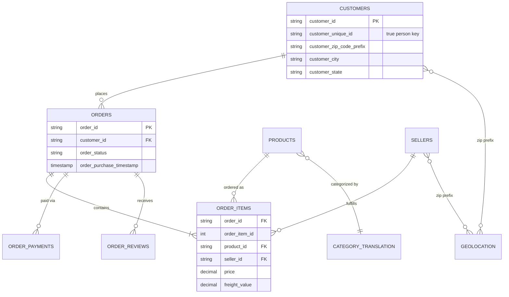

# 04 — Source Relationships (Entity Relationship Model)

**Content type: CURRENT PLATFORM CAPABILITY** (the source dataset's real
relational shape).

## Purpose

Show how the 9 raw tables actually relate, as the foundation both for
Silver-layer referential-quality checks and for the Gold star schema
design in `07-star-schema.md`.

## Entity relationship diagram

## Relationship notes that matter for modeling

- **CUSTOMERS → ORDERS is 1-to-many, but the "1" side is per-order, not
  per-person** (see `01-olist-dataset.md`) — the *true* person-to-orders
  relationship is many-to-many through `customer_unique_id`, since Olist's
  raw schema never stores a single stable customer-to-order FK.
- **ORDERS → ORDER_ITEMS is genuinely 1-to-many** — an order can and does
  contain multiple items, potentially from different sellers.
- **GEOLOCATION is many-to-many with zip prefix** — a single
  `zip_code_prefix` has multiple lat/lng observation rows (crowd-sourced
  data), so joining it directly without aggregation (e.g. `AVG(lat)`,
  `AVG(lng)` per prefix, or taking one representative row) will fan out
  row counts unexpectedly. This is a real, documented join hazard.
- **PRODUCTS → CATEGORY_TRANSLATION**: `product_category_name` in
  `products` is Portuguese; the translation file maps it to English
  (`product_category_name_english`) — a required join for any
  English-labeled category dashboard.

## Next document

[`05-grain-analysis.md`](05-grain-analysis.md).
