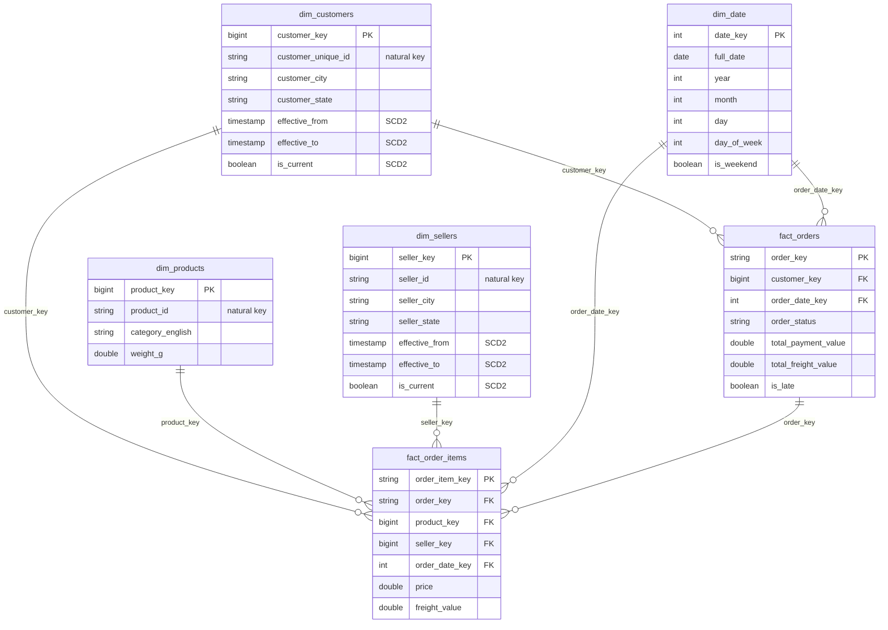

# 07 — The Target Star Schema

**Content type: PROJECT IMPLEMENTATION.**

## Purpose

Lock down the exact Gold-layer tables you will build in later modules
(`07-dimensional-modeling/`), and — critically for this request — give you
a concrete, hands-on way to **validate the design against the real raw data
on your own machine before you build anything on the platform**. Don't
skip the hands-on section: catching a bad assumption here (in five minutes,
with `pandas`) is far cheaper than catching it after you've built six
Pipeline Builder pipelines on top of a wrong grain.

## Prerequisites

- [`05-grain-analysis.md`](05-grain-analysis.md) read (grain statements for
  every table).
- The 9 Olist CSVs on your machine (see
  [`00-project-overview/06-prerequisites.md`](../00-project-overview/06-prerequisites.md)).
- Nothing on the OpenLakehouse platform needs to exist yet — this document
  only uses your local machine / Jupyter, matching the original guide's
  sequencing (design the model in Chapter 2, build it starting in Chapter 3).

## The star schema (final target)



Two fact tables, four dimensions. The full rationale for "why two fact
tables" and "why SCD2 for customers/sellers but not products" is in
[`07-dimensional-modeling/`](../07-dimensional-modeling/) — this document
only fixes the exact column list you'll implement.

## Column-level source mapping (what feeds each Gold column)

| Gold table.column | Comes from | Transform needed |
|---|---|---|
| `dim_customers.customer_unique_id` | `customers.customer_unique_id` | none (already the natural key) |
| `dim_customers.customer_city/state` | `customers.customer_city/state` | dedupe: one person can have many `customer_id` order-rows with (usually) the same city/state |
| `dim_products.category_english` | `products.product_category_name` → join → `category_translation.product_category_name_english` | lookup join |
| `dim_sellers.seller_city/state` | `sellers.seller_city/state` | none |
| `dim_date.*` | generated (no source table — see hands-on below) | `sequence()` generation |
| `fact_orders.total_payment_value` | `order_payments.payment_value` | `SUM(...) GROUP BY order_id` (payments are 1+ rows per order) |
| `fact_orders.total_freight_value` | `order_items.freight_value` | `SUM(...) GROUP BY order_id` |
| `fact_orders.is_late` | `orders.order_delivered_customer_date > orders.order_estimated_delivery_date` | derived boolean |
| `fact_order_items.price/freight_value` | `order_items.price/freight_value` | none (already at item grain) |

## Hands-On Walkthrough — validate the design against real data (Jupyter, no platform ingestion yet)

This uses Jupyter purely as a local pandas notebook against the CSVs on
disk — you are **not** writing to Iceberg yet (that's
[`03-bronze-ingestion/`](../03-bronze-ingestion/)). The goal is to prove
every mapping in the table above actually works before you build it as a
real pipeline.

1. Open Jupyter: `http://localhost:8888/jupyter/?token=openlakehouse`.
2. Click **Upload** (top-right of the file browser) and upload all 9 Olist
   CSVs into the root of the Jupyter file browser.
3. **File → New → Notebook**, choose the **Python 3** kernel.
4. Cell 1 — load everything into pandas DataFrames:
   ```python
   import pandas as pd

   customers = pd.read_csv("olist_customers_dataset.csv")
   orders = pd.read_csv("olist_orders_dataset.csv")
   order_items = pd.read_csv("olist_order_items_dataset.csv")
   payments = pd.read_csv("olist_order_payments_dataset.csv")
   products = pd.read_csv("olist_products_dataset.csv")
   sellers = pd.read_csv("olist_sellers_dataset.csv")
   category_translation = pd.read_csv("product_category_name_translation.csv")
   print({n: len(df) for n, df in [("customers", customers), ("orders", orders),
          ("order_items", order_items), ("payments", payments),
          ("products", products), ("sellers", sellers)]})
   ```
   Run it (Shift+Enter). **Expected output**: a dict showing
   `customers: 99441, orders: 99441, order_items: 112650, payments: 103886,
   products: 32951, sellers: 3095` — if any number differs, you likely
   uploaded the wrong file or a truncated download; stop and re-download
   before continuing.
5. Cell 2 — validate the `customer_unique_id` grain claim from
   [`05-grain-analysis.md`](05-grain-analysis.md):
   ```python
   dupe_check = customers.groupby("customer_unique_id").size()
   print("distinct persons:", len(dupe_check))
   print("persons with >1 customer_id row:", (dupe_check > 1).sum())
   ```
   **Expected output**: `distinct persons: 96096` (fewer than 99,441 rows —
   proving several thousand real repeat customers exist) and
   `persons with >1 customer_id row: 3345`. This is your concrete proof
   that keying `dim_customers` on `customer_id` (not `customer_unique_id`)
   would be wrong — you'd double-count these ~3,345 real customers as new
   people every time they re-ordered.
6. Cell 3 — validate `dim_products`'s lookup join won't drop rows:
   ```python
   merged = products.merge(category_translation, on="product_category_name", how="left")
   print("products total:", len(merged))
   print("products with no English category:", merged["product_category_name_english"].isna().sum())
   ```
   **Expected output**: `products total: 32951` (row count unchanged after
   the join — proves it's safe as a `left` join) and a small non-zero
   number (a handful of category names in `products` don't appear in the
   translation file — a real Silver-layer `fill_null` decision you'll make
   in [`04-silver-transformation/`](../04-silver-transformation/)).
7. Cell 4 — validate `fact_orders.total_payment_value`'s aggregation:
   ```python
   per_order_payment = payments.groupby("order_id")["payment_value"].sum()
   print("orders with payment rows:", len(per_order_payment))
   print("orders with >1 payment row (installments):", (payments.groupby("order_id").size() > 1).sum())
   ```
   **Expected output**: `orders with payment rows: 99440` (one order has
   zero payment rows — a real data-quality edge case you'll need a
   `LEFT JOIN` + `COALESCE(..., 0)` to handle, not an `INNER JOIN`, or that
   order silently disappears from `fact_orders`) and a nontrivial count of
   multi-installment orders, proving the `SUM()`/`GROUP BY` is necessary
   (a naive un-aggregated join would fan out `fact_orders` to one row per
   installment, corrupting the order grain).
8. Cell 5 — validate the `is_late` derivation has real signal:
   ```python
   orders["order_delivered_customer_date"] = pd.to_datetime(orders["order_delivered_customer_date"])
   orders["order_estimated_delivery_date"] = pd.to_datetime(orders["order_estimated_delivery_date"])
   late = orders["order_delivered_customer_date"] > orders["order_estimated_delivery_date"]
   print("late deliveries:", late.sum(), "out of", orders["order_delivered_customer_date"].notna().sum(), "delivered orders")
   ```
   **Expected output**: a few thousand late deliveries out of ~96,000
   delivered orders — non-trivial, confirming `is_late` is worth being a
   real fact column (this exact query becomes a 🧪 checkpoint again once
   the real `fact_orders` table exists in Gold).

> 🧪 **Checkpoint for this document**: all 5 cells above ran without
> errors and every "Expected output" matched. If any number is
> meaningfully different, re-read [`05-grain-analysis.md`](05-grain-analysis.md)
> and re-derive the affected mapping row before moving on — do not carry a
> wrong assumption into [`03-bronze-ingestion/`](../03-bronze-ingestion/).

## Next document

[`08-business-metrics.md`](08-business-metrics.md).
