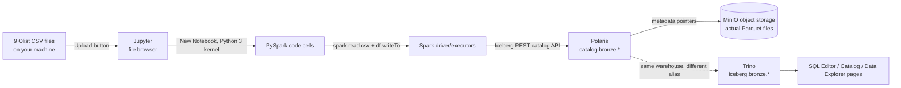

# 01 — Bronze Ingestion Architecture

**Content type: CURRENT PLATFORM CAPABILITY + PROJECT IMPLEMENTATION.**

## Purpose

Explain exactly which platform components move raw CSV data into a real
Iceberg Bronze table, and why the No-Code Pipeline Builder — the tool you
might expect to use first — is **not** the entry point for this step.

## Business context

Every downstream guarantee this platform gives you (data quality gates,
lineage, dimensional modeling, BI, ML) only exists for data that has
already landed in the lakehouse as a real table with a real schema. Until
then, the 9 Olist CSVs on your laptop are just files — nothing about them
is queryable, versioned, or governed. Bronze ingestion is the one-time
"crossing the threshold" step for each source dataset.

## Technical objective

- **Input**: 9 CSV files on your local machine.
- **Output**: 9 real Apache Iceberg tables under `bronze` schema, queryable
  via both Spark (`catalog.bronze.*`) and Trino (`iceberg.bronze.*`) —
  same underlying data, two engine-local catalog aliases (see
  [`01-architecture/02-logical-architecture.md`](../01-architecture/02-logical-architecture.md)).
- **Dependencies**: Jupyter (with PySpark kernel wiring), Spark
  master/worker, Polaris REST catalog, MinIO object storage — all already
  running if you brought up `docker compose --profile full up -d --build`
  per [`00-project-overview/06-prerequisites.md`](../00-project-overview/06-prerequisites.md).
- **Success criteria**: `SELECT count(*) FROM iceberg.bronze.olist_orders`
  in the SQL Editor returns `99441`.

## Why not the Pipeline Builder for this step

**CURRENT PLATFORM CAPABILITY, verified from the compiler source**: the
No-Code Pipeline Builder's only `source` node type is `iceberg_table` — it
reads *from* an Iceberg table that already exists, it does not read raw
CSV/files. There is no `csv`/`file` source type implemented in
`pipeline_compiler.py`, despite `minio`/`postgresql`/`kafka` appearing as
selectable *destination* types in the UI (those raise a real
`CompileError` if you try to use them — see
[`05-pipeline-builder/02-basic-nodes.md`](../05-pipeline-builder/02-basic-nodes.md)
for the full list of what's actually implemented vs. merely UI-visible).

This means the very first hop — CSV file → real Iceberg table — must go
through a **Jupyter + PySpark notebook**, which is a first-class, fully
supported way of writing to the same underlying warehouse. This is not a
workaround; it is the documented, intended pattern (the platform's own
existing FIFA and Olist reference walkthroughs use exactly this pattern).

## Architecture

- **Jupyter** (`http://localhost:8888/jupyter/?token=openlakehouse`) is
  where you write and run the ingestion code — a real Spark session
  backed by the `spark-master`/`spark-worker` containers, not a toy local
  engine.
- **Spark**'s catalog alias for this warehouse is `catalog` (set in
  `infra/spark/spark-defaults.conf`'s `spark.sql.catalog.catalog.*`
  properties).
- **Polaris** is the Iceberg REST catalog service that both Spark and
  Trino talk to — it tracks table metadata (schema, snapshots,
  partitioning) and hands out short-lived, scoped credentials to read/write
  the underlying MinIO objects (vended credentials).
- **Trino**'s alias for the *same* warehouse is `iceberg` — this is why
  every SQL Editor query in this project says `iceberg.bronze.*` while
  every PySpark cell says `catalog.bronze.*`. Same tables, different
  per-engine local names — a recurring point of confusion for newcomers,
  called out explicitly here so it doesn't surprise you later.

## Failure points to be aware of before you start

| Failure point | Symptom | Where it's covered |
|---|---|---|
| Wrong/incomplete CSV download | Row counts don't match expected values | [`07-ingestion-failures.md`](07-ingestion-failures.md) Scenario D |
| Jupyter kernel died mid-run (large `geolocation` file, ~1M rows) | Cell hangs or kernel restarts | [`07-ingestion-failures.md`](07-ingestion-failures.md) Scenario A |
| Re-running the ingestion notebook a second time | `createOrReplace()` silently overwrites — usually fine, but see idempotency notes | [`06-idempotency.md`](06-idempotency.md) |
| `inferSchema=True` guessing a wrong type for one column | A downstream `CAST` failure much later, in Silver | [`03-schema-inference.md`](03-schema-inference.md) |

## Next document

[`02-jupyter-pyspark-ingestion.md`](02-jupyter-pyspark-ingestion.md) — the
full, literal, click-by-click walkthrough.
