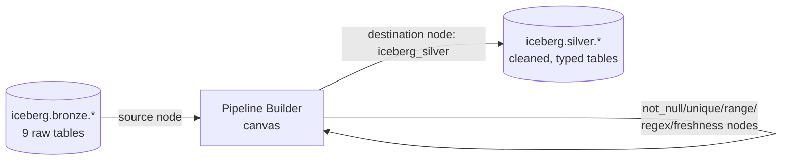

# 01 — Silver Architecture

**Content type: CURRENT PLATFORM CAPABILITY + PROJECT IMPLEMENTATION.**

## Purpose

Bronze preserved raw Olist data unmodified (module 03). Silver's job is the
opposite: **make the data trustworthy and typed**, without yet applying
business/dimensional logic (that's Gold, module 07). Concretely: correct
types, no duplicates, nulls handled deliberately, and every row passing a
set of quality checks.

## Where Silver is built: the No-Code Pipeline Builder

Unlike Bronze (Jupyter/PySpark, because no CSV source exists in the
Pipeline Builder), Silver is exactly what the Pipeline Builder is designed
for: its only real `source` node type is `iceberg_table` — and by now you
have 9 real Iceberg tables in `bronze` to read from.

**CURRENT PLATFORM CAPABILITY, verified from `pipeline_compiler.py`** — the
exact node types the compiler turns into real Trino SQL:

| Kind | Real, compiled types |
|---|---|
| Source | `iceberg_table` (only) |
| Transform | `select`, `rename`, `filter`, `join`, `union`, `aggregate`, `sort`, `deduplicate`, `cast`, `fill_null`, `replace`, `derived_column`/`window`, `pivot`, `unpivot` |
| Quality | `not_null`, `unique`, `range`, `regex`, `row_count`, `freshness` (`schema` type is UI-visible but **not yet compiled** — raises `CompileError`) |
| Destination | `iceberg_bronze` → `bronze` schema, `iceberg_silver` → `silver` schema, `iceberg_gold` → `gold` schema |

Every node in a pipeline compiles to one CTE in a single `WITH ... SELECT`
Trino statement — the whole pipeline is always inspectable as plain SQL
(you'll see this directly in the walkthrough below).

## Architecture

## Hands-On Walkthrough — see the compiled SQL before building anything

1. Open `http://localhost/pipelines` and log in if needed.
2. Click **New Pipeline**, name it `silver_orders_preview`.
3. Drag one **Source** node onto the canvas, set its config:
   `schema = bronze`, `table = olist_orders`.
4. Without adding any other node, click **Compile** (or **Preview SQL** —
   whichever button your Pipeline Builder version exposes; both surface the
   same compiled Trino text).
5. **Expected result**: the compiled SQL is exactly
   `SELECT * FROM iceberg.bronze.olist_orders` — confirming the 1:1
   mapping between a source node's config and the real SQL, before you've
   added any transform complexity.

> 🧪 **Checkpoint**: you've confirmed the Pipeline Builder is a real SQL
> compiler over your actual Bronze tables, not a black box — every node
> you add from here maps to one readable SQL fragment.

## Next document

[`02-data-cleaning.md`](02-data-cleaning.md).
