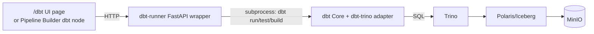

# 01 — dbt Architecture

**Content type: CURRENT PLATFORM CAPABILITY (verified) + PROJECT IMPLEMENTATION.**

## What runs where

- **dbt Core** (`dbt-trino==1.10.3`) runs inside its own container
  (`infra/dbt/Dockerfile`), compiling models to SQL and executing them
  against Trino — the exact same `iceberg` catalog you've been querying
  in SQL Editor all along.
- **`profiles/profiles.yml`** uses `method: none` (no auth) — matches
  this project's Trino setup, which doesn't require Trino-level
  authentication for internal container-to-container calls.
- A thin **dbt-runner FastAPI wrapper** (`infra/dbt/server.py`) exposes
  `list_models`, `run`, `list_files`, `get_file`, `create_file` as real
  HTTP endpoints — this is what both the app's `/dbt` UI page and Pipeline
  Builder `dbt` nodes (module 05) call under the hood. There is no
  separate/fake dbt behind the UI — it's the same real dbt project either
  way.

## Architecture

## Hands-On Walkthrough — confirm the real dbt project is reachable

1. Open `http://localhost/dbt`.
2. **Expected result**: the page loads a real file tree reflecting
   `infra/dbt/dbt_project/models/{staging,intermediate,marts}/` — the
   exact same folders you'd see with a terminal `ls` on the container.
3. Click on `models/staging/_sources.yml` (or any existing file) in the
   UI tree. **Expected result**: its real file content renders — this is
   `get_file()` reading the actual file off disk inside the dbt
   container, not a canned preview.

> 🧪 **Checkpoint**: the `/dbt` page's file tree and file contents match
> what you'd see running `docker compose exec dbt ls dbt_project/models`
> yourself — confirms the UI is a real window into the real project.

## Next document

[`02-project-structure.md`](02-project-structure.md).
