# 06 — Production Orchestration

**Content type: PROJECT IMPLEMENTATION.** Closes out this module with a
real, complete scheduled production setup for the Olist project.

## Hands-On Walkthrough — assemble the full production schedule

1. Set real cron schedules on each of these pipelines (via each
   pipeline's **Pipeline settings** panel, same mechanism as
   [`03-scheduling.md`](03-scheduling.md)):
   - `silver_orders`, `silver_customers`, `silver_sellers`,
     `silver_products`, `silver_order_items`, `silver_reviews`:
     `schedule = 0 2 * * *` (daily at 2 AM — Silver refresh).
   - Your Gold-layer fact/dimension-building pipelines from module 07:
     `schedule = 0 3 * * *` (daily at 3 AM — after Silver, giving Silver
     an hour's buffer to finish).
   - `qc_orders`/`qc_customers`/etc. from
     [`05-pipeline-builder/13-reusable-pipelines.md`](../05-pipeline-builder/13-reusable-pipelines.md):
     `schedule = 0 4 * * *` (daily at 4 AM — after Gold).
2. Confirm all schedules are picked up: Dagster UI → **Sensors** →
   `scheduled_pipelines_sensor` → **Tick history** should, over the next
   day, show separate launched runs at each of the 3 configured times.
3. Set up basic alerting awareness (manual, since this platform has no
   native Dagster alerting sensor today — a documented gap): check
   Dagster's **Runs** page each morning for any `FAILURE` status, or
   integrate with [`15-observability/06-incident-response.md`](../15-observability/06-incident-response.md)'s
   Grafana-based alerting instead, which *does* have real alerting
   infrastructure (module 15).

## The complete daily operational picture for this project

```mermaid
gantt
    title Daily Olist pipeline schedule (UTC)
    dateFormat HH:mm
    axisFormat %H:%M
    section Silver
    Silver refresh (6 pipelines) :02:00, 30m
    section Gold
    Gold fact/dim build :03:00, 30m
    section Quality
    Quality checks (qc_*) :04:00, 15m
```

> 🧪 **Checkpoint for the whole module**: you have a real, running,
> 3-tier daily schedule (Silver → Gold → Quality) entirely driven by each
> pipeline's own `definition.schedule` field and Dagster's sensor, with at
> least one observed automatic tick confirming it actually fires.

## Next module

[`10-data-quality/01-quality-strategy.md`](../10-data-quality/01-quality-strategy.md).
