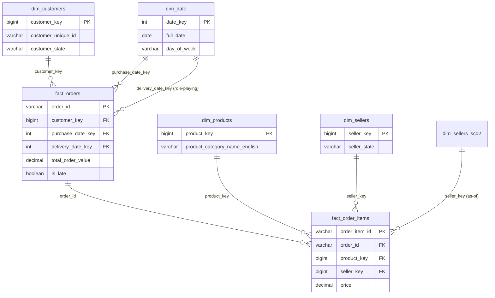

# 02 — Entity-Relationship Model

**Content type: PROJECT IMPLEMENTATION.** A visual/reference companion to
the dimensional model built across module 07.

## The real, complete ER diagram for the Olist Gold layer



## Hands-On Walkthrough — verify this diagram against the real schema

1. In **SQL Editor**, list every Gold table's real columns and compare
   against the diagram above:
   ```sql
   SELECT table_name, column_name, data_type
   FROM iceberg.information_schema.columns
   WHERE table_schema = 'gold' ORDER BY table_name, ordinal_position;
   ```
2. **Expected result**: every column in the diagram exists in your real
   tables — if you've customized any dimension/fact table differently
   across modules 04-08, note the difference here (this diagram
   documents the reference build, not necessarily every variation you
   may have introduced during hands-on exercises).
3. Confirm the role-playing `dim_date` relationship concretely:
   ```sql
   SELECT count(*) FROM iceberg.gold.fact_orders f
   JOIN iceberg.gold.dim_date d1 ON f.purchase_date_key = d1.date_key
   LEFT JOIN iceberg.gold.dim_date d2 ON f.delivery_date_key = d2.date_key;
   ```
   **Expected result**: `99441` — both joins resolve correctly (the
   `LEFT JOIN` on `delivery_date_key` handles the legitimately-`NULL`
   undelivered orders).

> 🧪 **Checkpoint**: you verified the ER diagram's every column and
> relationship against your own real Gold-layer tables.

## Next document

[`03-metadata-and-catalog.md`](03-metadata-and-catalog.md).
